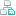

## Adf Azure Blob Storage Linked Service Element


API Type:

<a href="../api-reference/Varigence.Languages.Biml.DataFactory.AstAdfAzureBlobStorageLinkedServiceNode.html">Varigence.Languages.Biml.DataFactory.AstAdfAzureBlobStorageLinkedServiceNode</a>

Attributes
<table id="AttributeList" class="AttributeList"><tbody><tr><th class="AttributeIconColumnHeader">&nbsp;</th><th class="AttributeNameColumnHeader">Attribute</th><th class="AttributeTypeColumnHeader">API Type</th><th class="AttributeDefaultColumnHeader">Default</th><th class="AttributeSummaryColumnHeader">Description</th></tr><tr class="ad0"><td align="center" class="AttributeIcon"></td><td class="AttributeName">Name</td><td class="AttributeType"><a href="https://msdn.microsoft.com/en-us/library/System.String.aspx">String</a></td><td class="AttributeDefault">&nbsp;</td><td class="AttributeSummary">
Specifies the name of the object.  This name can be used to reference this object from anywhere else in the program.
</td></tr><tr class="ad1"><td align="center" class="AttributeIcon"></td><td class="AttributeName">ConnectionString</td><td class="AttributeType"><a href="https://msdn.microsoft.com/en-us/library/System.String.aspx">String</a></td><td class="AttributeDefault">&nbsp;</td><td class="AttributeSummary">
Specifies the connection string that contains information necessary to connect to the linked service.
</td></tr><tr class="ad0"><td align="center" class="AttributeIcon"></td><td class="AttributeName">EncryptedCredential</td><td class="AttributeType"><a href="https://msdn.microsoft.com/en-us/library/System.String.aspx">String</a></td><td class="AttributeDefault">&nbsp;</td><td class="AttributeSummary">
Specifies the encrypted credential that will be used to authenticate the linked service.
</td></tr><tr class="ad1"><td align="center" class="AttributeIcon"></td><td class="AttributeName">Endpoint</td><td class="AttributeType"><a href="https://msdn.microsoft.com/en-us/library/System.String.aspx">String</a></td><td class="AttributeDefault">&nbsp;</td><td class="AttributeSummary">
URL that hosts the Azure Blob Storage.
</td></tr><tr class="ad0"><td align="center" class="AttributeIcon"></td><td class="AttributeName">LogicalDisplayFolder</td><td class="AttributeType"><a href="https://msdn.microsoft.com/en-us/library/System.String.aspx">String</a></td><td class="AttributeDefault">&nbsp;</td><td class="AttributeSummary">
Specifies a path that should be used for organizing the tree display of this object in the Logical View in BimlStudio.
</td></tr><tr class="ad1"><td align="center" class="AttributeIcon"></td><td class="AttributeName">SasUri</td><td class="AttributeType"><a href="https://msdn.microsoft.com/en-us/library/System.String.aspx">String</a></td><td class="AttributeDefault">&nbsp;</td><td class="AttributeSummary">
Specifies the Shared Access Signature URI that contains information necessary to connect to the linked service.
</td></tr><tr class="ad0"><td align="center" class="AttributeIcon"></td><td class="AttributeName">ServicePrincipalId</td><td class="AttributeType"><a href="https://msdn.microsoft.com/en-us/library/System.String.aspx">String</a></td><td class="AttributeDefault">&nbsp;</td><td class="AttributeSummary">
Client ID for the application.
</td></tr><tr class="ad1"><td align="center" class="AttributeIcon"></td><td class="AttributeName">ServicePrincipalKey</td><td class="AttributeType"><a href="https://msdn.microsoft.com/en-us/library/System.String.aspx">String</a></td><td class="AttributeDefault">&nbsp;</td><td class="AttributeSummary">
Key for the application
</td></tr><tr class="ad0"><td align="center" class="AttributeIcon"></td><td class="AttributeName">Tenant</td><td class="AttributeType"><a href="https://msdn.microsoft.com/en-us/library/System.String.aspx">String</a></td><td class="AttributeDefault">&nbsp;</td><td class="AttributeSummary">
Specify either the domain name or tenant ID that houses your application.
</td></tr></tbody></table>



### Singleton Children

<table id="ChildList" class="ChildList"><tbody><tr><th class="ChildIconColumnHeader">&nbsp;</th><th class="ChildNameColumnHeader">Child</th><th class="ChildTypeColumnHeader">API Type</th><th class="ChildSummaryColumnHeader">Description</th></tr><tr class="cd0"><td align="center" class="ChildIcon"></td><td class="ChildName">&lt;<a href=../api-reference/Varigence.Languages.Biml.DataFactory.AstAdfKeyVaultSecretNode.html">AccountKeyKVS</a> /&gt;</td><td class="ChildType"><a href="../api-reference/Varigence.Languages.Biml.DataFactory.AstAdfKeyVaultSecretNode.html">AstAdfKeyVaultSecretNode</a></td><td class="ChildSummary">Defines a field in a Linked Service that references a key vault secret. This allows users to reference a password without putting it explicitly in the Azure Data Factory json.</td></tr><tr class="cd1"><td align="center" class="ChildIcon"></td><td class="ChildName">&lt;<a href=../api-reference/Varigence.Languages.Biml.DataFactory.AstAdfKeyVaultSecretNode.html">ConnectionStringKVS</a> /&gt;</td><td class="ChildType"><a href="../api-reference/Varigence.Languages.Biml.DataFactory.AstAdfKeyVaultSecretNode.html">AstAdfKeyVaultSecretNode</a></td><td class="ChildSummary">Defines a field in a Linked Service that references a key vault secret. This allows users to reference a password without putting it explicitly in the Azure Data Factory json.</td></tr><tr class="cd0"><td align="center" class="ChildIcon"></td><td class="ChildName">&lt;<a href=../api-reference/Varigence.Languages.Biml.DataFactory.AstAdfLinkedServiceConnectViaNode.html">ConnectVia</a> /&gt;</td><td class="ChildType"><a href="../api-reference/Varigence.Languages.Biml.DataFactory.AstAdfLinkedServiceConnectViaNode.html">AstAdfLinkedServiceConnectViaNode</a></td><td class="ChildSummary">Specifies the integration runtime that should be used to connect to the selected linked service.</td></tr><tr class="cd1"><td align="center" class="ChildIcon"></td><td class="ChildName">&lt;<a href=../api-reference/Varigence.Languages.Biml.DataFactory.AstAdfKeyVaultSecretNode.html">SasTokenKVS</a> /&gt;</td><td class="ChildType"><a href="../api-reference/Varigence.Languages.Biml.DataFactory.AstAdfKeyVaultSecretNode.html">AstAdfKeyVaultSecretNode</a></td><td class="ChildSummary">Defines a field in a Linked Service that references a key vault secret. This allows users to reference a password without putting it explicitly in the Azure Data Factory json.</td></tr><tr class="cd0"><td align="center" class="ChildIcon"></td><td class="ChildName">&lt;<a href=../api-reference/Varigence.Languages.Biml.DataFactory.AstAdfKeyVaultSecretNode.html">SasUriKVS</a> /&gt;</td><td class="ChildType"><a href="../api-reference/Varigence.Languages.Biml.DataFactory.AstAdfKeyVaultSecretNode.html">AstAdfKeyVaultSecretNode</a></td><td class="ChildSummary">Defines a field in a Linked Service that references a key vault secret. This allows users to reference a password without putting it explicitly in the Azure Data Factory json.</td></tr><tr class="cd1"><td align="center" class="ChildIcon"></td><td class="ChildName">&lt;<a href=../api-reference/Varigence.Languages.Biml.DataFactory.AstAdfKeyVaultSecretNode.html">ServicePrincipalKeyKVS</a> /&gt;</td><td class="ChildType"><a href="../api-reference/Varigence.Languages.Biml.DataFactory.AstAdfKeyVaultSecretNode.html">AstAdfKeyVaultSecretNode</a></td><td class="ChildSummary">Defines a field in a Linked Service that references a key vault secret. This allows users to reference a password without putting it explicitly in the Azure Data Factory json.</td></tr></tbody></table>



### Collection Children

<table id="ChildList" class="ChildList"><tbody><tr><th class="ChildIconColumnHeader">&nbsp;</th><th class="ChildNameColumnHeader">Child</th><th class="ChildTypeColumnHeader">API Type</th><th class="ChildSummaryColumnHeader">Description</th></tr><tr class="cd0"><td align="center" class="ChildIcon">

<td class="ChildName">&lt;AdfAnnotations&gt; &nbsp;&nbsp;&nbsp;&nbsp;&lt;<a href=https://msdn.microsoft.com/en-us/library/System.String.aspx">AdfAnnotation</a> /&gt; &lt;/AdfAnnotations&gt;</td><td class="ChildType"><a href="https://msdn.microsoft.com/en-us/library/System.String.aspx">String</a></td><td class="ChildSummary">
This is the collection of annotations that will be emitted in the json.
</td></tr><tr class="cd1"><td align="center" class="ChildIcon">

<td class="ChildName">&lt;<a href=Varigence.Languages.Biml.AstNode_Annotations.html">Annotations</a>&gt; &nbsp;&nbsp;&nbsp;&nbsp;&lt;<a href=Varigence.Languages.Biml.AstAnnotationNode.html">Annotation</a> /&gt; &lt;/<a href=Varigence.Languages.Biml.AstNode_Annotations.html">Annotations</a>&gt;</td><td class="ChildType"><a href="../api-reference/Varigence.Languages.Biml.AstAnnotationNode.html">AstAnnotationNode</a></td><td class="ChildSummary">
This is a collection of annotation items that can be used to specify documentation, tags, or other information.  Annotations are particularly useful for storing information about nodes that can be used by BimlScript code.
</td></tr></tbody></table>

