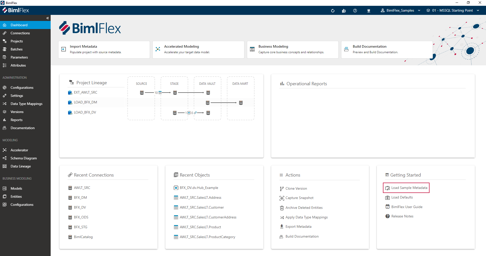

BimlFlex provides several sets of [sample metadata](xref:bimlflex-sample-metadata) and configurations.

These samples support various common use-cases and scenarios and are intended to assist adopting specific features for certain architectures and technical environments. The full list of available samples is available in the [samples documentation](xref:bimlflex-sample-metadata#available-metadata-samples).

For example, samples cover how to load files using [SQL Server Integration Services (SSIS)](xref:bimlflex-ssis-overview), how to implement [delete detection](xref:bimlflex-concepts-delete-detection) to load data into Azure, or how to deliver a [Data Vault](xref:bimlflex-data-vault-index) model on [Snowflake](xref:bimlflex-snowflake-index).

In the [BimlFlex App](xref:metadata-editors-overview), use the **Load Sample Metadata** button in the **Getting Started** pane on the [Dashboard](xref:bimlflex-dashboard) to load sample metadata to the current active **Customer**.

> [!TIP]
> The Varigence YouTube channel contains various introduction videos about using BimlFlex and BimlStudio. [This video](https://www.youtube.com/watch?v=2rL853XpST4?rel=0&autoplay=0) provides an overview of how to load sample metadata into BimlFlex.
