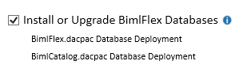
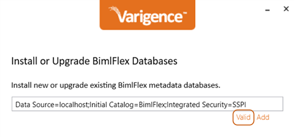
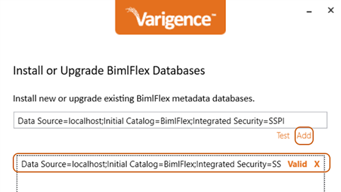
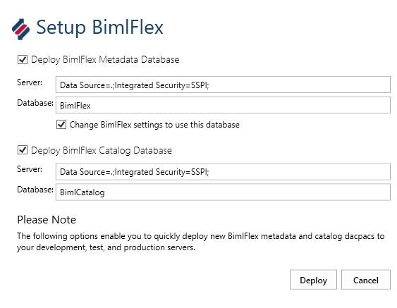
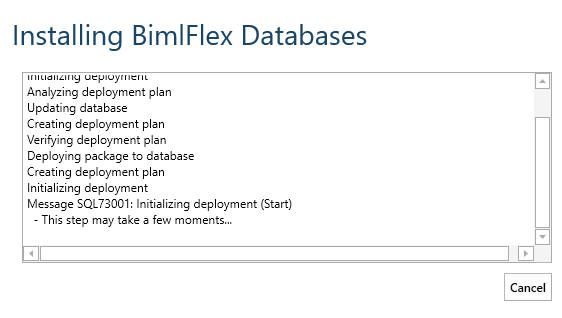

# BimlFlex Database

The BimlFlex Database - the core metadata repository database - is used by BimlFlex and BimlStudio to model and build the data solution, and to support the automation.

Modelers, analysts and data team members use the BimlFlex Applicationto model and interact with the metadata. This metadata is written to the BimlFlex metadata repository database. BimlStudio then accesses the metadata by querying the database to provide the development and build experience for creating data warehouse artifacts.

> [!IMPORTANT]
> The BimlFlex database contains crucial data for the data warehouse automation process. It is important maintain a strict disaster recovery policy for this database.

There are two different methods used to install the repository databases. The first option is to use the BimlFlex installer. The second option is to use BimlStudio.

## Installation

### Installing the BimlFlex Database using the Installer

#### Enable the Database Installation

On the first pane of the installation process, there is the option to setup and install the BimlFlex database. Check this box before continuing.

#### Setting the Connection Strings

Proceed through the setup until the "Install or Upgrade BimlFlex Databases" screen is reached.
This represents the location(s) of the BimlFlex databases to be installed.

Click `Test` to test the target connection and ensure that it is valid. `Test` will change to `Valid` once confirmed.  
Once a working connection string has been validated, click the `Add` button to finalize the database configuration. 

The desired installation location is now saved and will be used to install the database.

>[!IMPORTANT]
> It is important to back up any databases prior to an upgrade.

Press `Next` to repeat this same configuration process for **BimlCatalog**.

Before finalizing the BimlFlex database or BimlCatalog upgrade or installation, examine the *Pending Actions* list. 
Ensure that there is a pending action that corresponds to the desired database installation.

Press `Upgrade` or `Install` to finalize the BimlFlex database installation or upgrade.

### Installing the BimlFlex Database from BimlStudio

#### Open the Project in BimlStudio

Alternatively, it is also possible to install the databases from the BimlFlex project in BimlStudio.

In order to setup the databases, first create a [BimlFlex project for BimlStudio](xref:bimlflex-setup-bimlstudio-project).

When the BimlFlex project is opened in BimlStudio, the metadata database setup option is available in the BimlFlex Ribbon.

  

#### Setting the Connection String

Set up the databases through the **Setup BimlFlex** dialog.

Configure the connection string to point to the database instance where the database should be created.

> [!NOTE]
> Change the name of the databases from its default, **BimlFlex**, as needed

#### Deployment

Click **Deploy** to deploy the databases

Once setup completes, configure the BimlFlex Project and BimlFlex Applicationmetadata connections to use the new **BimlFlex** database. Configure The project and the Operational Reports to use the **BimlCatalog** database.

### Command Line/Terminal-Based Setup

To deploy the databases using the Microsoft `SqlPackage.exe` application (https://docs.microsoft.com/en-us/sql/tools/sqlpackage), or a similar task/process, the following process can be used.

The BimlFlex metadata database and BimlCatalog orchestration and auditing databases are delivered as dacpac files, with a pre-upgrade script for upgrades of existing databases. The dacpac and pre-upgrade script files can be extracted from BimlStudio.

Open a BimlFlex project in BimlStudio, navigate to the BimlFlex Ribbon UI tab, click the Debug Utilities option, click Extract DACPAC Folder button.

Once the dacpacs and scripts are available, it is possible to deploy them to a target using the `SqlPackage.exe` application.

Note that any existing database must be updated by first running the corresponding `BimlFlex_PreDacpac_Deployment.sql` or `BimlCatalog_PreDacpac_Deployment.sql` script.

## BimlFlex Database contents

### Customers and Versions

Metadata is stored on a per Customer, per Version basis. A 'Customer' can be seen as a tenant in a multi-tenant application. This allows different projects to use the same database, and provides a convenient way to manage different versions of the metadata.

### Entities

All entities are stored in the app tables within the database. There are a [number of different entity types](xref:bimlflex-reference-documentation-entities-index) that are stored in the BimlFlex database.  Some examples are: Connections, Objects, Projects, and Columns.

### Source to Target mappings

The database stores records for all source column to target column mappings that are used in the solution.

### Archive

BimlFlex provides archive tables to log historical changes to the metadata. The BimlFlex database also contains preloaded trial metadata in the archive tables. It is possible to restore the trial metadata from any point in the trial process and start from there.

### Snapshots

All metadata for a version can be stored through the snapshot feature and saved for later recall when needed.

## Maintaining the BimlFlex Database

The BimlFlex database contain important metadata for the automation solution. It is important that the database is maintained and backed up.
