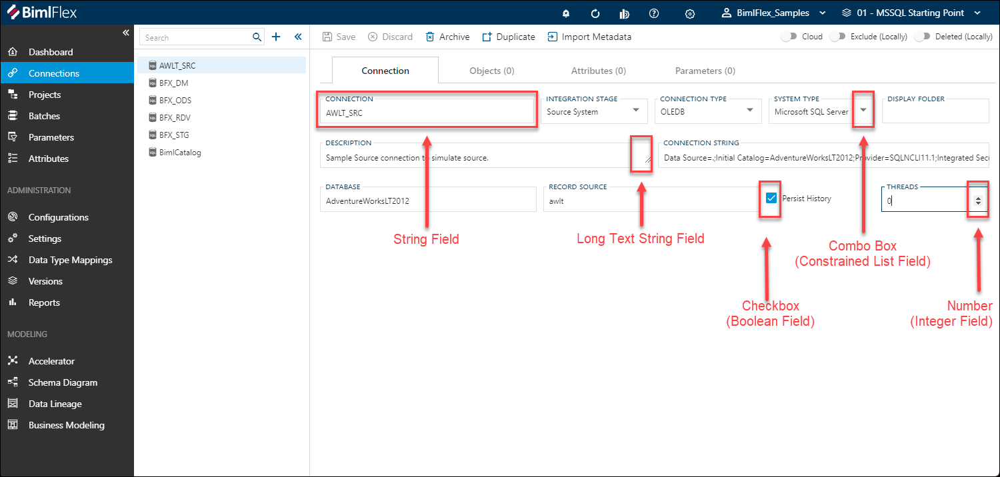
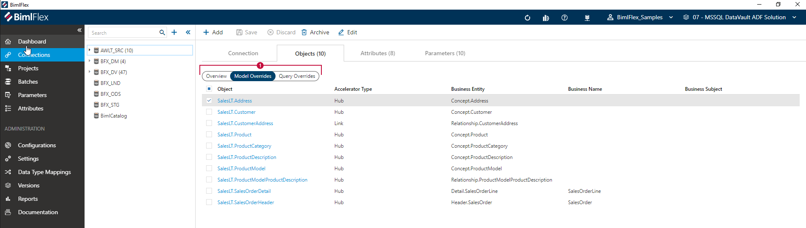
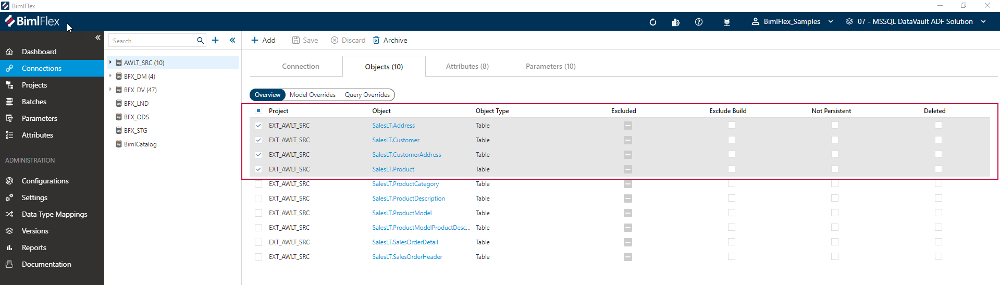

# BimlFlex App Overview

[!include[Connections](../includes/_incl-header-bimlflex-app.md)]

A quick overview of the User Interface elements that make up the BimlFlex App is provided in our [BimlFlex Tour](xref:bimlflex-tour), which demonstrates what features are available and how to navigate to them.

## BimlFlex App Components

### Overviews

| 
App Feature
 | Description |
| --------- | ----------- |
|[Dashboard](xref:bimlflex-dashboard) | The dashboard provides a quick view of the metadata in the version and contains the most common tasks and navigation options.|
|[Customers](xref:bimlflex-application-customers) | Customers provide a way to separate different organizations that can each define their own designs and versions thereof.|

### Editors

The BimlFlex App contains many editors to make managing the design of your data solution as easy as possible. An overview of the editing functionality covered by the App is provided below.

| 
App Feature
 | Description |
| --------- | ----------- |
|[Connection Editor](xref:bimlflex-connection-editor) | BimlFlex Connections provide the information required to connect to data sources. It also acts as containers for objects and allows setting overrides. Additionally, it has metadata to identify the integration stage along with package execution settings.|
|[Batch Editor](xref:bimlflex-batch-editor) | BimlFlex Batches group and help to define an ETL/ELT workload. They are used by Projects to set execution grouping.|
|[Project Editor](xref:bimlflex-project-editor) | BimlFlex Projects group and help to define an ETL/ELT workload. They specify the primary orchestration engine (SSIS or ADF) and define the Connections for the Source to Target pipeline.|
|[Object Editor](xref:bimlflex-object-editor) | BimlFlex Objects closely mirror a Relational Database table, though not every Object will translate as a table one-for-one due to BimlFlex having the ability to process flat files, Excel documents and, via use of Extensions Points, APIs calls.|
|[Column Editor](xref:bimlflex-column-editor) | The Column Editor is used to manage how BimlFlex interacts with all Columns in the BimlFlex process.|
|[Attribute Editor](xref:bimlflex-attribute-editor) | Attributes are used to conditionally override Configurations and Settings. They can also be used to extend the metadata model for bespoke coding requirements.|
|[Configuration Editor](xref:bimlflex-configuration-editor) | The Configurations module is used to manage configurations which drive the behavior of the BimlFlex product. By changing them the produced artifacts can adapt to support requirements for file locations, naming conventions, data conventions etc. The Configuration defaults are the Varigence recommended values and there is no need to change or configure unless there is a requirement to change specific behaviors.|

### Administration

| 
App Feature
 | Description |
| --------- | ----------- |
|[Settings](xref:bimlflex-setting-editor) | The Settings module is used to manage metadata and framework settings in the BimlFlex App. By changing settings, the produced artifacts can adapt to specific requirements for file locations, naming conventions, data conventions etc. Align these settings with the organizations best practices and environmental requirements.|
|[Data Type Mappings](xref:bimlflex-data-type-mappings) | BimlFlex Data Type Mappings provide the ability to map Data Types from a source system to another more standardized data type. This can be either a conversion of the Data Type entirely, such as a int to a bigint, the expansion of an existing Data Type, such as nvarchar(13) to nvarchar(20), or the combination of both, such as char(1) to nvarchar(10).|
|[Versions](xref:bimlflex-version-editor) | The Versions module is used to manage versions of the Metadata and BimlFlex versions for the active customer. Versions allow for changes in metadata or versions over time.|
|[Operational Reports](xref:bimlflex-operational-reports) | Operational Reporting screens allow users to see the status of their package runs at a high level and to drill down into details and view errors in failing packages.|

### Modeling

The Modeling features provides graphical tools for users to accomplish a range of data modeling tasks in an intuitive interface. Each tool provides views and actions that make sense in the context of the specific tool.

| 
App Feature
 | Description |
| --------- | ----------- |
|[Accelerator](xref:bimlflex-data-vault-accelerator) | The Data Vault Accelerator provides a quick-start opportunity with a best effort, technical modeling of Data Vault constructs out of the source metadata. It is configurable and provides a preview that can be rerun as many times as necessary so that the initial Data Vault modeling can be completed faster than through manual metadata modeling.|
|[Schema Diagram](xref:bimlflex-schema-diagram) | The Schema Diagram provides an entity relation view of any set of metadata based on the integration stage. It allows a user to get an overview of what the metadata looks like in an easy to understand view. It also helps the developer to execute the most common actions on the data in a graphical interface.|
|[Data Lineage](xref:bimlflex-data-lineage) | The Data Lineage Diagram provides an view of one or more relationships at column level. It allows a user to get a quick view of mappings and lineage in a graphical interface. It allows the developer to easily add or remove mappings using column drag and drop. It also provides some of the most common actions that make sense in the context of data mapping.|
|[Business Modeling](xref:bimlflex-business-modeling) | Design a holistic model that describes the business' data, while avoiding bias from already existing systems and data structures. Traditionally, this process involves a team of IT and business representatives collaborating in a series of workshops to define the business' Core Business Concepts (CBC), how they are described and how they interact with each other. The Business Modeling feature seeks to preserve the essence of this process: collaboration, discussion, and interaction, while simultaneously digitizing the team experience.|

# Customer Selection

The Customer Selection is used to change the context of the metadata that can be managed in the BimlFlex App. A Customer allows the creation of multiple separate areas that can have their own designs. A Customer can have one or more [Versions](xref:bimlflex-concepts-version).

Additional information on the Customer feature is available in the [Customer Concept Overview](xref:bimlflex-concepts-customer).

## New Customer Creation

[!include[NewCustomer](../includes/_incl-header-new-customer.md)]

[!include[BimlFlex Toolbar](../includes/_incl-toolbar.md)]

## BimlFlex Menu  

The BimlFlex Menu provides quick navigation to the available editors and modeling tools. The menu is dynamic and automatically expands and hides based on the current size of the application window.

If the menu is hidden, for example due to the size of the BimlFlex window or screen resolution, you can use the **Collapse**  icons annotated below to open or close the menu.

## Editor Layout  

The BimlFlex metadata editors aim to provide a streamlined and intuitive way to enter and manage your metadata. The visible features may vary from editor to editor, but they all use the same layout.

What follows is a quick tour of the various editor elements and how they function. For detailed information of the available the features reference the relevant documentation for the appropriate editor.

### Editor Action Buttons  

The **Editor Action Buttons** list the actions available within the currently selected item or user interface element in BimlFlex. While most areas in the BimlFlex App will show a set of generic action buttons, they are in fact context specific to the currently selected item or element. This means that buttons will be enabled or disabled when appropriate based on the selected element.

For example, if tabs are available,  different button (such as 'add') will be available than if a specific metadata element is selected.

The Editor Action Buttons are always located on the top of the screen, just under the [BimlFlex Toolbar](xref:bimlflex-tour#bimlflex-toolbar).

| Action | Overview |
| ----------------- | ---------- |
| Save | This will commit the values from the selected context to the BimlFlex Database. The application will prompt the user to save when context (e.g. screens) are changed and there is a risk that entered values will be lost |
| Discard | The discard button will revert any changed values in the current context to the original values before they were updated, assuming these have not been saved yet |
| Archive | Archive permanently deletes the metadata from the BimlFlex Database |
| Duplicate | The duplicate action button will create a new item based on the (values of) the selected item |
| Cloud | This slide toggle will show / hide certain configuration options that are only application to cloud connections |
| Excluded | This will determine if a selected item and its metadata will be excluded along with the rest of the solution. The item can still be seen by users who select the 'show excluded' option in the settings.
| Deleted | This slide toggle can flag a selected item to be considered deleted from the model, however the metadata is not physically removed from the BimlFlex database. The item can still be seen by users who select the 'show excluded' option in the settings.

>[!NOTE]
> In some cases, action buttons will appear greyed out. This indicates these are disabled for the current context.

### Treeview

The [**Treeview**](xref:bimlflex-treeview) provides an overview of existing components relative to the selected editor, and quick access to common features for managing the selected component.

When an editor is opened through the BimlFlex Menu, the default action is to show all components for the selected editor without any filtering applied.

>[!TIP]
> For additional information on the [**Treeview**](xref:bimlflex-treeview), including the **Search** and **Filtering** options, please refer to the [**Treeview Documentation**](xref:bimlflex-treeview).

### Editor Tabs

If the selected editor supports them, tabs are used to switch between managing of the selected parent component (with the name of the active editor) and managing of the associated child components.

>[!TIP]
> The first tab is considered the 'main' tab for an editor, and has the name of the active selected editor. For example 'Connection', 'Project' or 'Batch'.

## Current Editor Content

The editor is where all the metadata for the associated entity is represented. Layouts can vary depending on the editor being used but generally falls into one of three categories:

* Field List
* Table, or
* Multiple Views

### Field List  

A Field List provides a series of context sensitive fields that can be used to enter and update metadata. BimlFlex will dynamically hide and expose fields depending on the current properties of the selected editor.

Additionally, BimlFlex automatically applies field-level validations to prevent misconfiguration of metadata.

#### String Field

A string field allows for textual values, such as names or codes in free-text. An example is a name for a batch or connection.

#### Combo Box

A combo box, or constrained list field, shows possible values that can be selected from a drop-down list. These are the options provided by BimlFlex.

#### Number

A number, or integer, field accepts a natural number. The value can be increased or decreased by clicking on the up- and down arrows.

#### Checkbox

The checkbox, or Boolean, field can be turned on or off. When the checkbox has been enabled, a check will be visible. In some cases, a tri-state checkbox is available in BimlFlex. This indicates that lower-level features include a mix of enabled and disabled checkboxes.

#### Long Text String Field  

The long text string field can be resized by dragging the adjustment corner in the field. It also include an editor dialog with enhanced features for when a lot of information needs to be entered.

The editor dialog is accessed by clicking the  icon when the long text string field is in focus.

The editor dialog will open with the text from the long text string field. The editor dialog features include:  

* Text suggestions based on entered text
* Tab auto complete
* Scroll preview
* Line numbers

When changes are complete, click the '**Ok**' button to keep the changes that have been made. Click '**Cancel**' to discard the changes that have been made and close the editor.

### Table  

Table content is provided when an entity features some complex logic and should be edited through a dialog box. New items can be entered entered via the  **Add** button.

Existing items can be edited by selecting a row and then using the  **Edit** button.

#### Table Content

### Multiple Views  

When **Multiple Views** are used, an oval selector will appear listing out alternative views.
The active view is highlighted and can be changed by clicking another available option.
The alternate views only change what properties of an entity are visible/editable and will not filter, remove or resort the underlining list of entities.
Values can be edited by double-clicking the desired property.

### Sorting and Filtering

All grid views support sorting and filtering. Sorting can be done by clicking on the grid header, and repeat clicking will change the sorting direction.

Hovering over the header will show the  **Filter** button. Clicking this opens the filter dialog.

> [!NOTE]
> All of the columns support the ability for filters but the button is hidden by default. To show the button mouse over the field you would like to filter.

### Navigational Transitions and Checkbox Selection

BimlFlex features the ability to navigate directly to another component whenever it is referenced by a table or form. 

Click the light blue value will allow you to navigate directly to the the object referenced in the associated editor. Click the  icon for global navigation to any entity within the project.
Every navigable entity within the  will have such an icon.

BimlFlex features a checkbox UI system for any list of items being viewed. Highlight over a single item, and a checkbox will appear on the left. If selected, checkboxes will appear for all items in the list.

Selecting the checkbox at the top of the list will select/deselect all items. Having multiple items selected will allow the user to bulk-archive as many items as are currently selected.

With multiple items selected, users may select `Integration Key` from the **Objects** Action Bar to enter the Generate Derived Integration Key dialog menu with the desired items already selected.

# BimlFlex Treeview

The **Treeview** is one of the core ways of navigating through, and interacting with, the design metadata captured in BimlFlex.

The treeview is a context-sensitive visual representation of the relationships between metadata components. Where a component contains child components, it can be collapsed or expanded. It is located in the left-side navigation panel, between the menu items and the metadata editors.

In the treeview, the total number of items within an individual component will be displayed next to the object name. The treeview is expandable/collapsible by clicking the  icons.

Any instance of the  icon will serve as a Global Navigation Transition.
Clicking this icon will navigate the user directly to the referenced **Project**, **Connection** or **Object**.

The treeview side-panel contains a number of buttons and features that can be interacted with:

| Icon | Action | Description |
|-|-|-| 
| 

 | Add | **Add** will create a new entity. The exact entity depends on which editor is active. |
| 

 | Collapse | *Collapse* will cycle through the the various supported modes the Entity List can have.  Options are Full Panel, Split Panels, and Hidden. |
| 

 | Expand | *Expand* will cycle through the the various supported modes the Entity List can have.  Options are Hidden, Split Panels, and Full Panel. |

## Context Sensitive

### Connection Treeview

Depending on which menu item is selected, the treeview may show a different hierarchy of items.

For example, when the **Connections** are selected, the top level of the treeview will display the available **Connections**. These can be expanded to show the **Objects** that are associated to each connection, as well as the **Columns** belonging to each object.

Clicking on any of the items will open the corresponding editor. In the example above, this means that the **Connection Editor**, **Object Editor** and **Column Editor** can be accessed via the treeview in the connections menu.

The following menu items use the Connections Treeview:

* Connections
* Accelerator
* Schema Diagram
* Data Lineage

### Batch and Project Treeview

For **Batches** and **Projects**, only the top-level component is visible. No child items will be visible in the treeview. Clicking on an item in the treeview here will open the **Batch Editor** or **Project Editor** respectively.

### Parameter and Attribute Treeview

For **Parameters** and **Attributes** the object will not show its columns, but it's relevant parameters and attributes instead. By clicking on any of these, the corresponding editor will be opened.

## Search

The search control at the top of the treeview can be used to limit the visible components. The search field will only present items containing the term being searched, and will automatically expand if matched items are found.