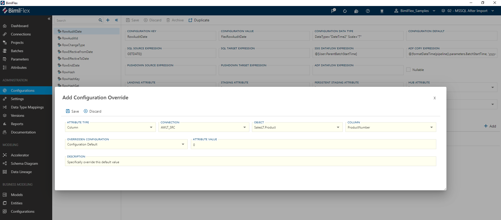
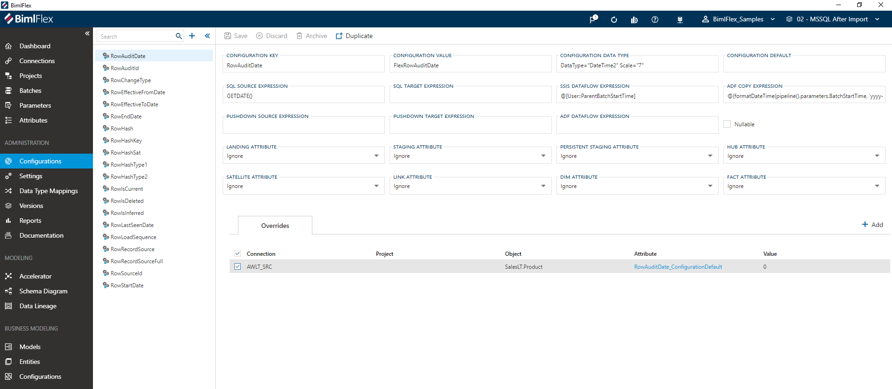

# Configuration Editor

[!include[Configurations](../includes/_incl-header-configuration.md)]

## Overview

 **Configurations** can be found under Administration in the BimlFlex App menu.

> [!NOTE]
> Detailed descriptions of all **Configuration Editor** fields and options are available in the [Reference Documentation](xref:bimlflex-reference-documentation-Configurations).

## Action Buttons

The action buttons modify the **Configuration** that is active in the editor.

| Icon | Action | Description |
| ---- | ------ | ----------- |
| 

 | Save | This will save any changes displayed in the **Configurations** editor.  The **Save** button is only enabled if there are changes in the editor.|
| 

 | Discard | **Discard** any unsaved changes and revert to last saved form.|

## Configuration Editor Overview

The **Configuration Editor** is used to manage all **Configurations**. The fields in the editor are defined in this table along with the validation rules.

### Configuration Application Properties

The definition of each configuration can be seen as a *Global Configuration*, and will apply to specific **Objects** based on their configuration. The configuration properties below control where each configuration applies. Exactly *how* the configuration applies depends on the selected **Configuration Attribute Type** for each individual application property.

| 
Field
| Description |
|------------------------------------ | ----------- |
| Landing Attribute            | Determines if the configuration is applied to objects in a `Landing` connection.|
| Staging Attribute            | Determines if the configuration is applied to objects in a `Staging` connection.|
| Persistent Staging Attribute | Determines if the configuration is applied to objects in a `Persistent Staging` connection.|
| Hub Attribute                | Determines if the configuration is applied to objects that have the `Hub` object type.|
| Satellite Attribute          | Determines if the configuration is applied to objects that have the `Satellite` object type.|
| Link Attribute               | Determines if the configuration is applied to objects that have the `Link` object type.|
| Dim Attribute                | Determines if the configuration is applied to objects that have the `Dimension` object type. If any Dimension objects in the project have `Type 2` columns, *Dim Attribute* must be set to `Derived`.|
| Fact Attribute               | Determines if the configuration is applied to objects that have the `Fact` object type.|

### Configuration Attribute Types

[!include[Object Types](../../07-reference-documentation/static-data/_enum-configuration-attribute-type.md)]

## Configuration Overrides

**Configuration Overrides** are used to override how configurations values are applied for selected areas of the design. For example, to implement a configuration for all columns except for the ones in a specific project. Overrides allow highly granular control of exceptions that need to be implemented in the solution.

All overrides that apply to the selected configuration are listed in the **Overrides** section of the editor.

### Adding a Configuration Override

To add a **Configuration Override**, click `+ Add` on the Overrides tab. This will open the **Configuration Override Editor**.

The **Configuration Override Editor** allows the override to apply at various levels of abstraction, for example at **Column** level, **Object** level, **Project** level or even for the entire **Connection** or **Customer**. This is specified by the `Attribute Type`. Depending on the selected type different options will be shown to specify the exact item the override needs to apply for.

> [!NOTE]
> The **Configuration Override Editor** will apply to the selected configuration.

The example below shows an override that applies to a specific **Column**, and overrides the `Configuration Default` that otherwise would apply based on the global configurations.

The fields that are visible in the editor depend on the selected `Attribute Type`, but the following fields will always be shown:

| Field Name               | Description                                         |
| -------------------------| --------------------------------------------------- |
| Attribute Type           | Defines the scope to which the override is applied. Depending of the selection option more detailed fields will shown as relevant for the selected scope.|
| Overridden Configuration | Defines the **Configuration** that will be overridden.|
| Attribute Value          | The value with which the **Configuration** will be replaced for the selected scope.|
| Description              | Allows to add a meaningful description explaining the purpose of the override.|

Depending on the selected Attribute Type, the following options will be made available for more granular control of the scope. All fields will be mandatory for the selected scope option.

| Attribute Type           | Options | More Information |
| -------------------------| --------------------------------------------------- | --------------------------------- |
| Column                   | Adds **Connection**, **Object** and **Column** fields.| [Column Editor](xref:bimlflex-column-editor)|
| Object                   | Adds **Connection** and **Object** fields.| [Object Editor](xref:bimlflex-object-editor)|
| Project                  | Add the **Project** selector field.| [Project Editor](xref:bimlflex-project-editor)|
| Connection               | Add the **Connection** selector field.| [Connection Editor](xref:bimlflex-connection-editor)|
| Customer                 | Does not add any fields, the override will apply to all content in the active **Customer**.| [Customer Overview](xref:bimlflex-concepts-customer)|
| Batch                    | Add the **Batch** selector field.| [Batch Editor](xref:bimlflex-batch-editor)|

When saving the override, BimlFlex will assign a unique name for the override. This will be a combination of the *Configuration Key* and the property to which the override applies.

### Editing or Archiving a Configuration Override

#### Using the Configuration Override Editor

In the **Configuration Editor**, the overrides that apply to the selected configuration are listed in the **Overrides** section.

To edit or remove the override, select the designated override and click on the `Edit` button. This will open the **Configuration Override Editor** where editing and archiving is possible.

Compared to adding a new override there are additional options when editing an existing override. The options are as follows:

| Icon | Action | Description |
|----|-|--------|-------------|
| 

 | Save | This will persist changed made to the override.|
| 

 | Discard | Pending changes to the override will be discarded.|
| 

 | Archive | Archive will remove the override from the active metadata repository, and move it to the metadata archive.|
| 

 | Duplicate | Allows to make a copy of the selected override. A new dialog will be shown to provide a new unique name for the new override and modify its details.|

### Using the Attribute Editor

**Configuration Overrides** are managed as **Attributes** in BimlFlex. The [Attributes Documentation](xref:bimlflex-attribute-editor) provides information on **Attributes** and how to manage them.

This means that all overrides that are created will also be visible in the [**Attribute Editor**](xref:bimlflex-attribute-editor) , and it is possible to edit and/or remove them here as well.

From the **Configuration Override Editor** it is possible to directly navigate to the corresponding **Attribute** by clicking on the attribute link in the overrides section. This will open the **Attribute Editor** and show the details of the selected override displayed as an **Attribute**.
