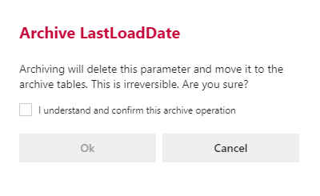

#### Archive Parameter Dialog

Confirmation box warning against the dangers of archiving.  You are required to confirm by both the check box and the *Ok* button.  

>[!WARNING]
> Archiving is a permanent removal of the selected entity from its associated table in the BimlFlex Database. The best practice is to first use the *Deleted* flag (soft delete) as an indication that the connection may need to be removed.
