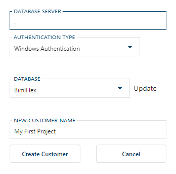

The [**Customer**](xref:bimlflex-concepts-customer) is the top-level grouping of metadata in the BimlFlex database. A customer represents an independent logical area for which the metadata is separated from other customers.

Customers can be used to identify different companies, teams or initiatives. Any metadata defined for a specific customer can not be used by other customers in BimlFlex.

A customer can contain multiple [**Versions**](xref:bimlflex-version-editor) to manage changes in metadata over time, but can also be used for a more fine-grained approach to separate metadata. For example, if you want to organize BimlFlex to use a single customer to represent the company, versions can be defined to represent separate teams or initiatives.

A customer can have multiple versions of metadata. An initial version is created for a new customer.

Use the **New Customer Button** in the BimlFlex App to add the customer to the BimlFlex database.

The customer can also be created through:

* BimlStudio > BimlFlex Ribbon > Open Bundle > New Customer
* BimlFlex Excel Add-in > BimlFlex Ribbon > Metadata Connection pane > New Customer
