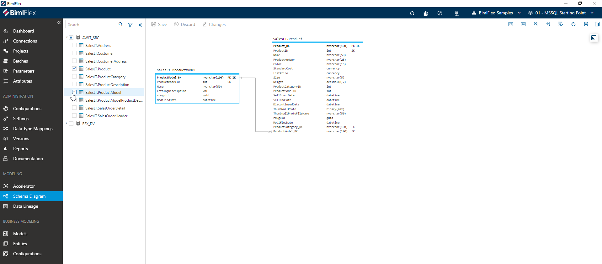

The [**Schema Diagram Designer**](xref:bimlflex-schema-diagram) provides an Entity-Relationship view of the BimlFlex metadata. It assists the modeler in getting an overview of the metadata, and helps to execute common actions in a graphical interface.

The screenshot above shows the Schema Diagram of a subset of the imported source [**Objects**](xref:bimlflex-object-editor).

Using the Schema Diagram Designer, the properties of objects and [**Columns**](xref:bimlflex-column-editor) can be modified. It is also possible to define new [**Integration Keys**](xref:bimlflex-concept-integration-keys) and use these to define references to other objects.

These references, in turn, can be used to deliver the correct models using the [**Accelerator**](xref:bimlflex-data-vault-accelerator).
