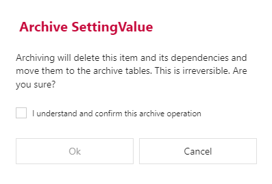

### Action Buttons

All **Attributes** assigned to the current entity show here.  New items can be entered via the *Add* action button.  Existing items can be edited by clicking the *Value* field to select the **Attribute** and using the *Edit* action button.  Various [navigational transitions](#navigational-transitions) are available on this form and outlined below.  

The following options are available:

| Icon | Action | Description |
| ---- | ------ | ----------- |
| 

 | Add | **Add** will create a new **Attribute** and assign it to the current entity.  When adding an attribute via this button, *Attribute Type* and the respective linked fields, will be pre-filled on the created [Add Attribute Dialog](#add-attribute-dialog). |
| 

           | Save    | **Save** will save the currently set of staged changes.  The **Save** button is only enabled if any **Attribute** has changes staged and there are no major validation issues with the current list of **Attribute** properties.                                                                                                                                              |
| 

 | Discard | This will **Discard** any unsaved changes and revert to last saved form.|

When checking a single **Attribute** in the overview two additional options will become visible. When selecting two or more attributes only the Archive option will be visible.

| Icon| Action| Description|
| ----| ----- | ---------- |
|

|Archive|**Archive** will hard delete the selected **Attribute**.  This will result in the physical removal of the selected record from the BimlFlex database.  The data will no longer be accessible by the BimlFlex Applicationand will require a Database Administrator to restore. Clicking **Archive** will create an [Archive Attribute Dialog](#archive-attribute-dialog).|
|

|Edit|**Edit** will open an [Edit Attribute Dialog](#edit-attribute-dialog) to edit the currently selected **Attribute**.  After edits are complete, be sure to click the **Save** button to confirm the changes.|

### Additional Dialogs  

[!include[Add Attribute Dialog](../dialogs/_dialog-add-attribute.md)]  

#### Edit Attribute Dialog

Edit the selected **Attribute**.  Once entry is finished ensure that the  **Save** button is clicked.

#### Archive Attribute Dialog

Confirmation warning against the dangers of archiving.  You are required to confirm by both the check box and the *Ok* button.

>[!WARNING]
> Archiving is a permanent removal of the selected entity from its associated table in the BimlFlex Database. The best practice is to first use the *Deleted* flag (soft delete) as an indication that the connection may need to be removed.

### Attribute Tab View

The **Attribute Tab** provides a different way to review the properties of **Attributes** associated with the selected entity.

#### Overview

The following details are shown in this view:

| Component              | Type                 | Description                        |
| ---------------- | -------------------------------------------------------------------- | ------------------------------------------- |
| Object            | Value                | The name of the **Objects** as associated with the current **Connection**. See the [Object Editor](xref:bimlflex-object-editor) documentation for more details.|
| Column        | Navigational Value                | Define the scope of the **Attribute**. See the [Attribute Editor](xref:bimlflex-attribute-editor) for more details. |
| Attribute           | Navigational Value | Define the scope of the BimlFlex process that the **Attribute** is applied to. Attribute Type is required and must be a valid [Attribute Type](xref:bimlflex-attribute-editor#attribute-types). |
| Value      | Value | The value to be returned when the custom attribute is accessed by the framework. See the [Attribute Editor](xref:bimlflex-attribute-editor) for more details.|
| Property     | Field       | Define the value for a custom attribute if it is not specified in the Attribute Value field. See the [Attribute Editor](xref:bimlflex-attribute-editor) for more details.|

##### Navigational Transitions

From the **Attribute Tab**, it is possible to navigate directly to the following areas of BimlFlex:

| Item | Action |
| ---- | ------ |
| Object Value | Navigate to the [**Object Editor**](xref:bimlflex-object-editor), by clicking  |
| Column Value | Navigate to [**Column Editor**](xref:bimlflex-column-editor), selecting clicked **Column** |
| Attribute Value | Navigate to [**Attribute Editor**](xref:bimlflex-attribute-editor), selecting clicked **Attribute** |
