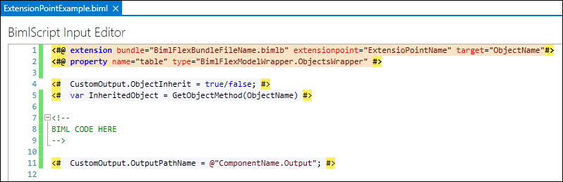
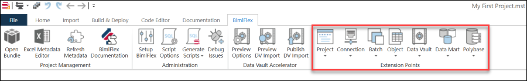

[Extension Points](xref:bimlflex-concepts-extensionpoints) are one of the key features BimlFlex provides customization to cater for specific scenarios. While the standard templates cover most real-world scenarios, there may be a specific tweak that would improve certain specific requirements. These modifications can be defined using Extension Points, that allow for custom logic to be added to a template at various points in the process.

It is important to remember that many features and functions available in BimlFlex allow for customisation in a way that does not require Extension Points. For example [Load Parameters](xref:bimlflex-concepts-metadata-parameters), [Settings and Overrides](xref:bimlflex-reference-documentation-settings-index), custom source queries with joins and filters, inherited tables and columns, data type expansions etc. are all available without the need for Extension Points.

Extension Points are meant to modify the behaviour of the data solution when the available BimlFlex features do not meet specific requirements.

> [!NOTE]
> Detailed information on Extension Points is available in the [Extension Point definitions](xref:bimlflex-reference-documentation-extensionpoints-index) reference documentation.

Extension Points are used to extend the default functionality of BimlFlex using standard Biml code. They can extend and override many different areas of the BimlFlex framework.

Extension Points have four key components:

* Extension Point directives that control _what_ (the Extension Point name) is injected and _where_ (the target reference).
* Inheritance options code that defines any object inheritance.
* Custom code that implements the required behaviour.
* Input and output path variables for adding the Extension Point to the data logistics process.

The resulting custom code created through the Extension Point can be Biml code or a combination of SQL, .Net and Biml code. However, the resulting output must always provide BimlScript compatible code so that the overall solution can complete the build process in BimlStudio.

Extension Points are created in BimlStudio, and a library of Extension Points is provided upon installation. The Extension Points are available in the BimlFlex Ribbon tab in BimlStudio, and they are organized there are several Extension Point areas with a large number of different Extension Points available. Each Extension Point template will generate a code block that targets a specific point of the project.

> [!NOTE]
> Extension Points are saved as Biml files in the BimlStudio Project and should be treated as source code for the solution.

A full overview of available Extension Points is available in the [Extension Point Reference Documentation](xref:bimlflex-reference-documentation-extensionpoints-index).
