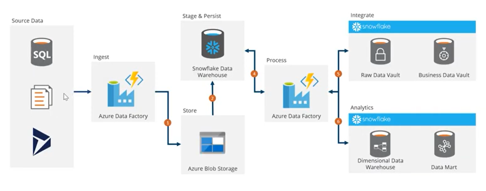
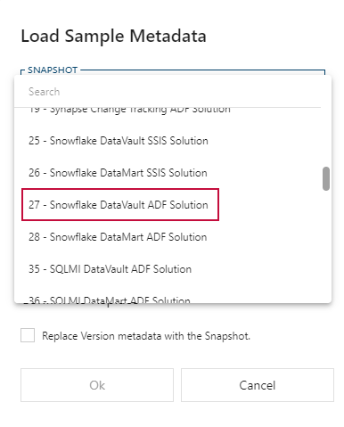
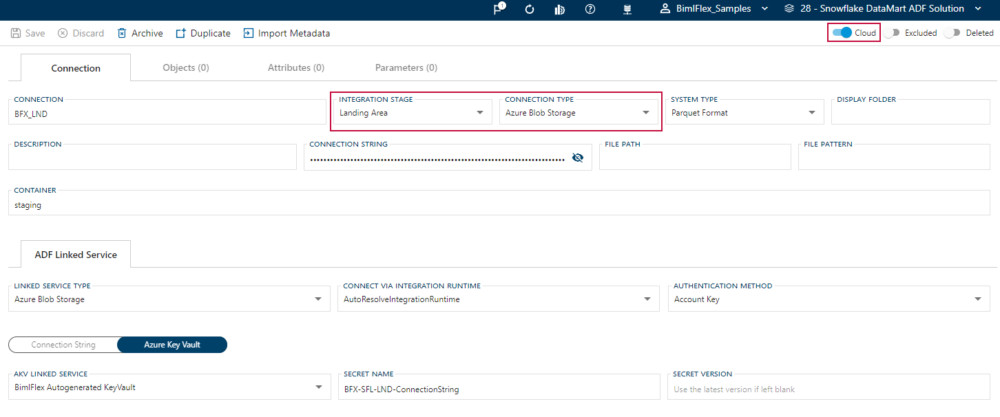
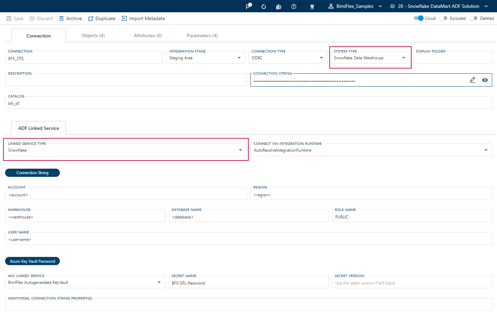
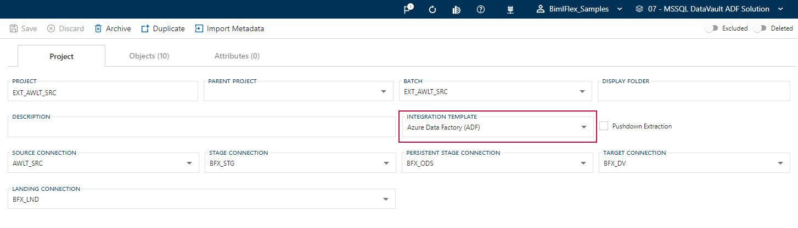
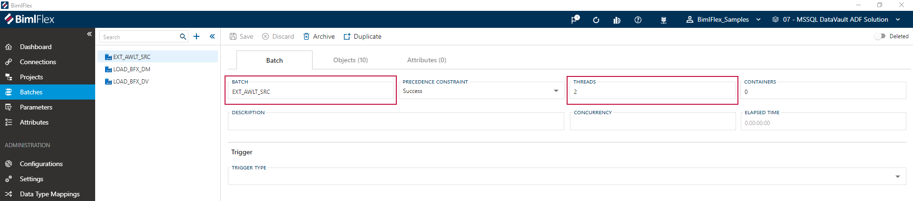
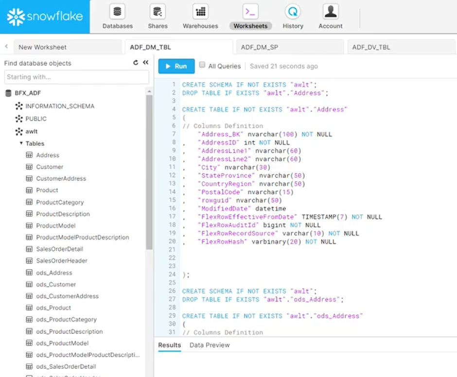
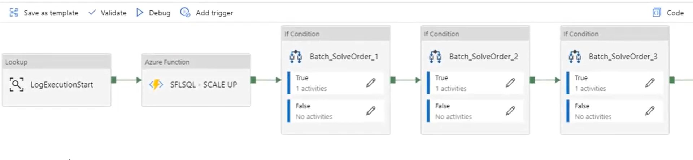
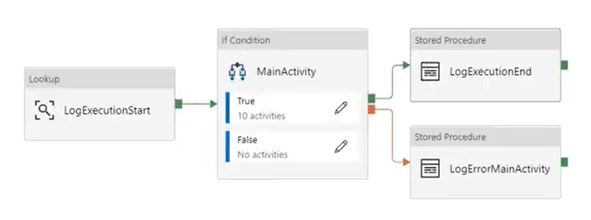

# Implementing Databricks Using Azure Data Factory

BimlFlex has established an intuitive process to implement Databricks using Azure Data Factory (ADF) for cloud based data warehousing solutions, as demonstrated in the video below.

## Architecture

Regardless of source data, this example will utilize ADF copy commands to ingest and land (stage) the source data in Azure Blob Storage, as a parquet file.

BimlFlex will provide logic to map the resulting files so that the generated Databricks Stored Procedure code can load the data into the Databricks tables.

With the source data being held in a Databricks database, again using Azure Data Factory and function bridge, the data can then effectively be processed into Data Marts or Data Vaults.

### Implement Databricks using Azure Data Factory

> [!NOTE]
> The example is intended to follow the guide for [Creating a Landing Area](xref:bimlflex-adf-landing-area#configure-a-landing-area-by-example).

The following video walks through the common steps and considerations for deploying an Azure Data Factory for Databricks.

> [!NOTE]
> Additional BimlFlex documentation regarding the implementation of Databricks in Azure Data Factory can be referenced [here](xref:bimlflex-databricks-configuration-overview).

## How to Configure Databricks in BimlFlex

Detailed prerequisites on working with Databricks and BimlFlex are provided in the [Databricks configuration overview](xref:bimlflex-databricks-configuration-overview) section. The below information assumes this configuration has been completed.

### Databricks Samples

BimlFlex provides a number of metadata samples, including samples that have a specific focus on Databricks within Azure Data Factory in this example.

Loading the sample metadata from within BimlFlex is as simple as selecting the snapshot from the *Load Sample Metadata* dropdown menu on the BimlFlex **Dashboard**.

> [!NOTE]
>More information on the specific creation of Data Marts and Data Vaults:
>
>* [Data Vault Templates](xref:bimlflex-data-vault-index)
>* [Data Mart Templates](xref:bimlflex-data-delivery-index)

As with all examples the data here is pointed at AdventureWorksLT 2012. The imported sample metadata will have modeled point in time (PIT) tables and bridge tables, and on top of those, built Data Mart tables, and Dimension- and Fact tables.

### BimlFlex Standard Connections

The connection settings remain standard as per previously uploaded BimlFlex featured videos, and should be configured as follows from within the BimlFlex **Connections** menu:

* *Source System* is cloud enabled
* *Staging / Landing Environment* is configured for Blob Storage configured with ADF linked services

* *System Type* is configured for Databricks Data Warehouse
* *Linked Service Type* is configured for Databricks

> [!NOTE]
> Within Azure Data Factory the "Linked Service Type" for Databricks does not actually exist. However, when this option is selected, BimlFlex automatically knows to use the function bridge specifically created to load data into Databricks

* *Integration Template* is configured for ADF Source -> Target

The simplicity of selecting settings, paired with the intelligence of BimlFlex to execute the appropriate functions, greatly streamlines the process of converging any solution into Databricks.

Prior to building out a solution BimlFlex also allows the opportunity to configure batches, assign batches to different compute warehouses, or adjust scaling up or down, from within the BimlFlex **Batches** menu.

## Output

BimlFlex will provide all necessary Databricks code, such as table, queries, and procedures definitions.

Depending on the selected **Integration Template**, BimlFlex will also generate supporting orchestration artifacts in either SSIS or ADF. But, because the data logistics themselves are running fully on Databricks using Stored Procedures, it is possible to use third party orchestration approaches or tools to direct the overall process.

The output has been configured for Databricks, deployed to Azure Data Factory, and visualized as such:  

Having now generated a solution, which may or may not consist of multiple compute warehouses targeting different batches, the following options may be adjusted:

* Scale up or scale down
* View copy commands including completions or errors.
* Suspend a solution

>[!NOTE]
> Any files in error will be moved to an error folder or archived. On the next run those files will have already been processed and moved to an appropriate folder.

>[!TIP]
>For additional videos relating to BimlFlex and Databricks integration, see:
>
>* [Configure Databricks Project](https://www.youtube.com/watch?v=yPWKs65JSFo&t=1s)
>* [Databricks Source to Stage](https://www.youtube.com/watch?v=9y5sGkPrfWU)
>* [Databricks Parallel Loading with Integration Keys](https://www.youtube.com/watch?v=_bQ4lact0Tw)
>
>For additional documentation regarding Databricks configuration please refer to the [Databricks Configuration Overview](xref:bimlflex-databricks-configuration-overview).
