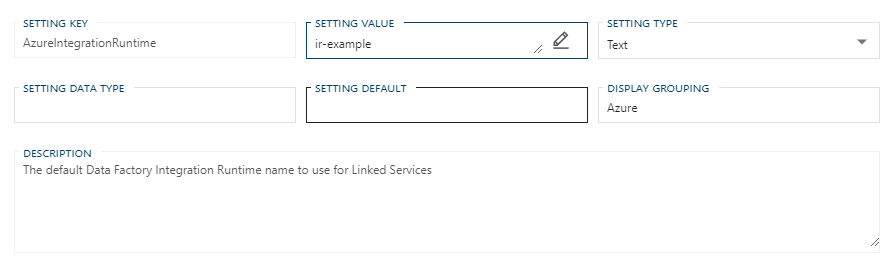
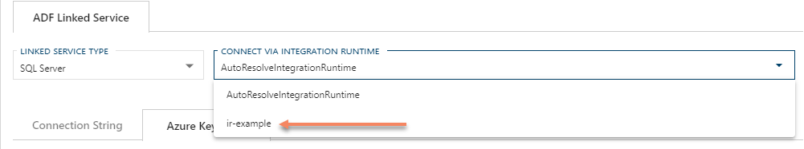

# Azure Data Factory Deployment Guide

<!-- TODO: Intro

BimlFlex accelerates the creation of Azure Data Factory orchestration project.

BimlFlex streamlines the creation of an Azure Data Factory.

The Data Factory can be configured to integrate with an existing Azure artifacts or .

Data Factory and integrate with existing Azure artifacts.

BimlFlex can accelerate the creation of a Azure Data Factory.

By only using metadata BimlFlex allows for automated ADF generation.

Quick and easy

rapid deployment

Existing Environment for best results

-->

> [!NOTE]
> Azure Data Factory is only one of the options for orchestrating your data warehouse environment.
> To learn more about another option see the [SQL Server Integration Services Deployment Guide](xref:bimlflex-ssis-deployment-guide).

## Deploying an Azure Data Factory By Example

> [!NOTE]
> The example is intended to follow the guide for [Creating a Landing Area](xref:bimlflex-adf-landing-area#configure-a-landing-area-by-example).

The following video walks through the common steps and considerations for deploying an Azure Data Factory for a Staging Area.


The general architecture of the generated Azure Data Factory is below.


### High Level Steps

The following steps are required though not highlighted in the video as they were completed in the previous video on [Configuring an Azure Data Factory Landing Area](https://www.youtube.com/watch?v=fYA4yTPe4ao?rel=0&autoplay=0 "BimlFlex - Configure Azure Data Factory Landing Area").

* Configure a Landing Area **Connection**
* Configure **Linked Services** for each **Connection** used by Azure Data Factory
  * If a Source System, Assign the Landing Area **Connection** as the *Landing Connection*
  * Enable *Cloud*
  * Populate the *ADF Linked Service* as required
* Update the BimlFlex **Project** to use *Integration Template* of `ADF: Source -> Target`

The following are the steps outlined in the video.

* Import metadata from Source System
* Build the Solution (Example uses BimlStudio)
* Deploy the Solution (Example uses PowerShell)

### Importing Metadata

The example uses imported metadata from the tables included in [AdventureWorksLT2012 database](https://github.com/Microsoft/sql-server-samples/releases/tag/adventureworks).

> [!TIP]
> For additional details on Importing Samples and Metadata refer to the below guides:  
> BimlFlex Docs: [Load Sample Metadata](xref:bimlflex-getting-started-sample-metadata)  
> BimlFlex Docs: [Importing Source Metadata](xref:bimlflex-getting-started-importing-source-metadata)  
> Microsoft Docs: [AdventureWorks installation and configuration](https://docs.microsoft.com/en-us/sql/samples/adventureworks-install-configure)

In order to generate the Staging Area, metadata for **Objects** from a Source System will be needed.

> [!NOTE]
> The example could be followed along with using metadata from any supported Source System.

### Building the Solution

Once the required metadata has been imported and configured the next step is to build the solution to generate the deployable artifacts.
Once a [BimlStudio project is setup](xref:bimlflex-setup-bimlstudio-project), this can be done simply by click the **Build** shortcut button.


Alternatively the **Build & Deploy** tab can be selected to click the **Build** button.


> [!TIP]
> For additional details on Building a Solution refer to the below guides:  
> BimlFlex Docs: [BimlFlex - Setup BimlStudio Project](xref:bimlflex-setup-bimlstudio-project)  
> BimlFlex Docs: [BimlFlex Generating DDL](xref:bimlflex-generating-ddl)  
> BimlFlex Docs: [BimlFlex Interactive Build](xref:bimlflex-interactive-build)  
> BimlFlex Docs: [Building Using the Command Line](xref:bimlflex-command-line-build)  
> BimlFlex Docs: [BimlFlex Continuous Integration and Continuous Delivery](xref:bimlflex-adf-continuous-integration-and-continuous-delivery)  

The process outlined is know as an [Interactive Build](xref:bimlflex-interactive-build), but a [Command Line Build](xref:bimlflex-command-line-build) can also be configured to assist with automation and a [Continuous Integration/Continuous Delivery](xref:bimlflex-adf-continuous-integration-and-continuous-delivery) framework.

### Deploy the Solution

As part of the the build process, BimlFlex will output artifacts and name them using the `<Output Folder>` and `<Data Factory Name>`.

> [!NOTE]
> *Output Folder*: The default output folder is `<Project Working Directory>\output\`.
> This can be configured under the BimlStudio project properties under **Build**, *Output Path*.
>  
> *Data Factory Name*: Uses the `AzureDataFactoryName` **Setting**, or `BimlFlex` if the *Setting* is blank.

A PowerShell script named `adf-deploy.<Data Factory Name>.ps1` will be output to the `<Output Folder>\Deploy\` folder to assist with deployment.
BimlFlex will automatically input the [Azure Environment Settings](#azure-environment-settings) if populated or these can be entered manually prior to script execution.
All variables and artifacts should be reviewed prior to the execution of the script as executing the script will generate billable Azure artifacts.

> [!IMPORTANT]
> **Ensure the script and JSON artifacts are reviewed prior to deployment.**
> The PowerShell script will create the Azure resources specified within the JSON files.
> In addition, the script will overwrite an existing object in Azure with the one currently defined JSON values if it already exists.

Though [PowerShell](xref:bimlflex-adf-using-powershell) is used in the example, the [Azure Portal](xref:using-azure-portal) can also be used.
This method uses the `arm_template.json` and `arm_template_parameters.json` files found in the `<Output Folder>\DataFactories\<Data Factory Name>\` directory.
These files are aggregate of the entire Azure environment generated by BimlFlex.

> [!TIP]
> For additional details on deploying your Azure Data Factory refer to the below guides:  
> BimlFlex Docs: [Deployment Through PowerShell](xref:bimlflex-adf-using-powershell)  
> BimlFlex Docs: [Deployment Through the Azure Portal](xref:using-azure-portal)  

BimlFlex will also output the JSON for each artifact individually should they be required for additional deployment methodologies.
These are found inside the `<Output Folder>\DataFactories\<Data Factory Name>\<Artifact Type>` directories named `<Object Name>.json`.

### Wrapping Up

That concludes the deployment of an Azure Data Factory.
If not already done, the Staging Area database would also need to be completed prior to execution of any Azure Pipelines.
Additional steps for this, and the other Integration Stages can be found in the [Deploying the Target Warehouse Environment](#deploying-target-warehouse-environment) section below.

If accessing an on-premise data source, an [Integration Runtime](#on-premise-data-source) will also need to be configured.

The example uses an Azure Key Vault with pre-configured Secrets.
Refer to [Azure Key Vault and Secrets](#azure-key-vault-and-secrets) for details on configurations.

Additional reading is provided under the [Detailed Configuration](#detailed-configuration) to highlight initial environment requirements, alternate configurations and optional settings.

## Detailed Configuration

In addition to the scenario given the example, BimlFlex support multiple Integration Stages and Target Warehouse Platforms.
The following sections outline the specific considerations when Azure Data Factory across various architectures and platforms.
Although features are highlight that are [Azure Synapse](xref:bimlflex-synapse-implementation) or [Snowflake](xref:bimlflex-snowflake-implementation) specific, the following articles are only designed to highlight the Azure Data Factory implications.
The referenced implementation guides should still be consulted prior to deploying an Azure Data Factory using either platform.

> [!TIP]
> For additional details on Target Warehouse Platforms refer to the below guides:  
> BimlFlex Docs: [Synapse Implementations](xref:bimlflex-synapse-implementation)  
> BimlFlex Docs: [Snowflake Implementation with ADF](xref:bimlflex-snowflake-implementation)  

### Configuring a Landing Area

When using ADF to orchestrate data movement a Landing Area is required to ensure the data is in the same environment as the Target Warehouse Environment.
This subject is covered in depth in the separate [Configure Azure Data Factory Landing Area](xref:bimlflex-adf-landing-area) guide.

### Configuring a ADF Project

In order to configure the **Project** for Azure Data Factory, simple set the *Integration Template* to `ADF: Source -> Target`.
BimlFlex requires that all **Connections** used be enabled for *Cloud*, **ADF Linked Service** configured.
If the **Connections** is not already, *Connection Type* needs to be set to `OLEDB SQL Based ELT` (or `ODBC SQL Based ELT` for Snowflake).

> [!NOTE]
> All **Projects** required a *Batch* and at minimum a *Source Connection* and *Target Connection*.

#### Converting a SSIS Project

BimlFlex allows for a rapid transition from an SSIS orchestration to an Azure Data Factory orchestration by applying the above settings.
Key points of consideration though are any existing *SSIS Dataflow Expressions* across **Configurations**, **Settings** and **Data Type Mappings**.

Azure Data Factory has a separate Expression Language from SSIS and as such requires separate logic and configuration.

### Initial Configuration

There are some environments that will require some additional setup outside of the configuration and installation of BimlFlex.
The scenarios where configuration will need to be configured outside of the BimlFlex/BimlStudio environment are listed below.

* On-premise Data Source
* Blob Storage Configured Landed Area\*

<!-- PolyBase not yet supported

- PolyBase Architecture (Synapse)\*\*

-->

> [!NOTE]
> **\***: Currently a Blob Storage Configuration is only supported by Snowflake

<!-- PolyBase not yet supported

>  
> **\*\***: In addition to PolyBase Architecture notes also follow guidelines for a Blob Storage Configured Landing Area.

-->

#### On-Premise Data Source

An on-premise data source will require the installation and configuration of an Self-Hosted Integration Runtime in order for the Azure Data Factory to have access to the data.
The following guides are provided for additional reference material and configuration details.

> [!TIP]
> For additional details on installing and configuring and Integration Runtime refer to the below guides:  
> Microsoft Docs: [Integration runtime in Azure Data Factory](https://docs.microsoft.com/en-us/azure/data-factory/concepts-integration-runtime)  
> Microsoft Docs: [Create and configure a self-hosted integration runtime](https://docs.microsoft.com/en-us/azure/data-factory/create-self-hosted-integration-runtime)  

<!-- SIR not yet supported

> Microsoft Docs: [Create a shared self-hosted integration runtime in Azure Data Factory](https://docs.microsoft.com/en-us/azure/data-factory/create-shared-self-hosted-integration-runtime-powershell)  

-->

Once an Self-Hosted Integration Runtime is configured, it will need to be added to BimlFlex.
This can be done by populating the BimlFlex `AzureIntegrationRuntime` **Setting**.



The value will then be available in the **ADF Linked Service** as an option under the *Connect Via Integration Runtime* dropdown.



If additional values are needed, they can be entered into the field as needed.

> [!WARNING]
> BimlFlex does not currently support a Shared Integration Runtime through automation.
> If a Shared Integration Runtime is required it will have to be manually assigned after build.

#### Blob Storage Configured Landing Area

Outside of configuring the appropriate settings for the [Blob Containers](#azure-blob-container-settings-blob-storage-configuration-only), the appropriate Azure artifacts will first need to be created.

##### Creating a Storage Account

Before a Blob Container can be created an Azure Storage Account needs to be created to host it.
The minimum requirement is one Azure Storage Account.
Depending on the needs of the environment though, as many as one Azure Storage Account per Blob Container can be created.

> [!TIP]
> For additional details on creating Azure Storage Account refer to the below guide:  
> Microsoft Docs: [Create an Azure Storage account](https://docs.microsoft.com/en-us/azure/storage/common/storage-account-create)

##### Creating a Blob Container

The Blob Container will be where the actual blob files are landed.
A separate container will need to be created for the staging (initial landing), archive (destination after a successful stage) and error (destination after a failed stage).

> [!TIP]
> For additional details on creating a Blob Container refer to the below guide:  
> Microsoft Docs: [Quickstart: Upload, download, and list blobs with the Azure portal](https://docs.microsoft.com/en-us/azure/storage/blobs/storage-quickstart-blobs-portal)

### Azure Key Vault and Secrets

An important part of handling sensitive information in Azure is the use and management of an Azure Key Vault.
BimlFlex supports both the dynamic creation of the required Azure Key Vault or the ability to reference existing Azure Key Vaults.

#### BimlFlex Auto-generated Key Vault

With an *AKV Linked Service* set to `BimlFlex Autogenerated KeyVault`, BimlFlex will automatically generate an Azure Key Vault named from the `AzureKeyVault` **Setting**.
BimlFlex will automatically assign the Access Policies needed by the Azure Data Factory so it can access the required Secrets.
In addition, required Secrets will also be created and populated with a value of `xxx`.

> [!WARNING]
> The `AzureKeyVault` **Setting** along with an *AKV Linked Service* set to `BimlFlex Autogenerated KeyVault` will clear out any Access Policies or Secrets defined through BimlFlex.
> If additional Access Policies were defined, such as User Principal access, or additional Secrets created they will not persist after redeployment.
> The configured values in specified Secrets will however persist.

The following is the minimum needed Access Policy for a User Principal needs in order to update the Secrets.

| Access Policy | Object         | Key Permissions | Secret Permissions | Certificate Permissions |
| ------------- | -------------- | --------------- | ------------------ | ----------------------- |
| User          | User Principal |                 | List, Set          |                         |

> [!TIP]
> For additional details on Azure Key Vaults and Sensitive Information Management refer to the below guides:  
> BimlFlex Docs: [Using Azure Key Vaults for Connection settings](xref:linked-service-azure-key-vault)  
> BimlFlex Docs: [Sensitive Information Management in Azure Data Factory](xref:sensitive-info-management)  

#### Existing Azure Key Vault

BimlFlex currently only support permission assignment and Secret creation when auto generating an Azure Key Vault.
When using an existing Azure Key Vault, all Secrets inputted into BimlFlex will have to me manually created and populated.
The generated Azure Data Factory will required the following permissions granted in order to access the required Secrets.
A User Principal will also need the minimum Access Policy to update required Secrets.

| Access Policy | Object         | Key Permissions | Secret Permissions | Certificate Permissions |
| ------------- | -------------- | --------------- | ------------------ | ----------------------- |
| Application   | Data Factory   |                 | Get, List          |                         |
| User          | User Principal |                 | List, Set          |                         |

> [!TIP]
> For additional details on managing Azure Key Vaults refer to the below guides:  
> Microsoft Docs: [Azure Key Vault](https://docs.microsoft.com/en-us/azure/key-vault/)
> Microsoft Docs: [About keys, secrets, and certificates](https://docs.microsoft.com/en-us/azure/key-vault/general/about-keys-secrets-certificates)

#### Connection String Secrets

When using an Azure Key Vault to handle a connection string, the following example can be used to assist with the creation.

> [!NOTE]
> Provider is not supported in the ADF connection string.  Ensure it is not present in the Secret.

### [ADF Connection String](#tab/connection-string-adf)

```cmd
# SQL Server (On-Premise)
Data Source=<server name>;Initial Catalog=<database>;User ID=<user>;Password=<password>;

# SQL Server Azure or Azure Synapse
Data Source=<server name>.database.windows.net,<port>;Initial Catalog=<database>;User ID=<user>;Password=<password>;

# Snowflake
host={Server Address};account={Account Name};user={User Name};password={Password};db={Database Name};schema={Schema Name};warehouse={Warehouse Name};

# Blob Container
DefaultEndpointsProtocol=https;AccountName={Storage Account};AccountKey={Storage Account Key};EndpointSuffix=core.windows.net
```

### [SQL On-Premise Example](#tab/connection-string-adf-mssql-example)

```cmd
Data Source=localhost;Initial Catalog=AdventureWorksLT2012;User ID=MyUser;Password=P@$$Word;
```

### [SQL Azure / Synapse Example](#tab/connection-string-adf-sqldb-example)

```cmd
Data Source=bfxserver.database.windows.net,1433;Initial Catalog=bfx_sqldw;User ID=MyUser;Password=P@$$Word;
```

### [Snowflake Example](#tab/connection-string-adf-sfl-example)

```cmd
host=xy12345.west-us-2.azure.snowflakecomputing.com;account=xy12345;user=MyUser;password=P@$$Word;db=bfx_sfl;schema=public;warehouse=compute_wh;
```

### [Blob Container Example](#tab/connection-string-adf-blob-example)

```cmd
DefaultEndpointsProtocol=https;AccountName=bfxstaging;AccountKey={Storage Account Key}==;EndpointSuffix=core.windows.net
```

***

## Configuring BimlFlex Settings

The **Settings** for the [Azure Environment](#azure-environment-settings) are the only settings that are globally applicable to all deployment architectures.
All other settings are dependent on specific deployment methodologies.

### Azure Environment Settings

The following Azure **Settings** are used to configure general Azure environment information.  

### [Settings](#tab/azure-environment-settings)

| Setting Key             | Setting Description                                                          |
| ----------------------- | ---------------------------------------------------------------------------- |
| AzureDataFactoryName    | The default Data Factory Name to use                                         |
| AzureKeyVault           | The default Key Vault name to use for Linked Services                        |
| AzureIntegrationRuntime | The default Data Factory Integration Runtime name to use for Linked Services |
| AzureResourceGroup      | The default Azure Resource Group name to use                                 |
| AzureSubscriptionId     | The default Azure SubscriptionId to use                                      |

### [Examples](#tab/azure-environment-settings-example)

| Setting Key             | Setting Description |
| ----------------------- | ------------------- |
| AzureDataFactoryName    | adf-bfx             |
| AzureKeyVault           | akv-bfx             |
| AzureIntegrationRuntime | ir-bfx-local        |
| AzureResourceGroup      | rg_BFX              |
| AzureSubscriptionId     | `<GUID>`            |

***

#### Azure Blob Container Settings (Blob Storage Configuration Only)

The following Azure **Settings** are used to configure the various blob destinations.

#### [Settings Pattern](#tab/azure-container-settings)

| Setting Key                       | Setting Description                                                            |
| --------------------------------- | ------------------------------------------------------------------------------ |
| Azure`<ContainerType>`Container   | The Container Name to use for the designated process.                          |
| Azure`<ContainerType>`AccountKey  | A Storage access key to use when accessing the Blob storage.                   |
| Azure`<ContainerType>`AccountName | The Azure Blob Storage Account Name to use for when accessing in blob storage. |
| Azure`<ContainerType>`SasToken    | A Storage access SAS Token to use when accessing the Blob storage.             |

> [!NOTE]
> Only an AccountKey or SasToken is needed, but not both.
> Both options are provided to support any specific environment needs.

#### [Stage Example](#tab/azure-stage-container-settings-example)

| Setting Key           | Setting Description |
| --------------------- | ------------------- |
| AzureStageContainer   | stage               |
| AzureStageAccountKey  |                     |
| AzureStageAccountName | bfxblobaccount      |
| AzureStageSasToken    | ?`<SasToken>`       |

> [!TIP]
> For additional details on how to generate a SAS Token refer to the following guide:  
> Microsoft Docs: [Create an account SAS](https://docs.microsoft.com/en-us/rest/api/storageservices/create-account-sas)  

#### [Archive Example](#tab/azure-archive-container-settings-example)

| Setting Key             | Setting Description |
| ----------------------- | ------------------- |
| AzureArchiveContainer   | archive             |
| AzureArchiveAccountKey  |                     |
| AzureArchiveAccountName | bfxblobaccount      |
| AzureArchiveSasToken    | ?`<SasToken>`       |

> [!TIP]
> For additional details on how to generate a SAS Token refer to the following guide:  
> Microsoft Docs: [Create an account SAS](https://docs.microsoft.com/en-us/rest/api/storageservices/create-account-sas)  

#### [Error Example](#tab/azure-error-container-settings-example)

| Setting Key           | Setting Description |
| --------------------- | ------------------- |
| AzureErrorContainer   | error               |
| AzureErrorAccountKey  |                     |
| AzureErrorAccountName | bfxblobaccount      |
| AzureErrorSasToken    | ?`<SasToken>`       |

> [!TIP]
> For additional details on how to generate a SAS Token refer to the following guide:  
> Microsoft Docs: [Create an account SAS](https://docs.microsoft.com/en-us/rest/api/storageservices/create-account-sas)  

***

<!-- PolyBase architecture not currently supported

### Azure PolyBase Settings (PolyBase Architecture Only)

The following AzCopy **Settings** are used to configure the use of PolyBase and EXTERNAL TABLES.  

### [Settings](#tab/azure-external-table-settings)

| Setting Key                 | Setting Description                                                                                                  |
| --------------------------- | -------------------------------------------------------------------------------------------------------------------- |
| AzureAllowPolybase          | Should the Azure Data Factory copy command use PolyBase or load directly to destination Azure Synapse.               |
| AzureBlobStorageDomain      | The AzCopy domain to use.                                                                                            |
| AzureCreateDummyFile        | Should the Staging package copy a placeholder.dummy file to accommodate the PolyBase limitation when no files exist. |
| AzureCreateExternalOnStage  | Should the Staging package `DROP` and `CREATE EXTERNAL TABLE` before running the Staging Stored Procedure.           |
| AzureExternalFileConversion | Should the extraction process for source to Blob-storage files applies default conversions.                          |
| AzureExternalFileFormat     | The default External File Format definition to use.                                                                  |
| AzurePolybaseSettings       | The default Azure PolyBase settings to use.                                                                          |
| AzureStageOnExtract         | Should the Azure-based Extract and Load process run the stage process in the  Azure Synapse destination.             |

### [Examples](#tab/azure-external-table-settings-example)

| Setting Key                 | Setting Description                                                                         |
| --------------------------- | ------------------------------------------------------------------------------------------- |
| AzureAllowPolybase          | Y                                                                                           |
| AzureBlobStorageDomain      | blob.core.windows.net                                                                       |
| AzureCreateDummyFile        | N                                                                                           |
| AzureCreateExternalOnStage  | N                                                                                           |
| AzureExternalFileConversion | Y                                                                                           |
| AzureExternalFileFormat     | WITH (LOCATION = '@@this/' , DATA_SOURCE = dwhload_storage , FILE_FORMAT = pipe_zip_format) |
| AzurePolybaseSettings       | <PolyBaseSettings RejectType="Value" RejectValue="0", UseTypeDefault="true" />              |
| AzureStageOnExtract         | Y                                                                                           |

> [!NOTE]
> AzureBlobStorageDomain:  Classic blob storage uses `blob.core.windows.net` Azure Data Lake Storage Gen2 targets (with hierarchical namespace) use `dfs.core.windows.net`.  

***

> [!NOTE]
> AzureExternalFileFormat: Ensure the following [EXTERNAL DATA SOURCE](#creating-a-external-data-source) and [EXTERNAL FILE FORMAT](#creating-a-external-file-format) are aligned with this setting correctly.

-->

### Azure Function Bridge Settings (Snowflake Only)

An Azure Function Bridge is automatically created and added to the deployment when using Snowflake with an ADF orchestration.  All that is needed is setting the below values and the specified Azure Function Bridge will be generated and configured to allow execution against your Snowflake databases.  

### [Settings](#tab/afb-settings)

| Setting Key             | Setting Description                           |
| ----------------------- | --------------------------------------------- |
| AzureFunctionBridgeKey  | The default Azure Function Bridge Key to use  |
| AzureFunctionBridgeName | The default Azure Function Bridge Name to use |

### [Examples](#tab/afb-settings-examples)

| Setting Key             | Setting Description |
| ----------------------- | ------------------- |
| AzureFunctionBridgeKey  | ValueForKey         |
| AzureFunctionBridgeName | afb-bfx-snowflake   |

***

## Deploying Target Warehouse Environment

When deploying the Target Warehouse Platform, BimlFlex can generate the required SQL scripts for the deployment of all necessary DDL.
The various methods of deployment and artifact creation options are outlined below.

### Automated SSDT Deployment through PowerShell (SQL Server, Azure SQL Database and Azure Synapse Only)

A part of the Build process, BimlStudio will generate a SQL Server Data Tools (SSDT) project for a Microsoft Target Warehouse Platform.
By default a SSDT deployment file named `ssdt-deploy.<DatabaseName>.ps1` is created and placed in the `...\<Output Folder>\Deploy\` folder for each database in the Target Warehouse Environment.

The SSDT project will have all the required tables, stored procedures and Data Vault default inserts required for the project.

> [!IMPORTANT]
> It is HIGHLY recommended when targeting a Azure SQL Database or Synapse Database that it is created manually in Azure prior to executing the `ssdt-deploy` PowerShell script.
> The generated SSDT project does not contain any configuration information for the Azure settings.
> This will result in the database being created with whatever defaults Microsoft is currently using, including a potentially higher than necessary *Performance Level*.

Alternatively the generated SSDT project can be used to create a deployment script or generate a DACPAC that can be deployed like a normal Data-tier Application package.

> [!TIP]
> For additional details on PowerShell and other deployment methods refer to the below guides:  
> BimlFlex Docs: [BimlFlex Interactive Build](xref:bimlflex-interactive-build)  
> BimlFlex Docs: [Building Using the Command Line](xref:bimlflex-command-line-build)  
> BimlFlex Docs: [Deployment Through PowerShell](xref:bimlflex-adf-using-powershell)  
> Microsoft Docs: [SQL Server Data Tools](https://docs.microsoft.com/en-us/sql/ssdt/sql-server-data-tools)  
> Microsoft Docs: [Data-tier Applications](https://docs.microsoft.com/en-us/sql/relational-databases/data-tier-applications/data-tier-applications)  
> Microsoft Docs: [SqlPackage.exe](https://docs.microsoft.com/en-us/sql/tools/sqlpackage)  

### Manual Script Deployment through SSIS

When using Snowflake as a Target Warehouse Platform manual deployment of the generated scripts is required.
The option is also available to any Microsoft Platform as an alternative to PowerShell or an SSDT Project.
Follow the below sections for steps on to how to generate and deploy the artifacts manually.

#### Generating SQL Scripts

The below table has been provided as a quick reminder as to when a script should be generated.

| Script                           | Condition                                                                        |
| -------------------------------- | -------------------------------------------------------------------------------- |
| Create Table Script              | When using anything beside Synapse or Snowflake as the Target Warehouse Platform |
| PolyBase External Table Script   | When using PolyBase Architecture                                                 |
| Azure Synapse Table Script       | When using Synapse as Target Warehouse Platform                                  |
| Data Vault Default Insert Script | When using a Data Vault                                                          |
| Data Vault Procedure Script      | When using a SQL Based ELT Data Vault                                            |
| Data Mart Procedure Script       | When using a SQL Based ELT Data Mart                                             |
| Persistent Procedure Script      | When using a SQL Based ELT Staging Area w/ PSA                                   |
| Business Vault Procedure Script  | When using PIT or Bridge Tables                                                  |
| Snowflake Table Script           | When using Snowflake as Target Warehouse Platform                                |
| Snowflake Procedure Script       | When using Snowflake with SQL Based ELT as Target Warehouse Platform             |

> [!TIP]
> For additional details on generating DDL refer to the below guide:  
> BimlFlex Docs: [BimlFlex Generating DDL](xref:bimlflex-generating-ddl)  

#### Deploying SQL Scripts

Once BimlFlex generates the scripts they can be executed against the target database.
These can be deployed through copy/paste using a SQL Server Management Studio on a Microsoft Platform, or SnowSQL on a Snowflake Platform.

> [!TIP]
> For additional details on installing or using SSMS refer to the below guides:  
> Microsoft Docs: [Download SQL Server Management Studio (SSMS)](https://docs.microsoft.com/en-us/sql/ssms/download-sql-server-management-studio-ssms)  
> Microsoft Docs: [What is SQL Server Management Studio (SSMS)?](https://docs.microsoft.com/en-us/sql/ssms/sql-server-management-studio-ssms)  
> Snowflake Docs: [Using SnowSQL](https://docs.snowflake.com/en/user-guide/snowsql-use.html)  
> Snowflake Docs: [Using Worksheets for Queries](https://docs.snowflake.com/en/user-guide/ui-worksheet.html)  

Any SQL client capable of executing DDL, such as Visual Studio Code or Azure Data Studio could also be used if preferred.

## Deploying Azure Artifacts

BimlFlex automatically generates the orchestration artifacts as part of the standard build process.
The actual artifacts generated depends on the method of orchestration that is used.
The below sections outline the various artifacts by orchestration methods.

### ADF Environment Artifacts

...Highlight what artifacts are actually created and deployed...

### Deploying ADF Environment and Orchestration

The process of deploying the Azure environment and ADF orchestration itself remains unchanged regardless of environment configurations.  

When requiring a Azure Function Bridge, such as with a Snowflake Deployment, these artifacts will automatically be generated and included.
The generated `arm_template.json` and `arm_template_parameters.json` files will always included the artifacts required for deployment.
The only requirement is that the appropriate settings are configured prior to building solution.

> [!NOTE]
> The files included are only generated objects.
> If an existing Azure Key Vault is specified, no Azure artifact will be created.

For an example of the deployment refer to [Deploy the Solution](#deploy-the-solution) in the [Deploying an Azure Data Factory by Example](#deploying-an-azure-data-factory-by-example) section.

Ensure these potentially missed steps are performed:  

* [Landing Area Configured](xref:bimlflex-adf-landing-area)  
* [ADF Template Set](#configuring-a-adf-project)
* [Azure Key Vault Secrets Updated](#azure-key-vault-and-secrets)
* [Azure Environment Settings Configured](#azure-environment-settings)  
* [Azure Blob Container Settings Configured](#azure-blob-container-settings-blob-storage-configuration-only)

> [!TIP]
> For additional details on generating deploying ADF packages refer to the below guides:  
> BimlFlex Docs: [Deployment Through PowerShell](xref:bimlflex-adf-using-powershell)  
> BimlFlex Docs: [Deployment Through the Azure Portal](xref:using-azure-portal)  
