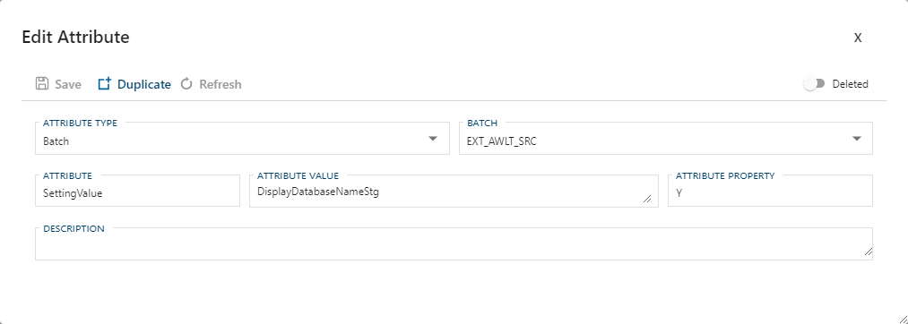

### Attributes Tab - Action Buttons

|Icon|Action|Description|Additional Dialog|
|-|-|-|-|
|

|Add|[Add] will add a new `Attribute` and assign it to the current entity.  When adding an attribute via this button [Attribute Type], along with the respective linked fields, will be pre-filled on the created dialog box.|[Add Attribute]|
|

|Edit|[Edit] will open a dialog box to edit the currently selected `Attribute`.  After edits are complete ensure you click the [Save] button to confirm the changes.|[Edit Attribute]|
|

|Archive|This will `hard delete` the selected `Attribute`.  This will result in the physical removal of the selected record from the metadata database.  The data will no longer be accessible by the BimlFlex app and will require a Database Administrator to restore.|[Archive Attribute]|

>[!WARNING]
> Archive:  
> Archiving is a permanent removal of the selected entity from it's associated table in the metadata database.  The best practice is to first use the [Deleted] flag to `soft delete` if you need to remove an entity.  [Archive] should only be used in the case that both:
>
> 1. The only fix to the current issue requires the [Archive] of the selected entity.
> 2. The full implications that the removing of the selected entity from the metadata system will cause.

### Additional Dialogs

**Add Attribute Dialog Box**  
  

**Edit Attribute Dialog Box**  
  

**Archive Attribute Dialog Box**  
  

### Attributes Tab - Table Descriptions

All `Attributes` assigned to the current entity show here and available for edit.

> [!TIP]
> See the [[Attributes Documentation]](attributes.md) for further details on creating or editing and `Attribute`.

