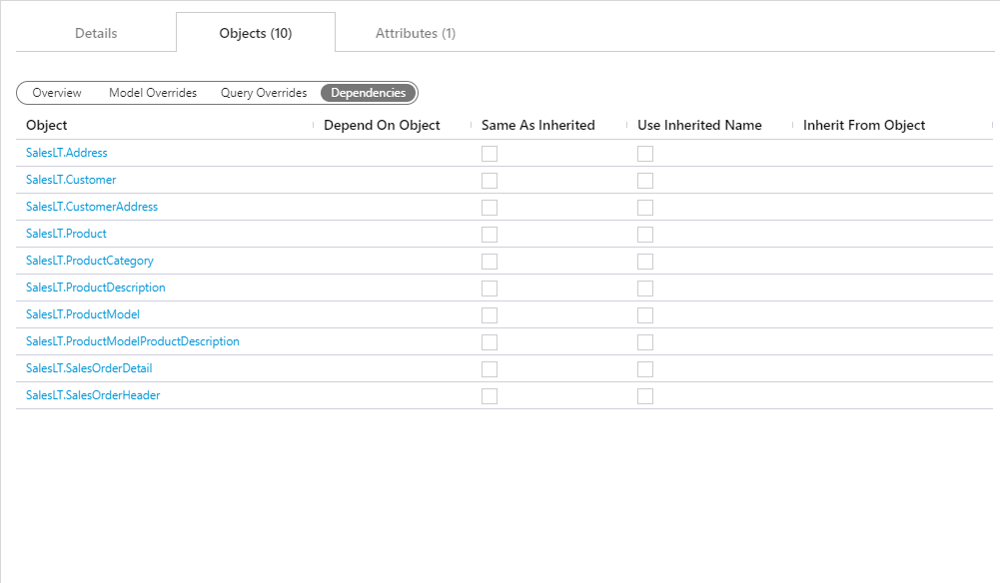

### Objects Tab - Action Buttons

|Icon|Action|Description|Additional Dialog|
|-|-|-|-|
|

|Add|[Add] will add a new `Object` to the `Batch`.|[Add Object]|
|

|Save|[Save] will save the currently set of staged changes.  The [Save] button is will only enable if any `Object` has changes staged and there are no major validation issues with the current list of `Object` properties.||
|

|Archive|[Archive] will `hard delete` the selected `Object`.  This will result in the physical removal of the selected record from the metadata database.  The data will no longer be accessible by the BimlFlex app and will require a Database Administrator to restore, if possible.|[Archive Objects]|
|

|Refresh|[Refresh] will trigger a refresh of the metadata for the selected list of `Objects`.||

>[!WARNING]
> Archive:  
> Archiving is a permanent removal of the selected entity from it's associated table in the metadata database.  The best practice is to first use the [Deleted] flag to `soft delete` if you need to remove an entity.  [Archive] should only be used in the case that both:
>
> 1. The only fix to the current issue requires the [Archive] of the selected entity.
> 2. The full implications that the removing of the selected entity from the metadata system will cause.

### Additional Dialogs

**Add Object Dialog Box**  
  

**Archive Object Dialog Box**  
  

### Objects Tab - Views

The [Objects Tab] provide quick and easy access to all `Objects` associated with the selected entity.  While the items in the list will not change, the views provide a quick concise view of various groupings of attributes.  General purpose and overview of each view will be outlined below.

> [!TIP]
> See the [[Objects Documentation]](objects.md) for further details on creating or editing and `Object` along with details on individual property values.

#### View: Overview

The [Overview] is available to give quick access to the more physical properties of the `Objects` relating to the selected entity.  These are representations of the physical `Source System` and represent the raw definitions of the object in it's original form.  Additional properties are available for bulk management such as controlling exclusions, disabling persistence or flagging an `Object` for deletion.

  

#### View: Model Overrides

The [Model Overrides] is available to allow for quick management of modeled metadata from the [Data Vault Accelerator](data-vault-accelerator.md).  This view is intended as easy way to reference and maintain previously entered metadata.

  

> [!IMPORTANT]
> Although it is possible for an experienced user to manage their high level metadata from this screen, it is recommended that you use the [[Data Vault Accelerator]](data-vault-accelerator.md) until you are strongly confident in your abilities to manually model metadata.  The [[Data Vault Accelerator]](data-vault-accelerator.md) is specifically designed to simplify and improve the experience of modeling metadata via a graphical designer as opposed to the table entry that this view provides.

#### View: Query Overrides

The [Query Overrides] view exposes any SQL overrides that may be required in the creation and maintenance of the `Object`.  By default the SQL required to perform most ETL/ELT task are dynamically generated and in many cases these overrides are not required.  When these cases are encounter they can be seen and managed from this view.

  

> [!IMPORTANT]
> Due to the BimlFlex App not requiring a connection to the raw source systems (this is done during ELT/ELT Orchestration and Integration), auto-complete and intellisense are not provided.  This is designed for developers/architects whom have a strong understanding of SQL and knowledge of the `Source Systems` that are designing from.

#### View: Dependencies

The [Dependencies] view allows for management of an `Object`'s dependencies or inheritance.  Dependencies are provided to instruct BimlFlex as to what `Objects` are required to be processed or managed before another.  Inheritance is a provided feature that allows for controlled reuse of previously entered metadata.

  

> [!TIP]
> For more information about dependencies and inheritance refer to the appropriate link(s) below:  
> [Object Dependencies]  - Links to come...
> [Object Inheritance]  - Links to come...
