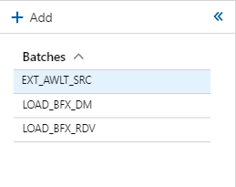
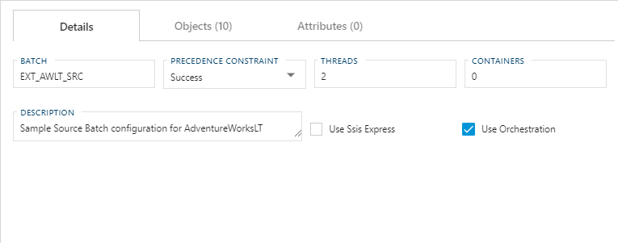
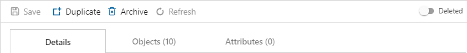
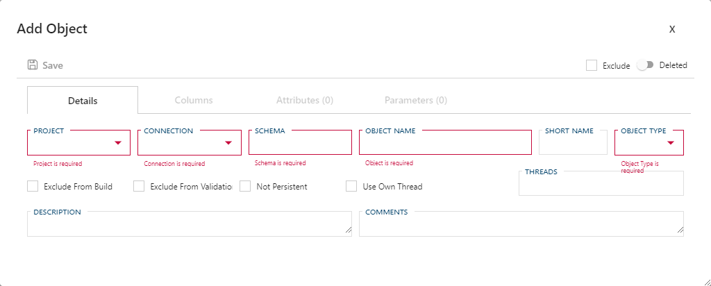
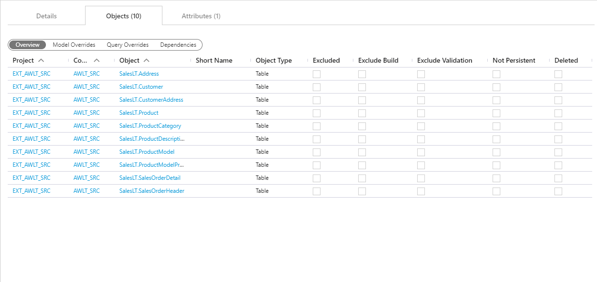
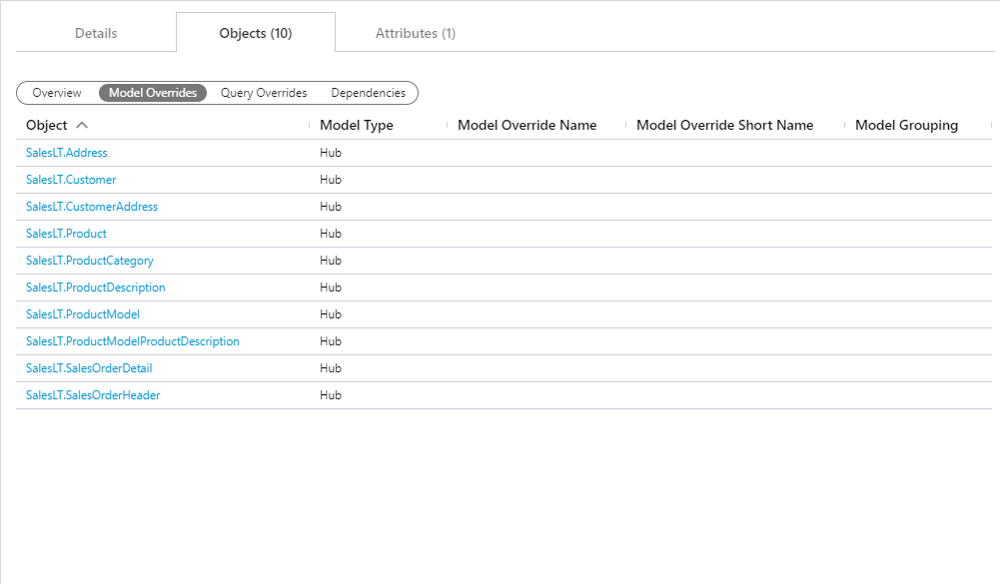
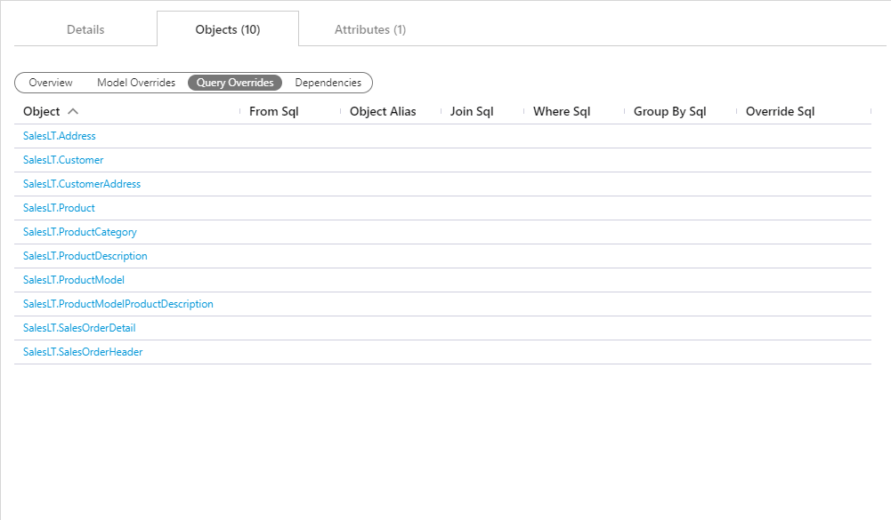
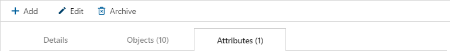
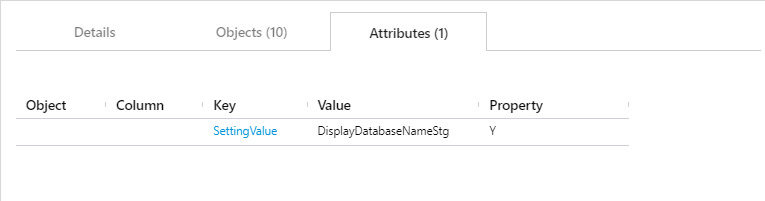

# Batches 

`Batches` group and help define an ETL/ELT workload.  They are uses by `Projects` to set execution grouping.

## Panel Overview

**Batches Panel**  

### Batch Navigation

This area allows for basic navigation and the creation of new `Batches`.

**Batch Navigation Pane**  

[Add](images/svg-icons/add.svg)

|Icon|Action|Description|
|-|-|-|
|

|Add Action|[Add] will start a new to the `Batch` in the [Details Tab].  Once the required information is entered click [Save Action Button] to add the new `Batch` to the list.|
|

|Collapse Action|[Collapse] will hide the [Batch Navigation Pane].|
|

|Expand Action|[Expand] will reveal the [Batch Navigation Pane] after it has been hidden.|

Below the Navigation Action Buttons are a list of `Batches` available for selection.  The highlighted `Batch` indicates the `Batch` that is currently selected.

### Action Buttons

[Action Buttons] list the actions available within the currently selected [Tab].  All [Action Buttons] are context specific to the currently selected [Tab].  Functions of each of the [Action Buttons] are outlined in their appropriate section(s) below.

**Tab Action Buttons**  

### Tabs

[Tabs] can be used to switch between maintenance of the select `Batch` or provide multiple views of an associated `Object` or `Attribute`.  

**Tabs**  

#### Tab - Single Form w/Fields or Table

Some [Tabs] only have a single view with either a list of fields of a table with a list of associated entities.  These [Fields] or [Tables] are context dependant and are outlined in the appropriate section(s) below.  Regardless of whether a [Table] or [Field] is displayed, either can be edited from the viewing form.  [Fields] can often be edited by simply clicking in the selected field while a [Table] requires a user to double-click on the value the user wants to edit.

**Single Form**  

#### Tab - Form w/Views

When a [Tab] has multiple views that may be used, an oval selector will appear listing out alternative views.  The active view is highlighted and can be changed by clicking another available option.  The alternate views only change what properties of an entity are visible/editable and will not filter, remove or resort the underlining list of entities.  As with a [Single Form], tables values can be edited by double-clicking the desired property.

**Form w/Views**  

## Details Tab

The [Details Tab] focuses on general batch information and configuration.  This [Tab] is used to define and create the `Batch` itself.

### Details Tab - Action Buttons

|Icon|Action|Description|
|-|-|-|
|

|Save|This will save the currently set of staged changes.  The [Save] button is will only enable if the `Batch` has changes staged and there are no major validation issues with the current `Batch` properties.|
|

|Duplicate|This will create a duplicate of the selected `Batch`.  A prompt will appear asking for a [New Name] and a new `Batch` will be created using all of the selected `Batch`'s current properties.|
|

|Archive|This will `hard delete` the selected `Batch`.  This will result in the physical removal of the selected record from the metadata database.  The data will no longer be accessible by the BimlFlex app and will require a Database Administrator to restore, if possible.|
|

|Refresh|This will trigger a refresh of the metadata for the selected `Batch`.|
|

|Deleted|This will `soft delete` the currently selected `Batch`.  This will remove the `Batch` from all processing and it will be excluded from all validation.|

**Archive Batch Dialog Box**  
  

>[!WARNING]
> Archiving is a permanent removal of the selected entity from it's associated table in the metadata database.  Best practice is to use the [Deleted] flag to `soft delete` a entity, and [Archive] should only be used in the case that you both:
>
> 1. The only fix to the current issue requires the [Archive] of the selected entity.
> 2. The full implications that the removing of the selected entity from the metadata system will cause.

  - This will trigger a refresh of the metadata for the selected `Batch`.

  - This will `soft delete` the currently selected `Batch`.  This will remove the `Batch` from all processing and it will be excluded from all validation.

>[!NOTE]
> A [Deleted] entity can be restored by flipping the [Deleted] flag back to `false`.  To view a [Deleted] entity go to your [BimlFlex Options] (1), enable [Show Deleted] (2) and click [Apply] (3).  This will now allow [Deleted] entities to appear.  Please ensure that the option is disabled again once the deleted member has been restored.  
>
> 

### Details Tab - Fields

[Batch]  
[Precedence Constraint]  
[Threads]  
[Containers]  
[Description]  
[Use Ssis Express]  
[Use Orchestration]  

## Objects Tab

The [Objects Tab] provides quick access to all `Objects` included in the `Batch`.

### Objects Tab - Action Buttons

  - [Add] will add a new object to the `Batch`.  A [Add Object] 

**Add Object Dialog Box**  
  

> [!TIP]
> See the [Objects documentation](objects.md) for further details on creating or editing and `Object`.

  - [Save] will save the currently set of staged changes.  The [Save] button is will only enable if any `Object` has changes staged and there are no major validation issues with the current list of `Object` properties.

  - [Archive] will `hard delete` the selected `Object`.  This will result in the physical removal of the selected record from the metadata database.  The data will no longer be accessible by the BimlFlex app and will require a Database Administrator to restore, if possible.

**Archive Object Dialog Box**  
  

>[!WARNING]
> Archiving is a permanent removal of the selected entity from it's associated table in the metadata database.  Best practice is to use the [Deleted] flag to `soft delete` a entity, and [Archive] should only be used in the case that you both:
>
> 1. The only fix to the current issue requires the [Archive] of the selected entity.
> 2. The full implications that the removing of the selected entity from the metadata system will cause.

  - [Refresh] will trigger a refresh of the metadata for the selected list of `Objects`.

### Objects Tab - Views

The [Objects Tab] provide quick and easy access to all `Objects` associated with the selected `Batch`.  While the items in the list will not change, the views provide a quick concise view of various groupings of attributes.  General purpose and overview of each view will be outlined below but for further details on what all the individual property values represent please view the [Objects documentation](objects.md).

#### View: Overview

//TODO: Overview Description

  

#### View: Model Overrides

//TODO: Model Overrides Description

  

#### View: Query Overrides

//TODO: Query Overrides Description

  

#### View: Dependencies

//TODO: Dependencies Description

  

## Attributes Tab

The [Attributes Tab] provides a view of any `Configurations` or `Settings` overrides that have been applied to the selected `Batch`.  

>[!NOTE]
> This is exclusive to the `Batch` level.  Additional overrides may be present on any grains higher or lower than the `Batch`.

### Attributes Tab - Action Buttons

  - [Add] will add a new `Attribute` to the `Batch`.  When adding an attribute via this button [Attribute Type] and [Batch] will automatically be auto populated on the associated dialog box.

**Add Attribute Dialog Box**  
  

> [!TIP]
> See the [Attributes documentation](attributes.md) for further details on creating or editing and `Attribute`.

  - [Edit] will open a dialog box to edit the currently selected `Attribute`.  After edits are complete ensure you click the [Save] button to confirm the changes.

**Edit Attribute Dialog Box**  
  

> [!TIP]
> See the [Attributes documentation](attributes.md) for further details on creating or editing and `Attribute`.

  - This will `hard delete` the selected `Attribute`.  This will result in the physical removal of the selected record from the metadata database.  The data will no longer be accessible by the BimlFlex app and will require a Database Administrator to restore, if possible.

**Archive Attribute Dialog Box**  
  

>[!WARNING]
> Archiving is a permanent removal of the selected entity from it's associated table in the metadata database.  Best practice is to use the [Deleted] flag to `soft delete` a entity, and [Archive] should only be used in the case that you both:
>
> 1. The only fix to the current issue requires the [Archive] of the selected entity.
> 2. The full implications that the removing of the selected entity from the metadata system will cause.

### Attributes Tab - Table Descriptions

As mentioned above, only `Batch` level `Attributes` are shown.  All the [Key] or [Key] + [Value] pairs will be assigned to the currently selected `Batch` so the [Object] and [Column] properties will likely be blank.  Please refer to the [Attributes documentation](attributes.md) for further details field values and meanings.

