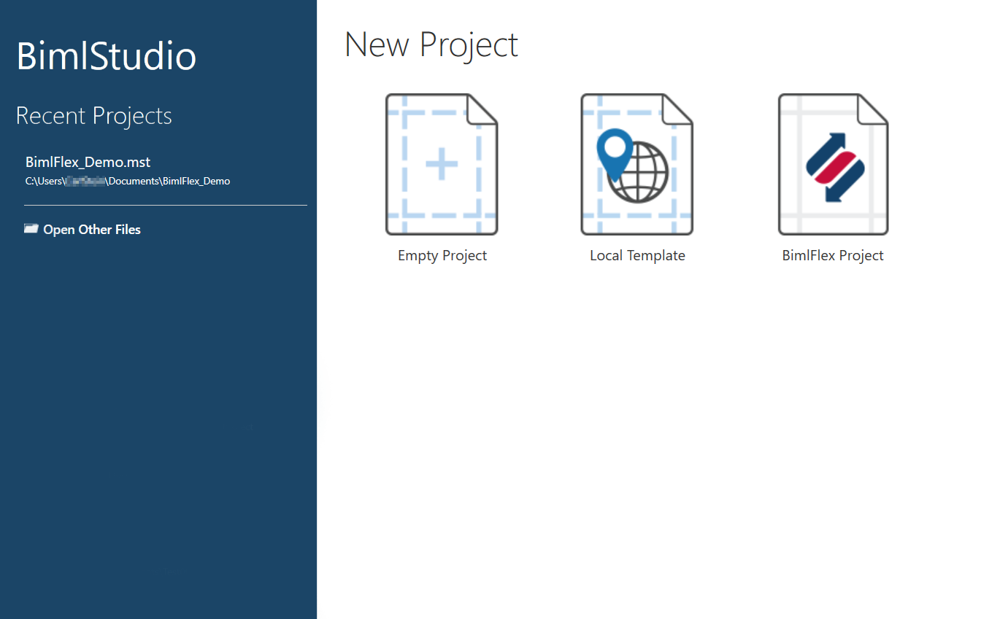
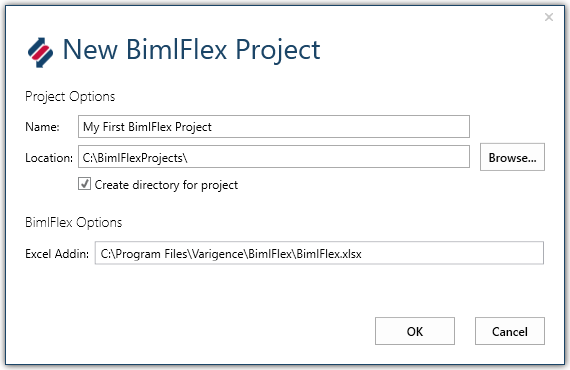
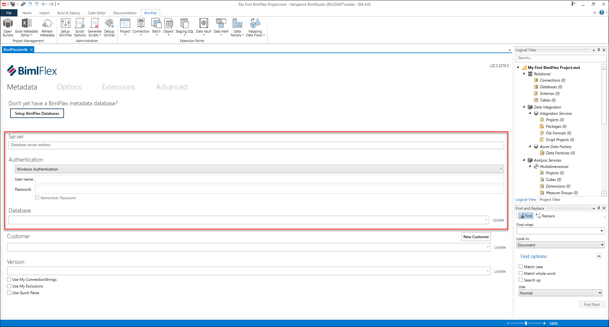

From the start page, create a new **BimlFlex Project**.

Place the project in a suitable folder, the folder will contain source code for the project and should be managed through a source control system.

Once the new BimlStudio project is created, it is possible to open it from the folder by opening the project file directly, or by opening the project from BimlStudio.

At this stage, a new BimlFlex project has been created in BimlStudio, but this has not yet been connected to the metadata repository.

> [!TIP]
> The Varigence YouTube channel contains various introduction videos about using BimlFlex and BimlStudio. [This video](https://www.youtube.com/watch?v=qhDTwv-jYKc?rel=0&autoplay=0) provides an overview of creating a new BimlFlex project in BimlStudio.
