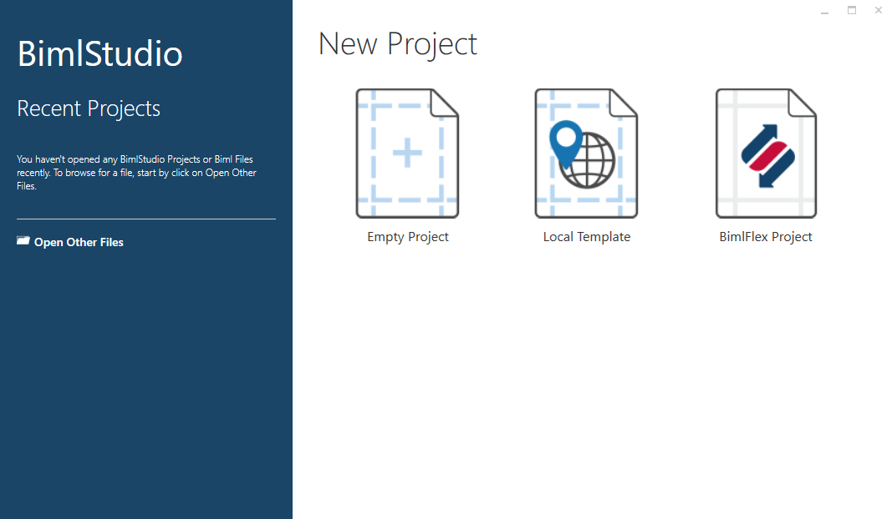
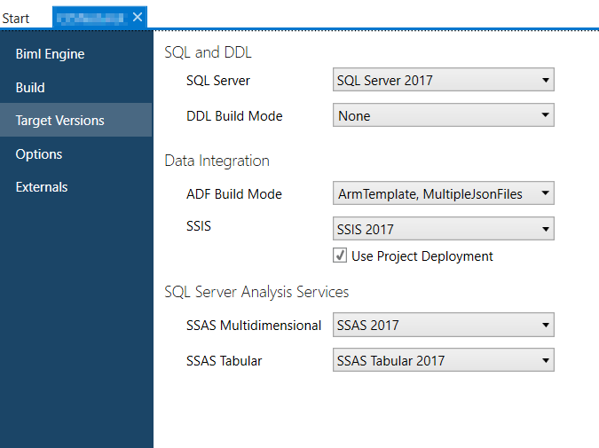

# BimlStudio Project Setup For BimlFlex

A BimlStudio project is used to build and generate the metadata configured in BimlFlex.

> [!TIP]
> [Watch this video guide on creating a BimlFlex and BimlStudio Project](xref:bimlflex-getting-started-initial-configuration).

## Create the BimlStudio Project

Create the BimlStudio project by using the *BimlFlex Project* template.

Fill in the *New BimlFlex Project* dialog to finish creating the project.

## Configure Metadata Settings

The Metadata configuration page is used to point the BimlStudio project at the BimlFlex metadata.

Use the fields in the form to set up a connection with the BimlFlex database and select the **Customer** and **Version** to use in the BimlStudio project. Save all changes with the save button in the application toolbar or `Ctrl + S`.

> [!NOTE]
> After saving these settings, close and re-open the application and project.

| Field | Description |
|------ | ----------- |
| Server | The address of the server where the BimlFlex database is hosted. |
| Authentication | The credentials used to access the server and database. |
| Database | The name of your BimlFlex Database. This dropdown list is populated with all databases available through the server connection. Clicking **Update** will refresh the list of available databases from the connection defined. |
| Customer | The BimlFlex Customer used to configure the project metadata. Click **Update** to refresh the dropdown with a list of Customers in the BimlFlex database. A new customer can be created with the **New Customer** button. |
| Version | The BimlFlex Metadata Version to be built and used for code generation in BimlStudio. Click **Update** to refresh the list of Versions in the BimlFlex database associated with the selected Customer. |
| Use My Connection Strings | Use the Connection Strings for the current user that were set while the `Use My Connection String` option was enabled. |
| Use My Exclusions | Use the Exclusions defined in the BimlFlex Metadata. |
| Use Quick Parse | Only load placeholder objects into the logical model. This allows for faster processing by not populating the full Biml representation in memory |

## Building Assets

Once the user is content with the configuration of their metadata, they are ready to build their assets, whether Cube, SSIS, or Azure Data Factory. The user should already have a [BimlFlex project for BimlStudio](xref:bimlflex-setup-bimlstudio-project) ready to go.

>[!NOTE]
> Building the project is required before deploying any time a change is made to the metadata.

### Open the Project

Open the project by double clicking the `.mst` file in the Windows File Explorer or by opening BimlStudio and locating the `.mst` file in the dialog.

### Project Settings

If this is the first time a solution is being built, the user should check their project settings to ensure that the correct target versions are set.
Access Project Settings by clicking `File` then `Project Settings`. 
Within the dialog, users may select settings for `Biml Engine`, `Build`, `Target Versions`, `Options`, and `Externals`.

From within `Project Settings`, users may edit the output of their project by selecting common output settings from multiple drop down menus.
Users may set their target SQL Server versions, ADF Build Modes, and SSAS analytical services.

>[!NOTE]
> Users should also check that their output path is correctly configured. If one is not provided then the generated assets will be created in the `output` folder of the directory that contains the .mst file.

### Build the Project

In the application, navigate to the *Build & Deploy* tab and locate the build button.
Alternatively, users can also use the build icon located in the toolbar. 

Once the project has built, the user can navigate to the project's output directory and examine their assets.

### Debugging

If the project fails to build, the user can examine the *Output* window at the bottom of the application. This window will display compiler error messages, as well as additional information, like the commands needed to replicate this build [in a command-line setting](xref:bimlflex-command-line-build).
