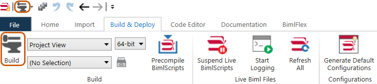

# BimlStudio Project Setup For BimlFlex

A BimlStudio project is used to build and generate the metadata configured in BimlFlex.

## Create the BimlStudio Project

[!include[BimlFlexProject](../build-and-deployment/_incl-header-bimlstudio-project.md)]

## Connect to the BimlFlex Database

[!include[BimlFlexDatabaseConnection](../build-and-deployment/_incl-header-bimlstudio-connect.md)]

## Building Assets

Once the user is content with the configuration of their metadata, they are ready to build their assets for the configured target architecture and technology. At this stage, the user should already have a [BimlFlex project for BimlStudio](xref:bimlflex-setup-bimlstudio-project) ready to go.

>[!NOTE]
> Any time a change is made in the metadata, it is required to build the project and deploy the generated artifacts to update the solution.

### Open the Project

Open the project by double clicking the `.mst` file in the Windows File Explorer or by opening BimlStudio and locating the `.mst` file in the dialog.

### Project Settings

[!include[BimlFlexProjectSettings](../build-and-deployment/_incl-header-bimlstudio-project-settings.md)]

### Build the Project

In the application, navigate to the *Build & Deploy* tab and locate the build button.
Alternatively, users can also use the build icon located in the toolbar. 

Once the project has built, the user can navigate to the project's output directory and examine their assets.

### Debugging

If the project fails to build, the user can examine the *Output* window at the bottom of the application. This window will display compiler error messages, as well as additional information, like the commands needed to replicate this build [in a command-line setting](xref:bimlflex-command-line-build).
