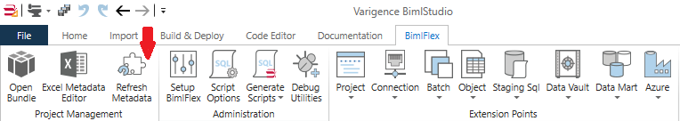

# BimlFlex Generating DDL

BimlStudio is used to create DDL based on BimlFlex Metadata.

## Load and Build Metadata

After the BimlFlex metadata has been configured to create the desired DDL and published, open the associated BimlStudio Project and the metadata will be loaded with the project. If BimlStudio is already open, click **Refresh Metadata** button in the *BimlFlex Menu* on the ribbon.

After the metadata has been refreshed, the Logical and Project Views should reflect the Metadata created with BimlFlex. Click the **Build** button in the shortcuts toolbar or in the *Build & Deploy* menu on the ribbon. The Output and Error panes at the bottom of the application will display the results of the build.

## Generate DDL Scripts

DDL Scripts are generated by using the selections in the Generate Scripts menu in the BimlFlex section of the ribbon.

BimlStudio will create a new tab with DDL script to be saved, run, or deployed in the appropriate environment. The result of the script generation and any errors will be displayed in the Output and Error panes.
