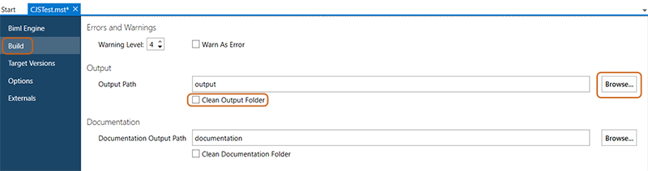

# BimlFlex Interactive Build

Once content with the configuration of the metadata, users are ready to build their assets whether they be SSIS or Azure Data Factory. The user should already have a [BimlFlex project for BimlStudio](xref:bimlflex-setup-bimlstudio-project) ready to go.

>[!NOTE]
> Building the project is required before deploying, any time changes are made to the metadata.

## Open the Project

To open the project, double click the appropriate `.mst` file in the Windows File Explorer or use the File > Open option in BimlStudio and locate the `.mst` file within the dialog.

## Project Settings

If this is the first time a solution is built, check the project settings to ensure that the correct target versions are set.

Project settings can be accessed by clicking *File* then *Project Settings*. 


>[!NOTE]
> Ensure that the output path is correctly configured. If one is not provided, then the generated assets will be created in the `output` folder of the directory that contains the `.mst` file.

## Output Path

To access or configure the project's output path, click *File* then *Output Settings*. Select *Build* from the left side of the menu.



The desired output path may be entered manually in the `Output Path` field.
Alternatively, click the *Browse...* button to locate and select the output folder from the path selection dialog that appears.

Select or deselect the `Clean Output Folder` option, as desired.
Cleaning the output folder will scrub the folder of any old files, so that the folder only contains assets related to the most recent build.

## Build the Project

In BimlStudio, navigate to the *Build & Deploy* tab and locate the build button in the ribbon menu.


Alternatively, a build button can also be accessed from the toolbar.


Once the project has built, its assets can be examined from within the project's output directory.

## Debugging

If the project fails to build, examine the *Output* window at the bottom of BimlStudio.
This window will display compiler error messages, and additional information such as the commands needed to replicate this build [in a command-line setting](xref:bimlflex-command-line-build).

If building for SSIS with script components, such as when enabling the RowSourceId configuration and the build machine has only Visual Studio 2019 installed, a build error might be logged in the output, indicating that the dll could not be found.

`MSBUILD : error : Error:: Metadata file 'Microsoft.SqlServer.DTSPipelineWrap, Version=<VersionNo>.0.0.0, Culture=neutral, PublicKeyToken=<Token>, processorArchitecture=MSIL' could not be found`

In Visual Studio 2019, the SSIS Extensions installer no longer registers the required dll's for script building in the GAC. Run the registration manually to allow using these dll's in the build process. 

Example commands:

```dos
REM Visual Studio Community 2019 and SQL Server 2019

"C:\Program Files (x86)\Microsoft SDKs\Windows\v10.0A\bin\NETFX 4.8 Tools\gacutil.exe" -i "C:\Program Files (x86)\Microsoft Visual Studio\2019\Community\Common7\IDE\PublicAssemblies\SSIS\150\Microsoft.SqlServer.ManagedDTS.dll"

"C:\Program Files (x86)\Microsoft SDKs\Windows\v10.0A\bin\NETFX 4.8 Tools\gacutil.exe" -i "C:\Program Files (x86)\Microsoft Visual Studio\2019\Community\Common7\IDE\PublicAssemblies\SSIS\150\Microsoft.SqlServer.ScriptTask.dll"

REM Visual Studio Enterprise 2019 and SQL Server 2017

"C:\Program Files (x86)\Microsoft SDKs\Windows\v10.0A\bin\NETFX 4.8 Tools\gacutil.exe" -i "C:\Program Files (x86)\Microsoft Visual Studio\2019\Enterprise\Common7\IDE\PublicAssemblies\SSIS\140\Microsoft.SqlServer.ManagedDTS.dll"

"C:\Program Files (x86)\Microsoft SDKs\Windows\v10.0A\bin\NETFX 4.8 Tools\gacutil.exe" -i "C:\Program Files (x86)\Microsoft Visual Studio\2019\Enterprise\Common7\IDE\PublicAssemblies\SSIS\140\Microsoft.SqlServer.ScriptTask.dll"
```

Update paths to the gacutil.exe file and the dll files as needed based on the local environment.

A similar error might be logged in the output if a 64-bit build is initiated on a machine without the corresponding 64-bit SQL Server components. These 64-bit components are normally only installed with SQL Server. For installations without SQL Server, in BimlStudio, in the Build & Deploy Ribbon UI Tab, change the build bitness from 64-bit to 32-bit and restart the build process.
