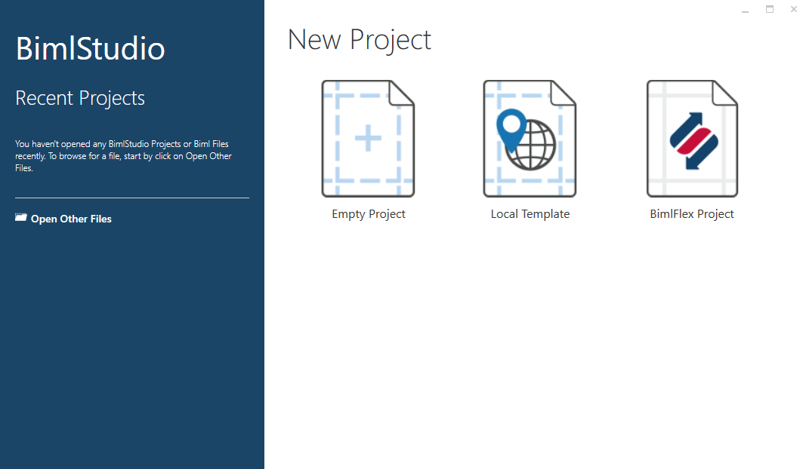
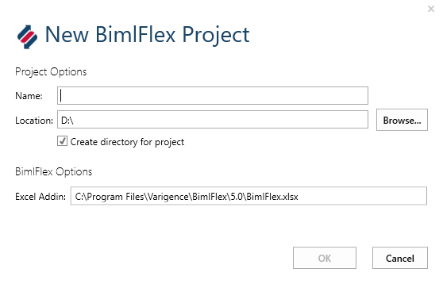

# BimlFlex - Setup BimlStudio Project

A BimlStudio project is used to build and generate the metadata configured in BimlFlex.

> [!TIP]
> [Watch this video guide](xref:bimlflex-getting-started-initial-configuration) on creating a BimlFlex and BimlStudio Project.

## Create the BimlStudio Project

Create the BimlStudio project by using the *BimlFlex Project* template.

Fill in the *New BimlFlex Project* dialog to finish creating the project.

## Configure Metadata Settings

The Metadata configuration page is used to point the BimlStudio project at the BimlFlex metadata.

Use the fields in the form to set up a connection with the BimlFlex database and select the **Customer** and **Version** to use in the BimlStudio project. Save all changes with the save button in the application toolbar or `Ctrl + S`.

> [!NOTE]
> After saving these settings, close and re-open the application and project.

| Field | Description |
|------ | ----------- |
| Server | The address of the server where the BimlFlex database is hosted. |
| Authentication | The credentials used to access the server and database. |
| Database | The name of your BimlFlex Database. This dropdown list is populated with all databases available through the server connection. Clicking **Update** will refresh the list of available databases from the connection defined. |
| Customer | The BimlFlex Customer used to configure the project metadata. Click **Update** to refresh the dropdown with a list of Customers in the BimlFlex database. A new customer can be created with the **New Customer** button. |
| Version | The BimlFlex Metadata Version to be built and used for code generation in BimlStudio. Click **Update** to refresh the list of Versions in the BimlFlex database associated with the selected Customer. |
| Use My Connection Strings | Use the Connection Strings for the current user that were set while the `Use My Connection String` option was enabled. |
| Use My Exclusions | Use the Exclusions defined in the BimlFlex Metadata. |
| Use Quick Parse | Only load placeholder objects into the logical model. This allows for faster processing by not populating the full Biml representation in memory |
