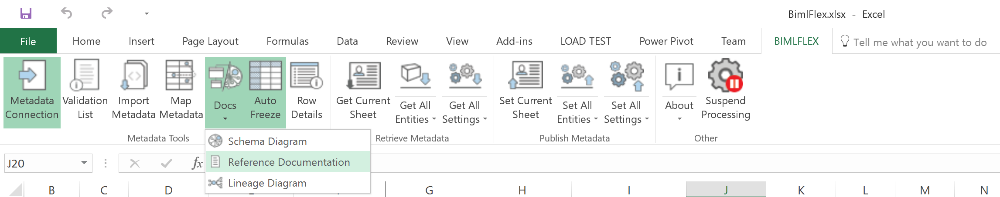

# BimlFlex Excel Add-in

BimlFlex Excel Add-in is the tool modelers and developers use to interact with the solution metadata. BimlFlex Excel Add-in connects to the BimlFlex metadata database.

## Getting Started

To install BimlFlex and the Excel Add-in refer to the installation and setup documentation

## User Interface

The BimlFlex Excel ribbon and tab is located at the top right-hand side of the standard Excel UI. This is where the UI for BimlFlex is located.

The BimlFlex Excel Add-in Ribbon tab is made up of 5 main groups:

* [Metadata Tools](#metadata-tools)
* [Retrieve Metadata](#retrieve-metadata)
* [Publish Metadata](#publish-metadata)
* [Other](#other)
* Status (hidden when everything is ok)

Metadata Tools is as section containing tools and functionality that allows high level control over metadata. Importing metadata, connecting to various metadata sources or generating overview documentation of metadata.

Retrieve Metadata is about getting the metadata from the metadata database (the BimlFlex Database) and bringing that metadata into Excel.

Publish Metadata allows Excel to save changed metadata back to the metadata database.

Other and Status sections apply to when BimlFlex Excel Add-in is inspecting the metadata. When an issue is encountered, the Status section will display any validation messages.

## Excel Sheets

The BimlFlex Add-in displays the metadata in a set of Excel sheets. These are normal Excel sheets. To navigate between them, click the sheet tab at the bottom of the Excel window.

Getting Started Sheet

* Getting Started

Metadata Sheets

* Connections
* Batches
* Projects
* Objects
* Columns
* Parameters
* Attributes

Configuration Sheets

* Configurations
* Settings
* Data Type Mappings
* Versions

### Metadata Entities

Each sheet contains columns and rows of metadata used to define entities and relationships. Managing the metadata and building the DataWarehouse is covered in the Implementation Guides and Configurations documentation.

The Metadata specification is detailed in the [Metadata Reference documentation](xref:bimlflex-metadata-entity-definitions)

## Metadata Tools

### Metadata Connection

The metadata data connection button in BimlFlex Excel is located on the far left and is the starting point for connecting to a given metadata database. This button opens a pane in Excel for connecting to a metadata database.

### Validation List

The validation list is a pane in BimlFlex Excel Add-in where any issues with metadata are displayed in a list along the side of the screen. The issues shown on this list are generated by the validation rules in the BimlFlex bundle.

### Auto Freeze

The `Auto Freeze` function freeze the left-hand side and top of the sheet in Excel. By default the frozen area are the relevant columns of a metadata sheet.

### Import Metadata

All metadata import functionality has been moved to the BimlFlex App.

More information: 

## Retrieve Metadata

### Retrieve Selection

`Retrieve Selection` will refresh the data for the selected cells and retrieve the relevant metadata from the BimlFlex metadata database.

### Get Current Sheet

`Get Current Sheet` will take the currently selected sheet in excel and retrieve the relevant metadata from the BimlFlex metadata database.

### Get All Entities

`Get All Entities` will go through each of the metadata spreadsheets and retrieve the current version of the metadata for each one.

### Get All Settings

`Get All Settings` will get all the

* Configurations
* Settings
* Data Type Mappings
* Versions

metadata for the current customer.

## Publish Metadata

### Set Current Sheet

`Set Current Sheet` will take the currently selected sheet in Excel and publish the relevant metadata changes to the BimlFlex metadata database.

### Set All Entities

`Set All Entities` will go through each of the metadata spreadsheets and publish the current version of the metadata for each one.

### Set All Settings

`Set All Settings` will publish the Configurations, Data Type Mappings and Versions metadata sheets to the metadata database

## Other

### About

Clicking the `About` button will display to the user a drop-down box that shows two more options. The options are **About** and **Help**

Help will redirect the user to the Varigence support website, where they can access articles and forum information on the use of the various products in the Varigence suite.

**About** will show various product information that relates to the customer and some support options should a user experience issues with a particular version of BimlFlex Excel Add-in:

* Product Name
* Version
* Licensed User
* Product Key

The `Change Product Key` will allow changing the current product key.

The `Copy Product Information` copies product information to the clipboard. This allows a quick way to share information about the version of BimlFlex Excel Add-in if required.

The `Copy Machine Code` button will copy a code that is unique to the current machine. machine code is used to generate static product activation keys for machines not normally connected to the Internet.

### Help

Navigate to the BimlFlex documentation site.
