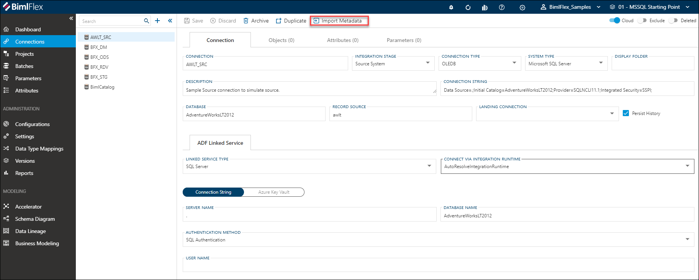

The BimlFlex platform provides a [**Import Metadata**](xref:bimlflex-concepts-importing-metadata), or metadata importer, feature that is accessible from the [**Connection Editor**](xref:bimlflex-connection-editor) and [**Project Editor**](xref:bimlflex-project-editor). The metadata importer connects to the data source using the defined connection, reads the data structures and populates the BimlFlex database with the corresponding metadata.

The [**Connection**](xref:bimlflex-connection-editor) for which metadata will be imported must have a valid connection string, which points to the database of which the metadata should be imported.

The import metadata feature can be used in any scenario where a schema is available, and there is a need to bring that metadata into a BimlFlex solution. If the data structure changes, the metadata can be imported again so that the model can be updated.

Importing metadata typically applies to connections that have been configured with the `Source System` [**Integration Stage**](xref:bimlflex-connection-editor#integration-stages) - as a 'source connection'.
