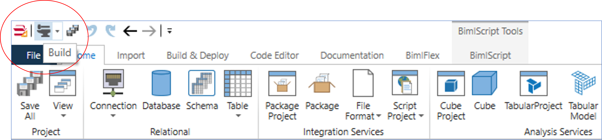

# Build Process

The Build Process in BimlStudio uses the BimlFlex metadata, expands this into BimlScript and then compiles this code to produce the relevant output and support scripting.

The process will access the BimlFlex metadata through the framework, expand this into BimlScript and then compile the result into artifacts than can be deployed to the designated target environment.

> [!TIP]
> The [Build & Deployment](xref:bimlflex-build-solution-overview) section contains practical details on how to configure BimlStudio for use with BimlFlex and build solution.

The Build Process can be started from BimlStudio by clicking the 'hammer and anvil' icon in the top-left corner.

If the Build is successful, the output artifacts will be available in the target directory that was configured. The exact outputs vary depending on the BimlFlex configuration, but include (not limited to):

* SSIS Packages
* ARM templates and JSON files for ADF components
* SQL (views, DDL, DML)
* SQL Server Data Tools (SSDT) Projects
* Deployment scripts in PowerShell
