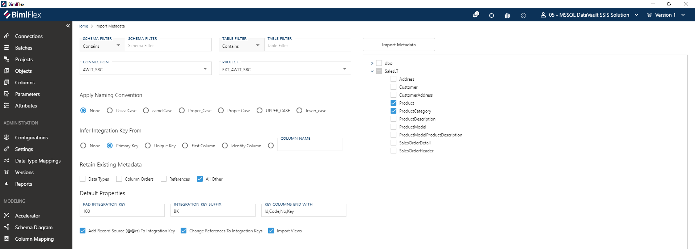

# Data Vault Templates

This document outlines the Data Vault templates in BimlFlex.

The Data Vault can be accelerated using the BimlFlex Data Vault Accelerator: [Data Vault Accelerator](xref:data-vault-accelerator)

## Setup

This document assumes the BimlFlex product has been installed, configured and that the sample source metadata is ready to be modeled.

> [!NOTE]
> More Information:
>
> * [BimlFlex Getting Started Intro Videos](xref:bimlflex-getting-started-intro-videos)
> * [BimlFlex Setup Overview](xref:bimlflex-setup-overview)

The walkthrough uses the Product and Product Category entities from the AdventureWorksLT sample source to demonstrate Data Vault concepts.

## Data Vault review

It is important to consider the Data Vault design and modeling principles while building the Enterprise Data warehouse. There are several books and training courses available on the subject of Data Vault modeling. Varigence provides a Data Vault modeling and implementation course that combines theoretical knowledge about the Data Vault approach with implementation guides using BimlFlex.

## The Data Vault Pillars

It can be prudent to revisit the Data Vault modeling pillars as defined by the CDVDM, The Data Vault modeling certification definition.

* Data Vault Models are built entirely upon Hubs, Links and Satellites
* Data Vault Hubs and Links contain no descriptive attributes
* Satellites contain all descriptive attributes (all context, details, time slices, etc.)
* Data Vault Hubs contain no Foreign Keys/relationships
* Satellites contain one-and-only-one Foreign Key/relationship (for the Hub or Link to which it is attached)
* All relationships represented in a Data Vault are manifest through Link Tables
* Satellites can attach directly to one-and-only-one Hub or Link
* Data Vault Hubs and Links all use a Sequence ID or Hash for a primary key

## Base Data Vault constructs

BimlFlex generates the required artifacts to populate Hubs, Links, Satellites etc. from its metadata.

### Hubs

Hubs maintain a distinct list of Integration keys.

The Integration key and the Hub table, as well as the source and source to target mapping, are defined in the metadata repository.

The Hub Entity is at the center of the **Core Business Concept**, CBC, and should be derived from **Enterprise Wide Business Keys**, EWBK's. A Hub is not necessarily the same as a Primary Key in the source system.

To be able to integrate data across systems and versions the actual Business terms used should be identified and used as Integration Keys for the Hubs where possible.

For the Integration key, it is recommended to use a wide Unicode/nvarchar datatype. This accommodates most data coming from any source. It also allows new sources to be integrated that might not adhere to the earlier assumed datatype of the Hub Integration key. The hub should accommodate all incoming data without judging, therefore it is recommended to use the most forgiving data type available.

BimlFlex uses a single Integration Key column to allow source agnostic integration. BimlFlex provides the FlexToBk() expression to allow easy construction of the Integration Key from multiple source columns and data types.

Descriptive attributes about the Integration key stored in the Hub are stored in the attached Satellites.

### Links

Links maintain relationships between two or more Hubs. The Link is also a distinct set of all occurrences of the combination of hubs ever seen. These relationships have their effectiveness maintained through (Link) Satellites or derived from related Hub Satellites.

Some Links need to emulate the Foreign Key constraints in their source, this is managed by defining **Driving Keys** for the Link Satellite.

The Link forms the base for the **Unit of Work**, UOW. The UOW defines the required granularity to properly identify the relationship; the UOW forms the grain of the relationship.

### Satellites

A Satellite is connected to either a Hub or a Link and maintain descriptive information about the Hub or Link. Satellites are the bearer of all descriptive attributes, context information and time-slice history in the Data Vault model.

An example is the effectiveness of a relationship, when a link is created from a relationship between two entities in the source it will create two Hub rows and a Link row (if some of the Hub records already exist those existing rows will be reused). The Link Satellite tracking effectiveness will have a row added that describes when the event was first discovered from the source. Should the source remove the relationship, the Link Satellite will be closed off by adding a new row with a deleted indicator describing the delete event.

Another example is the management of descriptive attributes. For a Product stored in the Product Hub there will be Satellites storing the information about the Product. Should the List Price be changed in the source, the Satellite will have another row added with this new data and the old record for the old price will be kept in its separate row. If End Dating is used then the old row will be end dated.

## More on Hubs

The Hub is the distinct set of Integration keys from the source. It is an insert-only table. Any effectiveness or descriptive attributes are tracked in attached Satellites.

The required metadata for a Hub is stored in the objects and columns data sets in the metadata editor. For the Source to Target Mapping the source and the target table and columns need to be defined and mapped.

<!--  -->

The Hub is Accelerated from Source Metadata and added to the Metadata set through the Data Vault Accelerator in the BimlFlex App. The Source To Target Mappings are automatically added to facilitate the load of the target Data Vault.

### Surrogate Key

BimlFlex normally hash the Integration Key value to a Surrogate Key column in the Hub. The Data Type and Hash Algorithm are configurable through the BimlFlex Settings. A common default is to use the SHA1 algorithm and store that in a Binary key column

### Integration Key

The Hub Integration key needs to accommodate data from existing sources as well as being able to accommodate changes in the existing sources and new sources added later.

The CBC/EWBK represented by the Hub is designed to integrate multiple systems. To support this, it is most common to use  Unicode string representation. The key length need to accommodate any reasonable Integration key that can be foreseen.

The default key length generated by BimlFlex using the Data Vault Accelerator is String/NVARCHAR(100).

Using the Infer Integration Key setting in the metadata importer will add the Integration Key to the source table as a new column. It uses the `FlexToBk(ProductID)` custom SSIS Expression to build the Integration key. The default settings will concatenate the columns together with tilde `~` as the default concatenation character. The `Product_BK` only has a single column mapped. Adding additional columns to the expression will result in a single key with the columns concatenated.

`FlexToBk(ProductID)` will generate Product_BK column data from the ID only (example: `680`)

`FlexToBk(Name,ProductNumber)` will generate Product_BK column data from the Name concatenated with the ProductNumber (example: `HL Road Frame - Black, 58~FR-R92B-58`) with the concatenation character as separator (the `~`)

`FlexToBk(@@rs,ProductID)` will generate Product_BK column data from the Connection Record Source and the ID (example: `awlt~680`)

### BimlFlex Build

All Data Vault Acceleration is done in the BimlFlex App.

Once the preview model is correct the model is published to the Repository. Once published, it is possible to refresh the metadata into the BimlFlex Project in BimlStudio.

BimlFlex groups Raw Data Vault loads by source table. A load process is generated that loads all targets from a source table in one artifact. For SSIS ETL patterns this is an SSI package, For ELT processing this is a Stored Procedure.

### Multiple key columns

Some Hub designs require multiple source key columns to define the Hub through the Integration Key. Sources with key overlap might need a system or source string added, multiple source keys might need to be combined to form a distinct Hub Integration key.

> [!NOTE]
> Deriving the Integration keys for the CBC/EWBK's is one of the more important design exercises in modeling the Data Vault. This guide does not include details on the required analysis and design process.

For these columns, BimlFlex concatenates them into a single string and separates them with the configured separator `~` as described above.

## Link

The Link Entity is the distinct set of relationships between the involved Hubs. Like the Hub, it is an insert-only table and any effectiveness or attributes should be tracked in a connected Link Satellite or derived from a connected Hub's Satellite.

Two or more Hubs are required to build a Link. The Product source table used for the Hub has a relationship to the Product Category table, representing the category of a product. The Product Category relationship will require a Hub for the Link to be built. The Product Category table also has a self-referencing hierarchy through the parent category. This provides an interesting scenario as that Link will reference the same Hub twice and will therefore need roleplaying names.

Links are built from the metadata of, and loaded from, a single source table. If there is a requirement to add data or attributes from related tables, they have to be joined into the source table in the source metadata. This can be either through the source to staging process, through a separate staging process on the Persistent Staging Layer, or through the Staged Query load concept.

It is recommended that sources provide all the required metadata for relationships between entities to be built using the identified Integration keys.

This guide uses the technical Ids from the source as keys.

The default naming convention used by the Accelerator is to create the Link name as the relationship between the Hubs. This works well in the Product to ProductCategory example scenario. For Links with more Hubs attached the name can be adjusted through the Metadata to use a different convention.

The Source tables need the Link keys for reference. The default naming convention uses `LSK_Entity_Entity_SK` naming style. The source tables have the keys for the Links added as well as the Hub keys for the relationships. The LSK column has the Link table as target table specified.

As before the Hub have a BK and an SK column.

All relationships from the source table to related tables, such as the ProductCategoryId column in the Product Table, should be represented through modeled Integration Key columns similar to the main Integration Key for the Table. The Metadata Import derive this when possible. For the Product source table the relationship to the ProductCategory has been implemented in the derived Column ProductCategory_BK. This column has a reference to the Integration Key Column ProductCategory_BK in the ProductCategory Object.

The Link Data Vault entries have a Link SK as well as an entry for each participating Hub. The entries for the participating Hubs have an entry in the `ReferenceTable` and `ReferenceColumnName` to identify the Hubs.

Building the solution from this metadata will generate two load packages in the Data Vault project, one each for the source tables. In each package will be loads for the Hub and the Link.

<!--
Illustrated here is the Link load flow:

-->

## More on Satellites

Satellites can be attached to either a Hub or a Link, to differentiate the Satellites attached to Links are called Link Satellites and prefixed with LSAT compared to Hub Satellites that uses SAT.

The Satellite concept is the same for both entity types. The columns and load patterns are the same. They both track changes over time. The common use for the Hub Satellite is to track descriptive attributes and their changes over time and the effectiveness of the Hub. When a Product gets deleted from the source system it will not be removed from the Hub, it will have a row in the Satellite added, indicating that the status of the Product is now deleted.

Link Satellites most common use case is to track effectiveness of the relationship. The Link Satellite can also have attributes.

The source data for the sample model contains descriptive attributes for both Product and Product Category. There are no descriptive attributes for the Link relationships so the Link Satellites will only track effectiveness of the relationships.

Acceleration of Link Satellites is a configurable Setting in BimlFlex.

### Hub Satellites

The required Source Object metadata is already in the metadata model, the Satellites attributes are read from the same source as the Hub. The destination Satellite tables/entities are added by adding the names and setting the Object Type to Satellite or Link Satellite

<!--

-->

The default naming convention uses the same name for the Satellite as the Hub or Link it is attached to with an additional suffix indicating the source system. It is recommended to use a consistent naming convention for all artifacts. The suffix naming suggests that additional Satellites can be added to the Hubs from other sources. The BimlFlex Accelerator uses the Record Source from the Connection as the default Suffix.

Only under specific circumstances is it recommended to load data into the same Satellite from multiple different sources and even then it is always possible to still load to separate destinations. The Data Vault model supports an unlimited number of Satellites attached to Hubs and Links, this should be embraced in the modeling so that the agility and flexibility to integrate changes and new sources are maximized.

Naming conventions, Attribute Splitting, exclusions and Suffix inclusion are all configurable from the Accelerator and in the Source Metadata

## Driving Keys

Data Vault Links represent many to many relationships. Any Hub entity in Data Vault can therefore have multiple active relationships to other entities through Links.

If there is a Foreign Key relationship between two entities in the source, or if there is application logic that manages opening and closing of relationships in mapping tables, that same behavior might need to be maintained in the Data Vault.

Driving Keys are documented in more detail here: [Data Vault Driving Keys](xref:bimlflex-driving-keys)

## Multi Active Satellites

Multi Active Satellites are satellites with an additional key attribute meaning multiple versions/groups of the Satellite can be active/valid at a given time. This is used when there are no other straightforward ways to model a situation with multiple active records at the same time.

BimlFlex support Multi Active Columns that indicate multiple rows are active at the same time and Multi Active Sets that indicate sets of rows being active at the same time.

Multi Active Satellites are created by adding a Multi Active Key to the Satellite definition. Set the Change Type of the column to Multi-Active Key and set the column as primary Key together with the Integration Key.

Multi Active Satellites break the formal Data Vault design and modeling pattern and it is recommended to use the default patterns if possible. An extra Hub roleplaying the Multi Active attribute can possibly be added to the UOW/Link to implement a similar behavior.

For sources that have multiple changes to the same row at the same time it is easier to define the order and override the `RowEffectiveFromDate` value to reflect that order instead of implementing Multi Activeness.

## The BimlFlex generated Data Vault Entity Load SSIS Project

The generated project for loading into the Data Vault will include load processes for each source entity.

The Entity load process (SSIS Package or Stored Procedure) will include all Data Vault loads from the source table.
