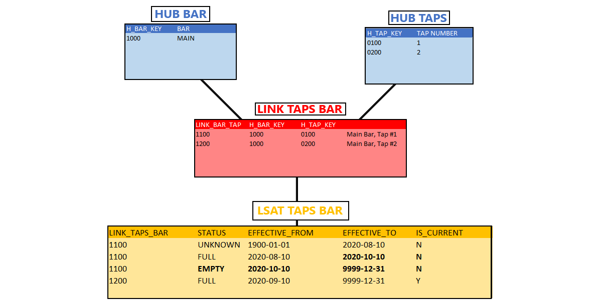
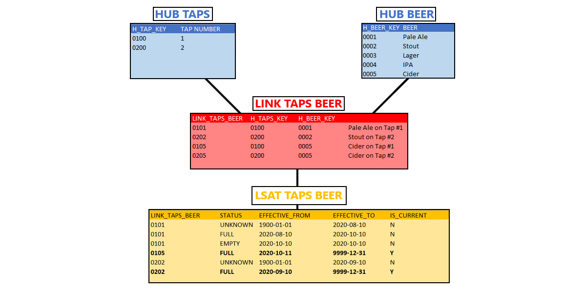

# Driving Keys in Data Vault

A **Driving Key** is a **Unique Key** on a Link that is used to determine the effectivity of a relationship or series of relationships.
This is commonly used when a relationship should be tracked based around a Business Concept itself as opposed to individual expiry records on the Link Satellite.
These can be used to enforce a many-to-one relationship on the otherwise many-to-many construct of a Link.
The a Driving Key is used to shift the focus to a driving Business Concept over simply an observed interaction.

## Driving Key Observability

From a modelling perspective, Driving Keys are not so much a separate construct as much as they are a qualifier on an existing one.
In practice a Driving Key is a term given to an existing Business Concept to 'drive' a Link.
The key itself is commonly the Business Key of the driving Business Concept or a source key persisted as a degenerate field on the Link itself.
Driving Keys don't change a model, but rather indicate how ELT/ETL should be performed and a relationship maintained.

## Relationships in a Data Vault

A core tenet of Data Vault modelling methodology is to track relationships in a Link and to be modeled as a many-to-many relationship.
Effectivity is then tracked in a Satellite based on the observation of when a unique interaction of Business Concepts are observed.
When a relationship is observed for the first time it is created and marked as active based on the date it was observed.
When a relationship is terminated similar logic is used and the relationship is terminated based on the date of the observed termination.
By nature these exist exclusively with no relation to any other observed relationship.
A Driving Key is required when a relationship should be tracked, observed and terminated based around a central Business Concept and not simply the relationship itself.
Effectivity is then started and ended based on when a Business Concept was first observed and when a relationship change occurs on the driving Business Concept.

### Tracking by Historical Relationship

A common model in Data Vault 2.0 methodology is to create a Satellite on the Link (LSAT) which contains history specific to the Link.
This allows one to track specific historical changes to a relationship, without having to reference or query any of the Hubs or Links associated with said data.
Using a LSAT is a benefit of Data Vault 2.0 that allows maintaining historical data where end-dated relationships may need to be reopened or reactivated again without fear of losing any data.

**For example:** Imagine the operation of a tavern, which opens for business on August 10, 2020.
A tavern will store kegs of different varieties of beer and then distribute those beverages through their tap system hooked up to a bar.

>[!NOTE]
> In this article's examples, Link Keys have been simplified in order to shift focus on Driving Key behaviors.

This hypothetical tavern has five (5) varieties of beer in stock: Pale Ale, Stout, Lager, IPA, and Cider.
There is only one (1) tap for distribution.
This architecture demonstrates a one-to-many relationship.
There is one tap and many beers.
The *type* of beer available on tap is, essentially, inconsequential.
At any given time only one beer is going to be available despite there being five (5) different options.

One month later on September 10, 2020 the tavern decides to install a second tap, at the same bar, subsequent to successful business operation.
Now there are two (2) possible options for available beer.
The Hub for Taps can be edited to include a second tap without any issue.
This addition does not change the architecture of the model, but now there are two (2) one-to-many relationships.

 One-to-Many Link Relationships")

A many-to-many relationship would appear as such, showing multiple relationships between Taps (*a possible two (2)*) and Beers (*a possible five (5)*).

An additional example of a many-to-many relationship would be a single tap having multiple active records for various beers that can also be active on other taps.
This may be done when tracking status for a empty keg and an active record for the current beer being served.

<!--
>[!NOTE]
> Many-to-many relationships CAN NOT have a Driving Key.
> 
-->

### Tracking by Driving Key

In the example scenario the Taps business entity is defined as "driving," meaning that ETL enforces the logic that a single Tap cannot be associated with multiple beers at the same point in time.

>[!NOTE]
> The Hubs for Taps and Beer remain static for the remainder of this example and as such are excluded from the below imagery.

Referencing the same example of tavern operation, historical tracking through a Link Satellite in this example might look like such:

<!--
"Zero Records" are optional records which indicate the first recognized interaction with a Driving Key.
The paramount indicator for a zero record is an interaction with a Driving Key, not when a record first enters the system.
In this instance our Driving Keys are the Taps, and zero records would appear as such:

-->

After enough pints sold a keg will be kicked (emptied).
A new beer will then replace the now-empty beer.
Data Vault keeps historical data so the record for the kicked beer will be end-dated and a new record will be created for the new relationship.

Assume that the Pale Ale on Tap #1 was kicked on October 10, 2020, and replaced the following day with the Cider being held in storage.

The changes to inventory might appear as such in the Link and Link Satellite:

The record for Beer on Tap #1 expired on October 10, 2020, the date the keg kicked.
A new record was created to mark the termination on October 10, 2020, noting the status as "empty."

Next, a new record will be created, and activated, to mark that a new Beer is now hooked up to Tap #1, with the status noted as "full."

The two active relationships at this point in time, October 11, 2020, are Beer on Tap #1 and the separate Beer on Tap #2.

The final model for this architecture would look as such:

## BimlFlex Handling of Driving Keys

BimlFlex is optimized to recognize Driving Keys automatically. The Accelerator allows the framework to automatically apply Driving Key type relationships for any Links derived out of a Hub and be included in the load logic. Alternatively, users may manually define Driving Keys through simple settings.
The simple process for both implied creation and manual creation of Driving Keys within BimlFlex are detailed below.

### Implied Creation of Driving Keys

BimlFlex is able to automatically apply Driving Key to any relationship created from a table being loaded with a *MODEL OBJECT TYPE* = `Hub`.
Due to the Foreign Keys in a database requiring a many-to-one in the source the application of a Driving Key scenario can be applied.
This will be automatically included in the ETL logic required and no separate **Attribute** will be added in the **Attributes Editor**.

> [!NOTE]
> Requirements:
>  
> - **Object** *ACCELERATOR OBJECT TYPE* = `Hub`
> - A **Column** in the **Object** that references another *ACCELERATOR OBJECT TYPE* = `Hub`.

### Default Driving Key Application

The default behavior within the BimlFlex Accelerator is to automatically apply Driving Key type relationships for any Links derived out of a Hub.

Any changes made to the Driving Key relationships by the user after the first accelerated modeling will be maintained in all future model accelerations.

### Manual Creation of Driving Keys

> [!NOTE]
> Prerequisites:
>  
> - The Link must already be accelerated.
> - The column to be used for the Driving Key must be on the LNK (not LSAT).

BimlFlex also offers users the ability to manually define Driving Keys to the assignment of **Column Attributes**.
This is done be flagging the required **Column** on the LNK with an **Attribute** to indicate that it is the Driving Key.
The BimlFlex App will automatically enforce a Driving Key relationship on the LSATs associated with the LNK, terminating relationships as needed.

**Objects** => Select LNK => Attributes Tab => [Add]

| Field          | Entered Value           |
| -------------- | ----------------------- |
| Attribute Type | Column                  |
| Column         | Column to be used as DK |
| Attribute      | IsDrivingKey            |

The settings within BimlFlex are all adjusted in the "Add Attribute" dialog box:

> [!NOTE]
> For additional information regarding BimlFlex's assignment of Driving Keys or the technical walkthrough for manually defining Driving Keys, please reference the following documents:
>
> - [Data Vault Templates](xref:data-vault-templates)
> - [BimlFlex Data Vault Best Practices](xref:data-vault-standards)
> - [Driving Keys](xref:driving-keys)