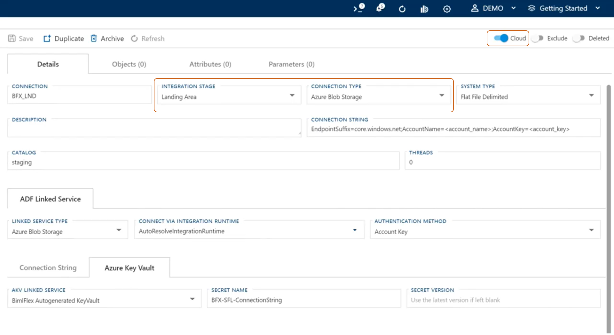
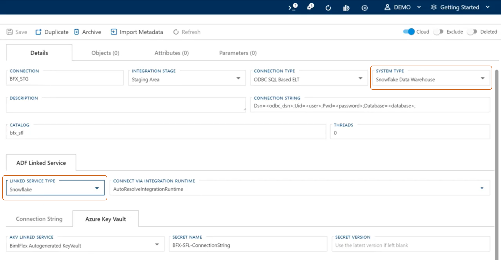

# Implementing Snowflake Using Azure Data Factory with BimlFlex

Accompanying our most recent video upload, [BimlFlex - Implement Snowflake using Azure Data Factory](https://www.youtube.com/watch?v=COGIHSjAdSg&feature=youtu.be), we seek to show BimlFlex users just how effortless the process of using Snowflake with Azure Data Factory can be.

## Azure Data Factory Automation

Referencing the above infographic, regardless of source data, this operation will be using Azure Data Factory copy command to ingest and land the source data in Azure Blob Storage as a parquet file.
Using Snowflake stored procedure code will allow users to call the function bridge to load the data into the Snowflake database and/or persistent staging area.
With the source data being held in a Snowflake database, again using ADF and a function bridge, the data can then effectively be processed into data marts or data vaults.

BimlFlex code maintains 100% standard Snowflake stored procedure code, which allows a user to stage the output of this process using other standard orchestration tools, including Snowflake load commands.

Another feature specific to BimlFlex that allows users to embrace full functionality of Snowflake is the ability to load parallel data.
Anyone working in an environment that sees source data generating at different intervals may wish to create parallel processes.
This allows users to load said data in similarly structured timing, or to process a large batch in one computing warehouse while simultaneously processing smaller batches in a second warehouse.

Varigence recognizes that Data Vault 2.0 embraces the concept of parallel loading as a new methodology for the smart and intelligent logistical handling of information, and strives to include this agility in all of our BimlFlex processes.

## How to Configure Snowflake in BimlFlex

Within BimlFlex 2020 users are provided with a number of metadata samples, with a specific focus on Snowflake within Azure Data Factory in this tutorial.
Loading the sample metadata from within BimlFlex is as simple as selecting the snapshot from the *Load Sample Metadata* dropdown menu on the BimlFlex **Dashboard**.

> [!NOTE]
>More information on the specific creation of data marts and data vaults:
> * [Data Vault Templates](https://docs.varigence.com/bimlflex/concepts/data-vault-templates)
> * [Data Mart Templates](https://docs.varigence.com/bimlflex/concepts/data-mart-templates)

As with all of our examples the data here is pointed at AdventureWorksLT 2012. The imported sample metadata will have modeled point in time (PIT) tables and bridge tables, and on top of those, built data mart tables, and dimensions and facts. The connection settings remain stanard as per previously uploaded BimlFlex feature highlight videos, and should be configured as follows from within the BimlFlex **Connections** menu:

 * *Source System* is cloud enabled
 * *Staging / Landing Environment* is configured for Blob Storage configured with ADF linked services
 * *System Type* is configured for Snowflake Data Warehouse
 * *Linked Service Type* is configured for Snowflake
 * *Integration Template* is configured for ADF Source -> Target

>[!NOTE]
>Within Azure Data Factory the "Linked Service Type" for Snowflake does not actually exist. However, when this option is selected, BimlFlex automatically knows to use the function bridge specifically created to load data into Snowflake.

The simplicity of selecting settings paired with the intelligence of BimlFlex to execute the appropriate functions greatly streamlines the process of converging any solution into Snowflake.

Lastly, prior to building out a solution, BimlFlex also allows users the opportunity to configure batches, assign batches to different compute warehouses, or adjust scaling up or down, from within the BimlFlex **Batches** menu.

## Output

The metadata has been loaded.  
The solution has been built.  
The output has been configured for Snowflake, deployed to Azure Data Factory, and is visualized as such:  

Having now generated a solution, which may or may not consist of multiple compute warehouses targeting different batches, a user may adjust any of the following options:
 * Scale up or scale down
 * View copy commands including completions or errors.
 * Suspend a solution

>[!NOTE]
> Any files in error will be moved to an error folder or archived, and on the next run, those files will have already been processed and moved to an appropriate folder.

BimlFlex provides a number of easily configurable parameters for your solution, including but not limited to:
 * High watermark lookups
 * Log row counts
 * Create a Snowflake stage
 * Process a data vault

Users are also provided the option to simultaneously process their source data and their resulting data vault, again referencing the parallelism provided by Data Vault 2.0.
This parallelism allows users to process their files completely from end-to-end, beginning with extraction, staging, processing a persistent stage, to loading a data vault.
With parallel processing the user is focusing on more files in less time, allowing your data and resources to all perform as expeditiously as possible.

At this final stage of your solution, users are also able to run data vault code independently from source staging, access batches to run the data vault code, or load bridge tables and point in time (PIT) tables to monitor performance, while your data marts sit atop your solution.

BimlFlex supports the entire workflow of Snowflake within Azure Data Factory.

## Snowflake Code

Snowflake code within BimlFlex contains all deployed tables, stage queries, dimensions, fact tables, and data vaults using a table script that can be implemented into any source control tools preferred by the user to deploy Snowflake.

All BimlFlex code is compiled into 100% Snowflake stored procedures.

As a result, users have the ability to run all code using whatever orchestration framework they desire, straight into their solution, with no vendor locking issues whatsoever.

>[!TIP]
>For additional videos relating to BimlFlex and Snowflake integration, see:
> * [BimlScript YouTube Channel: Configure Snowflake Project](https://www.youtube.com/watch?v=yPWKs65JSFo&t=1s)
> * [BimlScript YouTube Channel: Snowflake Source to Stage](https://www.youtube.com/watch?v=9y5sGkPrfWU)
> * [BimlScript YouTube Channel: Snowflake Parallel Loading with Integration Keys](https://www.youtube.com/watch?v=_bQ4lact0Tw)
