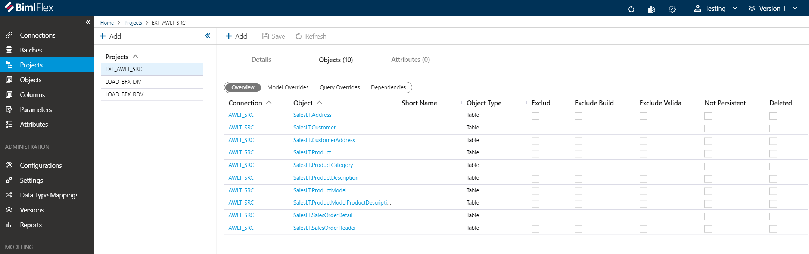

# Importing Metadata

## Import Metadata

The primary source BimlFlex uses to generate Data Warehousing and Business Intelligence assets is metadata. Metadata is most commonly in the form of objects with corresponding attributes.

Although it is relatively straightforward to define individual metadata objects, it can take considerable time and effort to create, update and maintain the number of objects that would typically be involved in an enterprise data warehouse solution.

The BimlFlex App provides an import tool which is accessible from the Connections and Projects screens. It connects to a database source and populates the BimlFlex database with metadata.

This tool can be used in any scenario where a schema is available, and there is a need to bring that metadata into a BimlFlex project. If a change happens in the source, the metadata can be imported again to update the model.

[//]: # (TODO: Add Recording)

### Locating the tool

In the BimlFlex App, Navigate to a Source Connection or associated Source Project. The Connection should have a connection string which points to the database which should be imported. In the details tab, click the `Import Metadata` button. This opens the Import Metadata page.

### Import Metadata UI

There are a number of options for importing metadata. Align these options with the solution architecture and metadata conventions.

The example connection in the Sample Metadata is `AWLT_SRC` which points to the AdventureWorksLT database, using the project `EXT_AWLT_SRC` as the target for imported metadata.

Below the Connection and Project drop downs are all the main options. Use these to control the behavior of the import, such as what object types to import, naming conventions to apply and what to retain if the metadata has been imported before.

### Metadata Options Definitions

A brief overview of the UI.

#### Filter Tables and Schemas

The Schema Filter and Table Filter can be used to limit the Assets made available/visible for import. This is useful if a subset of available tables will be imported or if new tables are added to an existing repository. Filtering also improves performance when connecting to and importing large database schemas.

#### Source and Target

| Option Name       | Definition |
| ----------------- | ---------- |
| Source Connection | Name of the connection that points to the data source the project is extracting from. The Connection String is defined in the Details tab in the Metadata |
| Target Project    | Name of the previously defined project that will use this metadata as its source in the source to target loading. |

#### Table and column names

Options to apply naming conventions to imported metadata.

* None - This will retain the source system default naming conventions.
* PascalCase - E.g. "CustomerAddress"
* camelCase - E.g. "customerAddress"
* Proper\_Case - E.g. "Customer\_Address"
* Proper Case - E.g. "Customer Address"
* UPPER\_CASE - E.g. "CUSTOMER\_ADDRESS"
* lower\_case - E.g. "customer\_address"

#### Inferred Metadata

Infers Integration Keys from column constraints

* None - Nothing
* Infer Integration Key from Primary Key
* Infer Integration Key from Unique Key
* Infer Integration Key from First Column
* Infer Integration Key from Identity Column
* Infer Integration Key from Named Column  

#### Retain Changes to Previously Imported Metadata

Controls if existing metadata should be retained during the import of metadata.

* Data Type Changes
* Column Order Changes
* Foreign Key Changes
* All Other, Don't override anything else

To override everything, uncheck all checkboxes.

#### Default Properties

This controls default behavior of inferred Integration Keys.

* Pad Integration Keys (Amount) – defines Integration Key width
* Integration Key Prefix or Suffix - based on your settings, it will auto populate a value which can be overridden here. It will add this value as prefix or suffix onto the column name to indicate Integration Key.
* Key Columns End With – When inferring key/reference names, what substring to look for at the end of a column name - `Id`, `Code`, `No`, `Key`, or any custom string added.

#### More Options

* Add Record Source (@@rs) To Integration Key
* Change References To Integration Keys
* Import Views

## Retrieve Objects for Import

Click the `Connect to Database` button. If the Connection String is correct and the user has permissions to the schema, it will list all the tables and views (if Import View were selected in the options) as Importable Assets.

### Importable Assets

The Importable Assets list is read from the Source Connection. Choose items that should be included in the metadata import.

Upon clicking the `Import Metadata` button, the metadata will be imported into the BimlFlex app and will be available for review and modelling.

### Verify Imported Metadata

Navigate back to the Connection or Project and view the Objects tab. You should see all the newly imported Objects.

## Import Metadata Over Existing Metadata 

If there are changes to the source schema it is possible to safely run the Import Metadata on the same data again. Use the options to make sure you don't override anything you have changed after running the original import. 

I.e. If a new column is available on a table where you modified the column ordinals, then check `Column Orders` under the `Retain Existing Metadata` options before you import the table.

