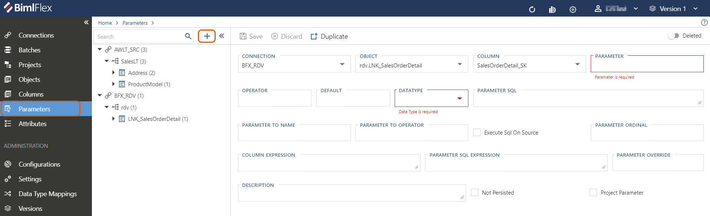
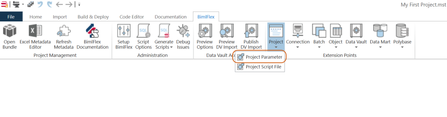
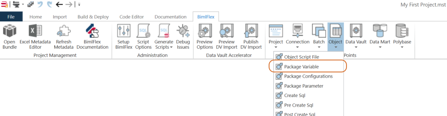

# Load Parameters

BimlFlex provides a number of standard out-of-the-box `parameters`, as well as the functionality to create your own. Parameters can be used in many ways - for example for managing data load windows, orchestration and standardized or default values.

Parameters are most commonly used to define a high water mark or define a filter for what is returned from a Source System. The explanations and scenarios belong are generated in vein with that task.

## Parameter Management

Once a **Parameter** is created in BimlFlex, the BimlCatalog DB (`[BimlCatalog]` by default) is used to manage them.

**Parameter values are persisted in the `[bfx].[ConfigVariable]` table.**

### [[bfx].[ConfigVariable] Details](#tab/table-configvariable)

Click a tab for example or detailed column descriptions.

### [Examples](#tab/table-configvariable-example)

| ConfigVariableID | SystemName | ObjectName                                       | VariableName   | VariableValue           | ExecutionID`*` | PreviousValue | DataTypeOverride`**` |
| ---------------- | ---------- | ------------------------------------------------ | -------------- | ----------------------- | -------------- | ------------- | -------------------- |
| 5                | AWLT_SRC   | AWLT_SRC.SalesLT.SalesOrderDetail.ModifiedDate   | LastLoadDate   | 2004-06-01 00:00:00.000 | 19             | 1900-01-01    | {NULL}               |
| 6                | AWLT_SRC   | AWLT_SRC.SalesLT.ProductDescription.ModifiedDate | LastLoadDate   | 2004-03-11 10:32:17.973 | 20             | 1900-01-01    | {NULL}               |
| 7                | AWLT_SRC   | AWLT_SRC.SalesLT.Product.CustomerID              | LastCustomerID | 21002135                | 21             | 19001010      | int                  |

> [!TIP]
>
> * `*`: This value can be used to get detailed audit history from the `[bfx].[Execution]` or `[rpt].[ExecutionDetails]` tables.

### [Column Definitions](#tab/table-configvariable-definition)

| Column Name          | Usage                                                                                                  |
| -------------------- | ------------------------------------------------------------------------------------------------------ |
| ConfigVariableID     | Table SK                                                                                               |
| SystemName           | Name of the **Connection** associated with the **Parameter**                                           |
| ObjectName           | Full name of the **Object** the **Parameter** is used with                                             |
| VariableName         | Name of the **Parameter**                                                                              |
| VariableValue        | Last or current persisted value                                                                        |
| ExecutionID`*`       | The `ExecutionID` of the Package/Pipeline used to load the Parameter                                   |
| PreviousValue        | Previous `VariableValue` on the last execution                                                         |
| DataTypeOverride`**` | Overrides the implicit variable detection.  See [DataTypeOverride Details](#datatypeoverride-details). |

> [!TIP]
>
> * `*`: This value can be used to get detailed audit history from the `[bfx].[Execution]` or `[rpt].[ExecutionDetails]` tables.

***

#### DataTypeOverride Details

`[DataTypeOverride]` is not a column that is populated by default and is only required in limited edge case scenarios.
This column should be ignored unless you are experiencing issues with the **Parameter** updating as a result of one of the below scenarios.

##### Usage Scenario for DataTypeOverride

Currently the only know edge case happens when a loading an `int` or `decimal` value.
The **Parameter** will fail to update in the `[bfx].[ConfigVariable]` if all the below are true:

* Parameter is an `int` or `decimal` datatype
* Parameter already has an entry in `[bfx].[ConfigVariable]`
* The current `[VariableValue]` can be evaluated as a date
  * Specifically if `ISDATE( [VariableValue] ) = 1` on SQL Server
* The value being loaded does CAN NOT be evaluated as a date
  * Specifically if `ISDATE( [VariableValue] ) = 0` on SQL Server

##### Updating DataTypeOverride

The `[DataTypeOverride]` can only be accessed/viewed on the `[bfx].[ConfigVariable]` table in the **BimlCatalog**.
To populate this column use SQL UPDATE statement as outlined in the template below.

#### Usage of DataTypeOverride

##### [SQL Script Template](#tab/update-datatypeoverride-template)

```sql
UPDATE
    [bfx].[ConfigVariable]
SET
    [DataTypeOverride] = [ 'int' | 'decimal' ]
WHERE
    [ConfigVariableID] = { ConfigVariableID }

```

##### [SQL Script Example](#tab/update-datatypeoverride-sample)

```sql
UPDATE
    [bfx].[ConfigVariable]
SET
    [DataTypeOverride] = 'int'
WHERE
    [ConfigVariableID] = 7

```

***

> [!NOTE]
>
> `[DataTypeOverride]` currently only support the `int` and `decimal` values.

**Parameter history is logged to the `[bfx].[AuditConfigVariable]` table.**

### [[bfx].[AuditConfigVariable] Details](#tab/table-AuditConfigVariable)

Click a tab for example or detailed column descriptions.

### [Examples](#tab/table-AuditConfigVariable-example)

| AuditConfigVariableID | ConfigVariableID | SystemName | ObjectName                                     | VariableName | VariableValue           | ExecutionID | PreviousValue           | RowLastModified             |
| --------------------- | ---------------- | ---------- | ---------------------------------------------- | ------------ | ----------------------- | ----------- | ----------------------- | --------------------------- |
| 1                     | 5                | AWLT_SRC   | AWLT_SRC.SalesLT.SalesOrderDetail.ModifiedDate | LastLoadDate | 2004-06-01 00:00:00.000 | 19          | 1900-01-01              | 2020-12-01 09:38:47.9900000 |
| 17                    | 5                | AWLT_SRC   | AWLT_SRC.SalesLT.SalesOrderDetail.ModifiedDate | LastLoadDate | 2020-12-01 09:50:24.267 | 76          | 2004-06-01 00:00:00.000 | 2020-12-01 09:50:41.8066667 |

### [Column Definitions](#tab/table-AuditConfigVariable-definition)

| Column Name           | Usage                                                                |
| --------------------- | -------------------------------------------------------------------- |
| AuditConfigVariableID | Table SK                                                             |
| ConfigVariableID`*`   | `ConfigVariableID` of the **Parameter**                              |
| SystemName            | Name of the **Connection** associated with the **Parameter**         |
| ObjectName            | Full name of the **Object** the **Parameter** is used with           |
| VariableName          | Name of the **Parameter**                                            |
| VariableValue         | Current persisted value for the listed execution                     |
| ExecutionID`**`       | The `ExecutionID` of the Package/Pipeline used to load the Parameter |
| PreviousValue         | Previous `VariableValue` prior to the listed execution               |
| RowLastModified       | Date the audit record was created                                    |

> [!TIP]
>
> * `*`: This value can be used to get audit record from the `[bfx].[ConfigVariable]` table.
> * `**`: This value can be used to get detailed audit history from the `[bfx].[Execution]` or `[rpt].[ExecutionDetails]` tables.

***

## Parameter Usage

Below demonstrates how a data parameter has been incorporated into a source to target loading package.
Note that this load starts and ends with either a sequence containers (SSIS) or activities (ADF) that are specific for managing parameters.

Each time a package or pipeline is ran, BimlFlex will store the last value and update it as it changes over time.

### [SSIS Architecture](#tab/parameter-architecture-ssis)


The process starts before the main container (`SEQC - Main`).

The initial Sequence Container (`SEQC - Get Parameters`) will have a Execute SQL Task to look up any relevant parameters.
These task (`SQL - Get {Parameter}`) are used to check the BimlCatalog for an existing parameter value for the *PARAMETER*.

The retrieved value will be injected in to the source query filter clause using the specified logic from the metadata.

The final Sequence Container (`SEQC- Set Parameters`) after the main logic then handles setting the parameters.
There is a Execute SQL Task to grab the latest value (`SQL - Get Current {Parameter}`) from the staged data.
A following Execute SQL Task (`SQL - Set {Parameter}`) is then used to persist the value retrieved into the BimlCatalog.

### [ADF Architecture](#tab/parameter-architecture-adf)

<!-- TODO: Take picture of ADF Archtecture -->
<!--  -->

Activities are added to the beginning of the pipeline that retrieve the last value and the next value to be recorded after execution completes.

The initial Lookup Activity (`LKP_{Parameter}`) is used to check the BimlCatalog for an existing parameter value for the *PARAMETER*.
If none are present, it will generate one using the *DEFAULT* value that is configured.
If one is already present, it will retrieve the value.
The retrieved `[VariableValue]` value is then used to define the starting range for the Source Query.

The other Lookup Activity (`LKP_{ParameterToName}`) is used to query the Source System.
This uses the *PARAMETER SQL* against the *COLUMN* and stores the value in the pipeline as the *PARAMETER TO NAME*.

These values are then injected into the source query filter clause to limit values that are then returned from the Source System.

The ending SQL Server Stored Procedure Activity (`LOG_{Parameter}`) is then used to persist the value retrieved by the *PARAMETER TO NAME* into the BimlCatalog.

> [!NOTE]
> The ADF Architecture requires **Window Parameters** when using a **Parameter**.
>
> See [Window Parameters](#window-parameters) for more details.

***

## Creating Parameters in BimlFlex

Parameters can be added in BimlFlex through the **Parameter Editor**, accessible from the BimlFlex main menu.

> [!NOTE]
> For information on the **Parameter Editor** and its usage refer to the below guide:
>
> * BimlFlex Docs: [Parameter Editor](xref:bimlflex-parameter-editor)

To add a new parameters, click the `+` button in the tree view menu.



### Base Parameter

The Base Parameter settings are the core fields that are required for Package/Pipeline level Parameter.
With the exception of *PARAMETER SQL*, these are Source System agnostic.
Configuration of the base **Parameter** itself remains the same across Source Systems.

#### [Description](#tab/parameter-base)

| Field                 | Description                                                                                |
| --------------------- | ------------------------------------------------------------------------------------------ |
| Connection            | The **Connection** this parameter is associated with.  Must be an existing **Connection**. |
| Object                | The **Object** this parameter is associated with.  Must be an existing **Object**.         |
| Column                | The **Column** this parameter is associated with.  Must be an existing **Column**.         |
| Parameter             | The name of the parameter.                                                                 |
| Operator              | Operator to use again the *PARAMETER* when applied to the source **Column**.               |
| Default               | The parameter load value to use for the first load.                                        |
| Datatype`*`           | The Data Type to use for the parameter.  Must be a valid Data Type.                        |
| Parameter SQL`**`     | The query logic to derive the new parameter value.                                         |
| Execute SQL On Source | When enabled executes the SQL on the source instead of the destination.                    |
| Parameter Ordinal     | (Optional) The order of the parameter.                                                     |
| Description           | (Optional) Free text description.                                                          |
| Not Persisted         | Whether the parameter should be persisted to `[bfx].[ConfigVariable]`.                     |
| Project Parameter     | Project level Parameters that are commonly available in all packages in the project.       |

#### [Example](#tab/parameter-base-example)

| Field                 | Description                                                     |
| --------------------- | --------------------------------------------------------------- |
| Connection            | AWLT_SRC                                                        |
| Object                | SalesLT.Address                                                 |
| Column                | ModifiedDate                                                    |
| Parameter             | LastLoadDate                                                    |
| Operator              | >                                                               |
| Default               | 1900-01-01                                                      |
| Datatype`*`           | String                                                          |
| Parameter SQL`**`     | CONVERT(VARCHAR(27),MAX(@@this),121)                            |
| Execute SQL On Source | `true`                                                          |
| Parameter Ordinal     | 1                                                               |
| Description           | Parameter to record the high water mark when loading the table. |
| Not Persisted         | `false`                                                         |
| Project Parameter     | `false`                                                         |

***

> [!NOTE]
>
> * `*`: It is recommended that you use `String` for dates as SSIS sometimes finds it easier to deal with string representations.
> * `**`: See [Parameter SQL](#parameter-sql) for more examples
> [!IMPORTANT]
> `Execute SQL On Source`, along with `Parameter To Name` and `Parameter To Operator`, are required fields when configuring a **Parameter** for ADF.

#### Default

The parameter load value to use the first time the load happens, when there is no existing parameter value stored in the BimlCatalog database. For high watermark scenarios this is commonly a valid value guaranteed to be lower than any existing data, such as `1900-01-01` for dates. When adding dates in Excel, use the text-defining prefix so the data is kept as text rather than transformed into Excels internal date format, `'1900-01-01`.

#### Parameter SQL

Although the field is named *PARAMETER SQL*, it is easier to this of this field as a Parameter *QUERY*.

In a SQL based Source System this will correlate to a SQL Statement that is appended to the the `WHERE` clause.

In Dynamics, this will be an XML based statement for a `<attribute/>` under the `<fetch/entity/>` node or a complete replacement of the generated `<fetch/>` statement.

> [!IMPORTANT]
> Ensure this value is configured to align with how *EXECUTE SQL ON SOURCE* is configured.
>
> When `true` this should mirror the syntax needed on the Source System.
>
> When `false` this should mirror the syntax needed on the Target System.

#### [T-SQL (Microsoft)](#tab/parameter-sql-tsql)

| Field            | Description                          |
| ---------------- | ------------------------------------ |
| Parameter SQL`*` | CONVERT(VARCHAR(27),MAX(@@this),121) |

#### [SnowSQL](#tab/parameter-sql-snowsql)

| Field            | Description                                          |
| ---------------- | ---------------------------------------------------- |
| Parameter SQL`*` | TO_VARCHAR(MAX(@@this), 'YYYY-MM-DD HH24:MI:SS.FF9') |

#### [Oracle](#tab/parameter-sql-oracle)

| Field            | Description                                                                |
| ---------------- | -------------------------------------------------------------------------- |
| Parameter SQL`*` | CAST(TO_CHAR(MAX(@@this), 'YYYY-MM-DD HH24:MI:SS.FFFFFF') AS VARCHAR2(27)) |

#### [PostgresSQL](#tab/parameter-sql-postgres)

| Field            | Description                                                        |
| ---------------- | ------------------------------------------------------------------ |
| Parameter SQL`*` | CAST(TO_CHAR(MAX(@@this), 'YYYY-MM-DD HH24:MI:SS') AS VARCHAR(23)) |

#### [MySQL](#tab/parameter-sql-mysql)

| Field            | Description                                                                    |
| ---------------- | ------------------------------------------------------------------------------ |
| Parameter SQL`*` | LEFT(DATE_FORMAT(DATE_ADD(MAX(@@this), INTERVAL 0 DAY), '%Y-%m-%d %T.%f'), 27) |

#### [Dynamics - Attribute](#tab/parameter-sql-dynamics-attribute)

| Field             | Description                                                               |
| ----------------- | ------------------------------------------------------------------------- |
| Parameter SQL`**` | \<attribute name="modifiedon" alias="next_modifiedon" aggregate="max" /\> |

Dynamics Pattern for `<Attribute/>` *PARAMETER SQL*

```XML
<fetch distinct="false" mapping="logical" aggregate="true">
  <entity name="{object}">
     {Parameter SQL Value}
  </entity>
</fetch>
```

> [!IMPORTANT]
> This pattern is only valid for Dynamics entities with less than 50k records.
>
> If the Dynamics Entity has more than 50k records then use the `Dynamics - Blank` or `Dynamics - Fetch` patterns.

#### [Dynamics - Blank](#tab/parameter-sql-dynamics-blank)

When *PARAMETER SQL* is blank BimlFlex will generate a `<fetch/>` statement using the following pattern.

Dynamics Pattern for `<Attribute/>` *PARAMETER SQL*:

```XML
<fetch distinct="false" mapping="logical">
    <entity name="{object}">
        <attribute name="{column}" alias="{Parameter To Name}" />
        <order attribute="{column}" descending="true" />
    </entity>
</fetch>
```

> [!TIP]
> If you require more advanced logic you can customize the entire `<fetch/>` statement simply by defining it.

#### [Dynamics - Fetch](#tab/parameter-sql-dynamics-fetch)

| Field             | Description                                                                                                                                                                                                                                                                                                                                                                                     |
| ----------------- | ----------------------------------------------------------------------------------------------------------------------------------------------------------------------------------------------------------------------------------------------------------------------------------------------------------------------------------------------------------------------------------------------- |
| Parameter SQL`**` | \<fetch distinct="false" mapping="logical"> <br/>&nbsp;&nbsp;&nbsp;&nbsp;\<entity name="account"> <br/>&nbsp;&nbsp;&nbsp;&nbsp;&nbsp;&nbsp;&nbsp;&nbsp;\<attribute name="modifiedon" alias="next_modifiedon" aggregate="max" /> <br/>&nbsp;&nbsp;&nbsp;&nbsp;&nbsp;&nbsp;&nbsp;&nbsp;\<order attribute="modifiedon" descending="true" /> <br/>&nbsp;&nbsp;&nbsp;&nbsp;\</entity> <br/>\<fetch/> |

***

> [!NOTE]
>
> * `*`: All SQL based Source Systems will have similar pattern but differ in syntax.
> * `**`: When using Dynamics the first characters determine logic.
>   * If the *PARAMETER SQL* starts with `<fetch` then it will override the entire fetch statement with.
>   * If not, it will use the `Dynamics - Attribute` pattern.
>   * If blank it will use the `Dynamics - Blank` pattern.

### Window Parameters

**Window Parameters** are configured to load between two points.

Useful when it is not possible to derive the new parameter from the destination, such as a Blob file.
This allows the from and to to be derived and applied in the source query using only the source data.

These get configured by defining the below fields.

#### [Description](#tab/parameter-window)

| Field                 | Description                                                                          |
| --------------------- | ------------------------------------------------------------------------------------ |
| Parameter To Name     | Name of the parameter ending window parameter.  Cannot be same as Parameter Name.    |
| Parameter To Operator | Operator to use again the *PARAMETER TO NAME* when applied to the source **Column**. |

#### [Example](#tab/parameter-window-example)

| Field                 | Description  |
| --------------------- | ------------ |
| Parameter To Name     | NextLoadDate |
| Parameter To Operator | <=           |

***

> [!IMPORTANT]
> These, along with `Execute SQL On Source`, are required fields when configuring a **Parameter** for ADF.

BimlFlex Pattern for Window Parameters:

```sql
`{Existing WHERE Clause}` `{AND if Needed}`
     `{Column}` `{Operator}` `{Parameter}`
    AND `{Column}` `{Parameter To Operator}` `{Parameter To Name}`
```

Example:

```sql
WHERE
    [SalesLT].[ModifiedDate] > `{LastLoadDate Value}`
    AND [SalesLT].[ModifiedDate] <= `{NextLoadDate Value}`
```

### Parameter Overrides

These are provided to either apply alternate workarounds or replace sections of the the automated code generation.

#### [Description](#tab/parameter-override)

| Field                    | Description                                                                  |
| ------------------------ | ---------------------------------------------------------------------------- |
| Column Expression        | Used to override the column part of the WHERE clause in the source query.    |
| Parameter SQL Expression | Used to override the entire WHERE clause in the source query.                |
| Parameter Override       | Used to override the parameter part of the WHERE clause in the source query. |

#### [Example](#tab/parameter-override-example)

| Field                    | Description                         |
| ------------------------ | ----------------------------------- |
| Column Expression        | COALESCE(ModifiedDate, CreatedDate) |
| Parameter SQL Expression |                                     |
| Parameter Override       | DATEADD(dd, -3, ?)                  |

<!-- TODO: Add example Parameter SQL Expression -->

***

#### Column Expression

Used to override the column part of the WHERE clause in the source query to tweak the column expression. Useful when extra logic is required for the filter.

Example expression

```sql
COALESCE(ModifiedDate, CreatedDate)
```

<!-- TODO: Add example output -->

#### Parameter Override

Used to override the parameter part of the WHERE clause in the source query to tweak the column expression. Useful when extra logic is required for the filter.

Example expression

```sql
DATEADD(dd, -3, ?)
```

<!-- TODO: Add example output -->

<!-- TODO: Add #### Parameter SQL Expression -->
## Parameters in Extension Points

Extension Point-based parameters are available for more complex scenarios where the logic needed for the flow and parameter isn't easily injected through the normal parameter process.

It also supports specifying Project level Parameters that are commonly available in all packages in the project.

### Extension Point Project Parameters (SSIS)

Add Extension Points in BimlStudio.

More information: [BimlFlex Extension Points](xref:bimlflex-concepts-extension-points)



The newly created file contains some sample scripts:

```biml
<#@ extension bundle="BimlFlex.bimlb" extensionpoint="ProjectParameter" target="<ProjectName>" #>

<Parameter Name="ServerName" DataType="String" IsRequired="true">localhost</Parameter>
<Parameter Name="UserName" DataType="String" IsRequired="true">varigence</Parameter>
<Parameter Name="UserPassword" DataType="String" IsRequired="true">P@ssw0rd!</Parameter>
```

The directives are required for the Extension Point. An additional attribute for the target of the Extension Point needs to be specified.

For a project parameter, this is the name of the project it targets.

Once the Project Parameter is defined through the Extension Point it can be reused throughout the project in either metadata or additional Extension Points as needed.

### Extension Point Package Parameters (SSIS)

Package Parameters only affect the individual package it targets.

Package parameters can be used when a single package requires bespoke logic that doesn't fit the existing parameter logic.

These parameters can be used for any logic and might not need to be persisted in the BimlCatalog database.

Add Extension Points in BimlStudio



The newly created file contains some sample scripts:

```biml
<#@ extension bundle="BimlFlex.bimlb" extensionpoint="PackageVariable" target="<ObjectName>"#>
<#@ property name="table" type="BimlFlexModelWrapper.ObjectsWrapper" #>

<#* CustomOutput.ObjectInherit = true; *#>
<Variable Name="TenantCode" DataType="String">UNK</Variable>
<Variable Name="CurrentModifiedDate" DataType="String" Namespace="User">1900-01-01</Variable>
```

The directives are required for the Extension Point.

An additional attribute for the target of the Extension Point needs to be specified.

For a package parameter, this is the name of the package it targets.

Once the Package Parameter is defined through the Extension Point it can be reused throughout the Package in either metadata or additional Extension Points as needed.
