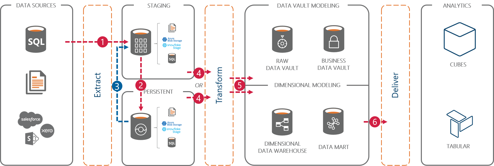

# Persistent Staging Area Concept

A `Persistent Staging Area` (PSA) is an optional area in the data solution design that records the transactions (events) that were received by the data solution over time. Much like an archive, it shows the changes in data in its original form and prior to any interpretation towards data integration or delivery.

The PSA provides a historised view of the data received from the operational systems ('source'), even if these systems themselves do not have this data anymore. With a PSA, it is possible to reload the upstream data solution from the original transactions - *replaying the history* of transactions into a potentially different information model.

The PSA tables or files have the same structure as the source they receive the data from, with a few additions to enable storing multiple version of the data based on the source primary key. Generally speaking, the PSA is a copy of the source table that can store its history.

There are two forms on a PSA that BimlFlex supports:

1. Full history, which captures the incoming transactions as described above. And,
2. Current state, which only shows the most recent state of a given record.

The main difference is that in the full history configuration new data is always inserted, whereas in the current state option new changes in data are inserted (if new) or updated (if existing). In BimlFlex, this version of the PSA concept is referred to as an `ODS` - an Operational Data Store.

In other words, by default history is recorded in the PSA but this can be configured to not store history - which creates an ODS.

A PSA is a good option to include in the overall design if you gradually build out your data solution. This is because it is possible to start collecting data, and build up a history of events, while considering what the target model (information model, or business model) should look like. Once the target model is sufficiently completed the available data can be loaded into this model.

It is also possible to change your mind and tweak the target model, after which the PSA can provide the data to (re)populate the updated model - either partially or in full.

## Persistent Staging in BimlFlex

In BimlFlex, a PSA is defined as a specific `Integration Stage` for a given `Connection`. This feature will inform BimlFlex that objects mapped to this connection are PSA objects.

In a `Project`, a PSA is directly linked to a source connection. When configuring a Project in BimlFlex for which the first connection is a source system, a PSA connection will be requested for configuration. BimlFlex will create PSA tables, using the PSA connection, for the selected source system objects (connection).

In this setup, an option to `Persist History` is available. When this option is enabled *full history* will be recorded in the PSA, and when this option is disabled only the *current state* of information will be available.

## Data flows related to the PSA

If added to the design, the PSA can be used in various ways in the solution.

During regular processing the data is loaded into the next layers from the staging area. For ETL style loading patterns, data can be loaded into the staging area and the PSA in the same batch. Most ETL style patterns first load data into the staging area and then merge the differential into the PSA.

The PSA can be used for *re-initialization*. During re-initialization, the regular processing is paused and the full history from the PSA is loaded into selected staging area tables. The upstream layers can be reloaded from here and using the historical data that is now available. This is the 3rd data flow in the diagram.

However, this is not the only way to do this. In other configurations the PSA can also be used directly to populate the upstream layers with data. This makes the PSA an integral part of the solution. The staging area is still used for various purposes, such as deriving the data delta and staging flat files.

This approach uses an `Staged Query` entity type, which allows an already available (staged) dataset to be used for further processing to a Data Vault or Dimensional model. The interface between the PSA and the upstream model (Data Vault or Dimensional) must be defined as a separate object in the metadata to allow processing.

Essentially, the Staged Query can be used to retrieve data from the PSA.

Explanation of the high level data flow numbers:

1. Data is loaded into the staging area.
2. From the staging area, data delta is inserted into the PSA. Note that in some patterns the staging area and the PSA are loaded at the same time.
3. Data can optionally be re-initialized; copied back into the staging area for re-processing of upstream layers.
4. The data can be merged into the Data Vault or Dimensional Model from the staging area or from the PSA. This is a configurable option.
5. Any transformations required to map the data to the target model are applied.
6. Data is delivered in a form that is fit for consumption.