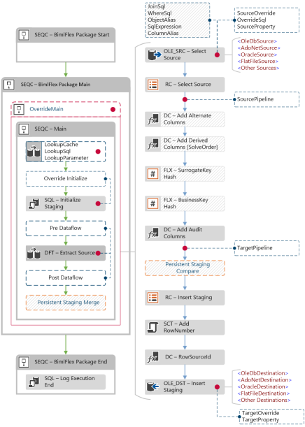
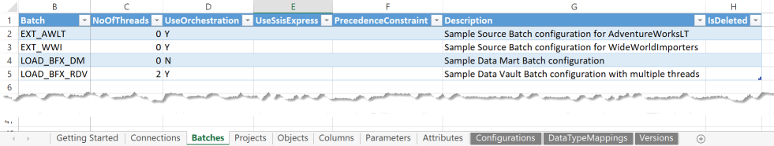
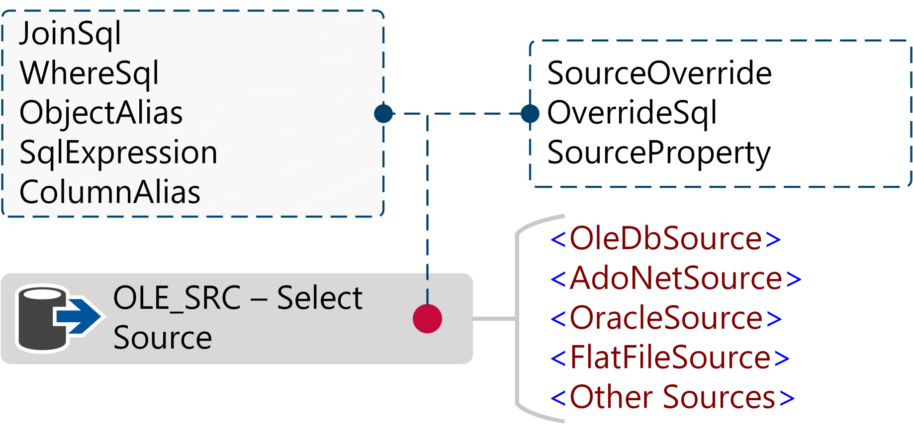
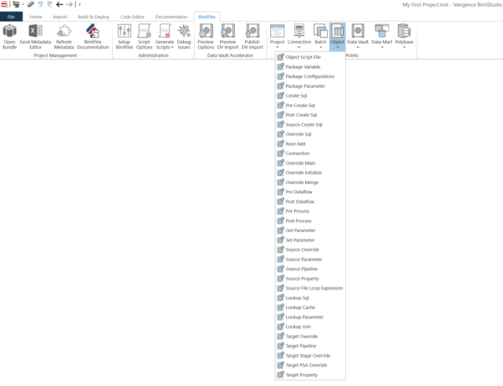
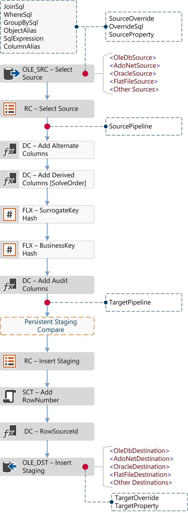
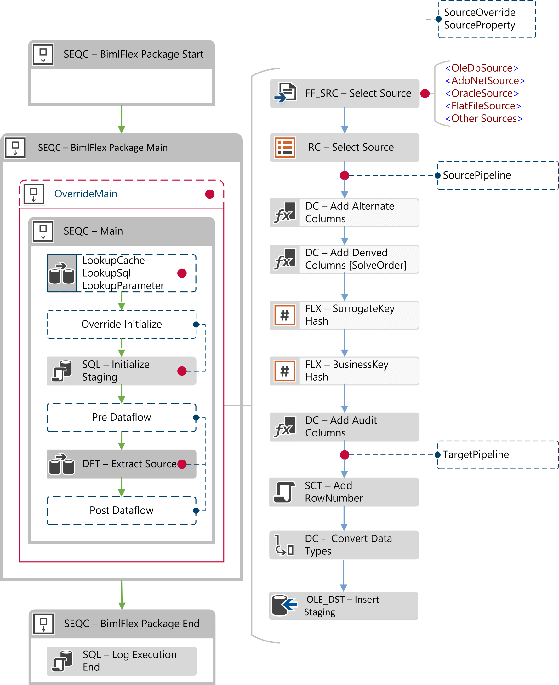
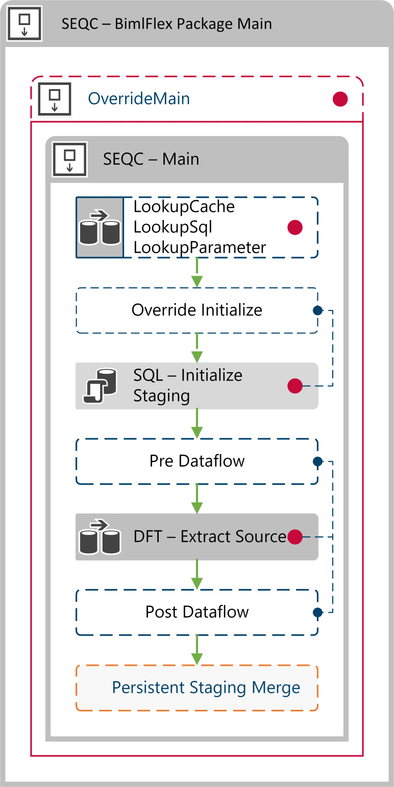

# Source to Staging Templates

BimlFlex offers users the ability to automate the development of best practice ETL out of the box using metadata modeling. As part of this, there are various options for users when designing a staging layer for their solution.

## Watch Recordings

### 03.BimlFlex - Source To Staging

In this session, we explore the process of configuring Source to Staging process.


### 05.BimlFlex - Object Inheritance

In this session we look at Object Inheritance to reuse metadata.


### 13.BimlFlex - Import Files

In this session we look at how to configure flat files.


## Source to Staging

Using metadata, the source schemas are mapped to a staging environment. This provides all the required metadata for the source to staging/persistent staging. When run through SSIS, data is transferred and any transformations that are defined using SsisExpressions and/or SqlExpressions are applied.

The source to staging creation can be toggled on or off based on what metadata has been defined.

Database sources and Flat File sources utilize different templates. The template used is controlled by the IntegrationTemplate property of the project.

### Integration Templates

Below is the currently supported Integration Templates

|Project Integration Templates|Staging Available|
|--- |--- |
|Source -> Target|Yes|
|Source -> File Extract|Not Applicable|
|Source -> Zip File Extract|Not Applicable|

### ETL Pattern Overview

The standard framework being applied. This can be overridden by using metadata settings or Extension Points, signified by the red dots and dashed lined rectangles.



**\[SEQC – BimlFlex Package Start\]** is added to every package and have an OnPreExecute EventHandler that decides if the package should execute and/or perform any Rollback operations prior to executing.

**\[SEQC – Main\]** is where the core source to staging load is implemented.

**\[SQL – Initialize Staging\]** Truncates the target staging table.

**\[DFT – Extract Source\]** Data flow task that implements the source to staging data load process.

  **\[OLE\_SRC – Select Source\]** Source component for the extraction. This contains the source SQL `SELECT` statement.

  **\[RC – Select Source\]** logs the number of input rows into `[BimlCatalog].[ssis].[RowCount]`

  **\[DC – Audit Columns\]** adds all the ETL audit columns to the pipeline. Depending on configuration these could be:

  * `RowEffectiveFromDate`
  * `RowEffectiveToDate`
  * `RowLastSeenDate`
  * `RowStartDate`
  * `RowEndDate`
  * `RowAuditId`
  * `RowChangeType`
  * `RowRecordSource`
  * `RowIsCurrent`
  * `RowIsDeleted`

  **\[RC – Insert Staging\]** logs the number of insert rows into `[BimlCatalog].[ssis].[RowCount]`

**\[SCT – Add RowNumber\]** adds a sequence number to the pipeline. (as not all destinations support identity columns).

  **\[DC – RowSourceId\]** derives the sequence number into the data type and column name specified for RowSourceId in the Configuration metadata.

  **\[OLE\_DST – Insert Staging\]** inserts all new columns into the staging table that have been extracted from the source component along with any derived columns.

**\[SEQC – BimlFlex Package End\]** is added to every package and logs package success completion.

## Adding Staging to a Solution

### Project Implementation

BimlFlex supports source to target project that extracts data from a source system, staging deltas and persisting changes into Persistent Staging. 

Once data is staged it can be loaded further to the target destination. There are several ways a project can be configured.

The diagram below shows sample project loads loads to suit different scenarios.


Base project design and architecture in BimlFlex based on the layers and modeling techniques used in the organization.

Example: properties included in a project with staging.

|Attribute Name|Example Project Attributes|
|--- |--- |
|Project|EXT_AW|
|Source Connection|AdventureWorksLT|
|Stage Connection|AW_STG|
|Persistent Stage Connection (Optional)|AW_ODS|
|Target Connection (final destination of the data: DW, DV etc.)|AW_DV|
|Batch Name|EXT_AW|
|Parent Batch (Optional)||
|Integration Template. (Source Target)|Source Target|

This Project configuration describes a project that loads data that from source system AdventureWorksLT and prepares for the final Data Vault (`BFX_RDV`) destination.

Adding a valid staging connection in the Stage Connection property will include all required tables and ETL to the solution in BimlStudio.

By defining the final destination as Data Vault, the process optimizer includes hashing of keys into Staging that are required for Data Vault. Note that the sample projects below has separate projects for Source To Staging to Persistent Staging and Staging to Data Vault.


Defining a new Source to Staging project:

1. Insert a valid batch name to use as its parent package
1. Insert valid source and target destination connections
1. Insert a valid staging connection, and if applicable add a valid Persistent Staging connection.
1. Select the Source to Target integration template. Source to Staging loads uses the Source to Target template.
1. Commit the changes to the Metadata database through the "Set Current Sheet" button on the Projects tab.

### Batch Implementation

Batches represent parent packages that control what set of child packages will be executed together.



Defining a Batch:

1. Use a descriptive name
2. `NoOfThreads`, Number Of Threads, control the parallelism if the execution within the Batch
3. `UseOrchestration`, Use Orchestration, controls if the Batch will use the Orchestration function within the Batch
4. `UseSsisExpress`, Use SSIS Express, controls if BimlFlex should generate SSIS Express packages. SSIS Express packages can run without a licensed SQL Server but has limited functionality
5. `PrecendenceConstraint`, Precedence Constraint, controls if the execute package tasks in the batch should implement a specific Precedence Constraint

## Customizing Source Queries

BimlFlex supports tweaks to automated source queries through metadata as well as custom source queries through Extension Points. Joins and where filters are easily added through metadata.

### JoinSql

Add `JOIN` statements in the JoinSql column in the Objects sheet. 
Example, to join the Customer and Sales tables:

```sql
INNER JOIN [sales].[Customer] cst ON sls.[CustomerID] = cst.[CustomerID]
```

The join condition uses aliases for tables. The alias for a table is specified in the ObjectAlias metadata column

### WhereSql

Add `WHERE` statements in the WhereSql column in the Objects sheet.
Example, filter AddressType on a string literal:

```sql
WHERE ca.[AddressType] = 'Main Office'
```

### GroupBySql

Add `GROUP BY` statements in the GroupBySql column in the Objects sheet.

```sql
GROUP BY [CustomerID]
```

### ObjectAlias

The ObjectAlias metadata column used on the Objects tab. A customer table can be aliased `cst` to use in custom Sql statements.

### Column Overrides

BimlFlex supports a number of overrides on individual columns.


### SqlExpression

`SqlExpression` is used to apply a transformation to a column in the query. This can apply any valid SQL expression to the column query extracting the data.

Example:

```sqk
CONVERT(VARCHAR(60), [City])
```

### SsisExpression

SsisExpression is used to apply a Derived Column transformation during extraction. This can apply any valid SSIS expression to the column in the data flow.
Example:

```
(DT_STR, 60, 1252)ALT_CITY
```

### Column alias

Column alias defines the SQL alias for a source query.

Example, the source query needs to apply a rename of a column. BimlFlex will create the query using the original column name and add `AS [Alias]` to the query.

Example code:

Adding the Alias

```sql
AlternateName
```

to the column

```sql
Name
```

will generate the following SELECT snippet for the column

```sql
[Name] AS [AlternateName]
```

## Example: Joining Tables in BimlFlex

Example of a join between the `SalesOrderHeader` and `Customer` tables to add columns from the `Customer` table to the `SalesOrderHeader` Staging and Persistent Staging through an `INNER JOIN`. This will add the join and any specified additional columns into the source `SELECT` statement.

### Objects in metadata


Example: `ObjectAlias` and `JoinSql` added to metadata

### Columns in metadata


Example: added `CustomerLastName` column joined from the `Customer` table.

This manually added column uses the following SqlExpression to inject the column from the joined table using the alias defined for that table as well as a custom name in the `SalesOrderHeader` Staging table.

SqlExpression:

```sql
cust.LastName AS CustomerLastName
```

Example, generated source query:

```sql
SELECT
     soh.[SalesOrderID]
     -- several excluded columns
     ,soh.[ModifiedDate]
     ,cust.LastName AS [CustomerLastName]
FROM [SalesLT].[SalesOrderHeader] soh 
     INNER JOIN [SalesLT].[Customer] cust on soh.[CustomerId] = cust.[CustomerId]
```

Steps to create a source query join using two tables that are included in metadata are as follows:

1. Determine which table (A) will be used to join against an already existing table (B)
1. Ensure that both tables A and B both have an object alias set in the object's metadata
1. Add a join statement into the JoinSql column of table A ensuring that the correct object alias is being used for both
1. If additional columns are added to the load add them to the columns sheet
1. Set the changes on both Object and column metadata sheets
1. Check the output in BimlStudio is as expected
1. Build and test

## Custom Source Queries with Extension Points

Another option for customizing source queries is by adding an Extension Point.

Extension Points are a comprehensive feature of BimlFlex and has its own documentation here: @bimlflex-extension-points. A subset focused on Source to Staging is included here.

Extension Points are custom logic and tasks that can be injected directly into the BimlFlex framework in order to extend and replace standard BimlFlex functionality.

The diagram below shows at which point the extension points are added to the source component ETL in BimlFlex. The left-hand side box contains the adjustments a user can make to the source query in metadata and the right-hand box contains the extension points that can be added that control the source query.



### Create a Source Override Extension Point

Example, create a source override extension point.

In BimlStudio, click the Source Override in the BimlFlex Tab, Extension Points group, Object drop-down to create the Extension Point Biml file.



In the new Biml file that opens, add the required target attribute for the source this will override, such as `AdventureWorksLT.SalesLT.Address` for the source connection, schema and table.

Rename the added Extension Point file so that it is easy to identify it later.

Add the custom SQL query and the resulting columns to the code.


## Load Threading

BimlFlex supports optimizing the ETL processes by selectively adding multi-threading to packages.

If threading is applied to the ETL pattern, this will divide the amount of rows being processed across the available cores provided by the server. This can results in performance improvements.

To adjust, edit NumberOfThreads on the Connection and Object tabs. Determine the number of threads to allocate using the BalanceDistributor component and add the value as appropriate. The BalanceDistributor is the component in SSIS that allows threading to occur. Setting the NumberOfThreads to two will alter the **\[DFT – Extract Source\]** data flow. 0 represents the default of 1 thread.

## Load Hashing

Hashing of incoming rows also allows for potential performance increases. Creating row hashes minimizes the number of comparisons that are required in the delta process.

### \[FLX – Full Row Hash\]

Hashes all the columns in the row.

BimlFlex uses this for delta detection in the staging layer (comparing loads to Persistent Staging) for sources that do not have built-in CDC.

### \[FLX – IntegrationKey Hash\]

Hashing the Integration Key for use in Data Vault.

Configuring hashing is done through the Configurations and Settings page of the BimlFlex Excel Add-in.

Data Vault targets will always hash Integration Keys as that is a requirement for Data Vault.



## File to Staging

For file based sources there are some additional configurations required. As the file doesn't provide the required metadata, the Objects and Columns sheets needs to be populated manually.



## Adding File to Staging Metadata

Each source File requires a flat file connection on the Connections tab in BimlFlex Excel. This will define the attributes for the file.

Example attributes for a flat file connection:

|Attribute Name|Example Project Attributes|
|--- |--- |
|Name|CustomerFile|
|ConnectionString|C:\ImportFiles|
|Catalog|CustomerFiles|
|ConnectionType|FILE|
|SystemType|"File Delimited", "File Ragged Right", "Excel"|
|IntegrationStage|Source|
|RecordSource|TF|
|FilePath|C:\ImportFiles\|
|FilePattern|Customers*.*|

Flat file loads also need a Batch entity. Add a new Batch with appropriate name and configuration.

Each file will have its own Batch. It is possible to group multiple Batches using the Parent Batch entry so that several files are loaded in a single Batch.

Flat file loads also need a Project entity. Add a new Project with appropriate name and configuration.

Flat files also need a file specification defined in the Objects sheet. File Type, first row column names, delimiters and codepage/encoding needs to correspond to the format of the files.

Each column in the source needs a column definition in the Columns sheet. The only requirement in this step is that the table used as the target for the customer rows has the correct number of columns with matching data types.

Refresh the solution metadata in BimlStudio, build and test the solution.

## Persistent Staging

### Adding Persistent Staging

Persistent staging can be seamlessly added to a project. Similar to how BimlFlex handles staging in a project, BimlFlex will automatically generate all the required table schemas and ETL needed to include persistent staging.

Delta/change detection for the Persistent layer is done on the defined primary keys of the source.

All the required information is already in place and can be inferred from the staging and source table metadata.

Creation and inclusion of Persistent Staging loads is controlled by the PersistHistory Flag for the connection. 

By configuring Y for the source the ETL process and table definitions are included for the source.



The above template includes the following

#### \[LKP – PSA/ODS\]

Lookup rows from Persistent Staging are used to perform CDC/Delta Detection. If the source system changes, users can override this by defining an ExtensionPoint for LookupJoin or LookupSql. The following query is generated by the template.

```sql
SELECT
     SRC.[RowHash]
    ,SRC.[RowRecordSource]
FROM
     [aw].[Address] SRC
<# if (table.GetPersistHistory()) { #>
WHERE
     SRC.[RowIsCurrent] = 1
<# } #>
```

#### \[SQL – Insert PSA/ODS\]

When `@IsInitialLoad` is set to `TRUE`, perform a direct insert into the PSA database bypassing the end dating and MERGE process.

#### \[SQL – Merge PSA/ODS\]

When `@IsInitialLoad` is set to `FALSE`, `MERGE` the changes into the PSA database.

#### \[SQL – Update End Dates\]

Updates relevant End Dates and Current Flags.

## Persistent Staging to Staging

BimlFlex supports reloading the data warehouse using persisted staging as the source. The standard Build process automatically creates a reinitialization project that reloads the Staging tables from Persistent Staging.

For the sample AdventureWorksLT source, the project `INIT_FROM_PSA_EXT_AWLT_Project` is generated.
