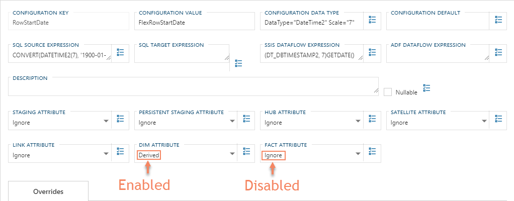
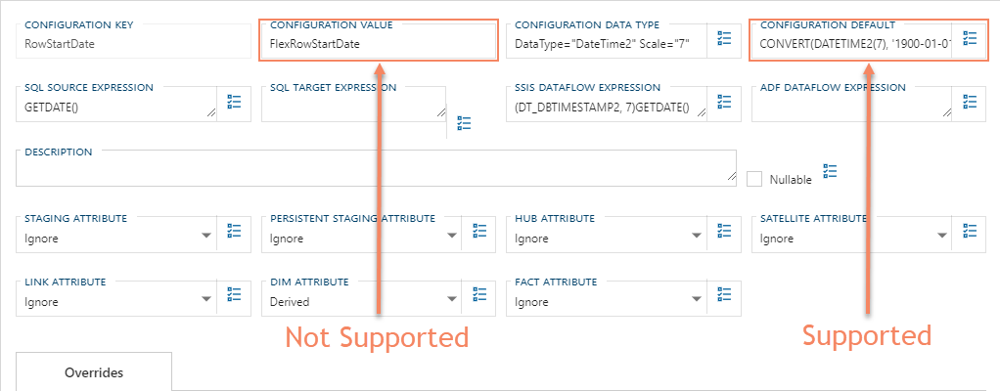
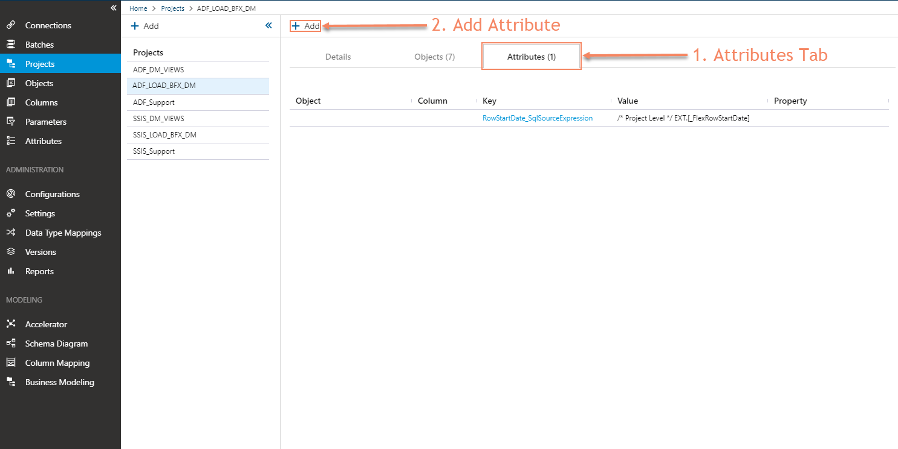
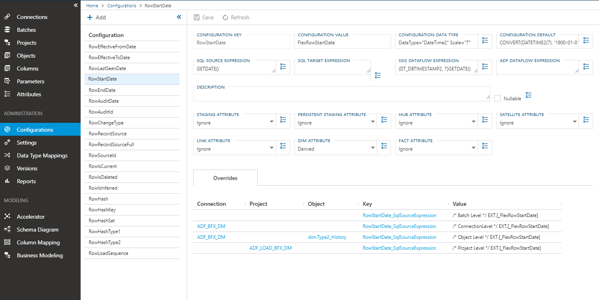
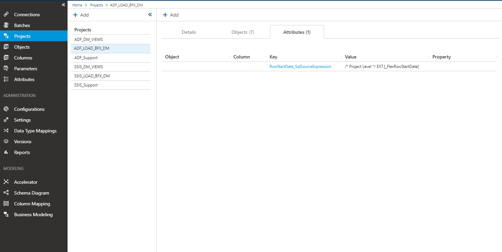
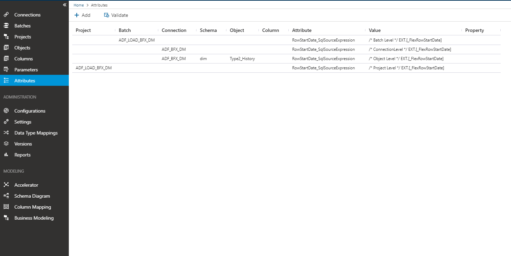

# BimlFlex Configurations and the Data Mart

BimlFlex **Configurations** are used to apply and drive default behavior across multiple data architecture concepts.
At a high level, **Configuration** values control where/when they get applied and how they are calculated.

> [!TIP]
> For additional details on managing **Configuration**, **Attributes** and **Configuration Overrides** refer to the below guides:
>
> BimlFlex Docs: [Configurations](xref:bimlflex-configurations)
>
> BimlFlex Docs: [BimlFlex Configurations](xref:bimlflex-metadata-configurations)
>
> BimlFlex Docs: [Attributes](xref:bimlflex-attribute-editor)
>

## Common Configurations

The below tabs outline common **Configurations** used in the Data Mart, along with recommended field values.
These are the recommendations only if choosing to enable the **Configuration(s)** and if no prior standard is in place.
These can be adjusted to fit an organization's specific data standards.

### [Description](#tab/configuration-description)

| Configuration      | Description                                                             |
| ------------------ | ----------------------------------------------------------------------- |
| RowStartDate       | Defines the start of time definition for a row in the data warehouse.   |
| RowEndDate         | Defines the end of time definition for a row in the data warehouse.     |
| RowIsCurrent       | Flag to set if the row is current.                                      |
| RowIsInferred `*`  | Flag to set if the row is inferred.                                     |
| RowHashType1 `**`  | Defines the expression used to derive a row hash for type 1 attributes. |
| RowHashType2 `***` | Defines the expression used to derive a row hash for type 2 attributes. |

### [Value](#tab/configuration-value)

| Configuration      | Value (Column Name) |
| ------------------ | ------------------- |
| RowStartDate       | FlexRowStartDate    |
| RowEndDate         | FlexRowEndDate      |
| RowIsCurrent       | FlexRowIsCurrent    |
| RowIsInferred `*`  | FlexRowIsInferred   |
| RowHashType1 `**`  | FlexRowHashType1    |
| RowHashType2 `***` | FlexRowHashType2    |

### [Data Type](#tab/configuration-data-type)

| Configuration      | Data Type                      |
| ------------------ | ------------------------------ |
| RowStartDate       | DataType="DateTime2" Scale="7" |
| RowEndDate         | DataType="DateTime2" Scale="7" |
| RowIsCurrent       | DataType="Boolean"             |
| RowIsInferred `*`  | DataType="Boolean"             |
| RowHashType1 `**`  | DataType="Binary" Length="20"  |
| RowHashType2 `***` | DataType="Binary" Length="20"  |

### [Default](#tab/configuration-default)

| Configuration      | Default      | Implied Conversion                         |
| ------------------ | ------------ | ------------------------------------------ |
| RowStartDate       | '1900-01-01' | `1900-01-01 00:00:00.000000`               |
| RowEndDate         | '9999-12-31' | `9999-12-31 00:00:00.000000`               |
| RowIsCurrent       | 1            |                                            |
| RowIsInferred `*`  | 0            |                                            |
| RowHashType1 `**`  | 0            | `0x00000000000000000000000000000000000000` |
| RowHashType2 `***` | 0            | `0x00000000000000000000000000000000000000` |

### [Expression](#tab/configuration-expression)

| Configuration      | SQL Source Expression               | SSIS Dataflow Expression          |
| ------------------ | ----------------------------------- | --------------------------------- |
| RowStartDate       | GETDATE()                           | (DT_DBTIMESTAMP2, 7)GETDATE()     |
| RowEndDate         | CONVERT(DATETIME2(7), '9999-12-31') | (DT_DBTIMESTAMP2, 7)"9999-12-31") |
| RowIsCurrent       | CONVERT(BIT, 1)                     | true                              |
| RowIsInferred `*`  | CONVERT(BIT, 0)                     | false                             |
| RowHashType1 `**`  |                                     | [vck@@this1]                      |
| RowHashType2 `***` |                                     | [vck@@this1]                      |

### [Attributes](#tab/configuration-concept-attributes)

| Configuration      | Dim Attribute | Fact Attribute |
| ------------------ | ------------- | -------------- |
| RowStartDate       | Derived       | Ignore         |
| RowEndDate         | Derived       | Ignore         |
| RowIsCurrent       | Derived       | Ignore         |
| RowIsInferred `*`  | Derived       | Ignore         |
| RowHashType1 `**`  | Hash          | Hash           |
| RowHashType2 `***` | Hash          | Ignore         |

***

> [!NOTE]
> \*: Requires the **Setting** `DmInferDim` to be enabled prior to use.
>
> \*\*: Only used if there is a **Column** with a *CHANGE TYPE* of `Type 1` in the **Object**.
>
> \*\*\*: Only used if there is a **Column** with a *CHANGE TYPE* of `Type 2` in the **Object**.
>

## Setting a Configuration for the Data Mart

All **Configurations** are global and set in the [**Configuration Editor**](xref:bimlflex-configurations).
These can be enabled and disabled for each data architecture concept.

> [!WARNING]
> **Configurations** are global, so be aware of prior **Configurations** before changing any of the mentioned values.
> Some **Configurations**, such as `RowIsCurrent`, may already be in use by the Staging or Data Vault Integration Stages.
> Any changes to a field value will impact all Integration Stages where the **Configuration** is enabled.
> If logic needs to be different between Integration Layers consider a project level [**Configuration Override**](#overriding-configurations).
>

### Enabling A Configuration

In order for a **Configuration** to be applied the associated *{Concept} ATTRIBUTE* will need to be configured.
For the Data Mart this is either the *DIM ATTRIBUTE* or *FACT ATTRIBUTE* fields for a Dimension or Fact respectively.

#### [Example Image](#tab/configuration-example-image)

#### [Attribute Value List](#tab/configuration-attribute-values)

| Value   | Description                                                                                            |
| ------- | ------------------------------------------------------------------------------------------------------ |
| Ignore  | Do not add this **Configuration** to the applied Concept.                                              |
| Default | Calculate using the value in the *CONFIGURATION DEFAULT* field.                                        |
| Derived | Calculate using the value in the *SQL SOURCE EXPRESSION* `*` or *SSIS DATAFLOW EXPRESSION* `**` field. |
| Hash    | Apply hashing logic to the applicable columns.                                                         |
| Source  | Retrieve from a column in the Source with the same name as the *CONFIGURATION VALUE*.                  |
| Target  | Retrieve from a column in the Target with the same name as the *CONFIGURATION VALUE*.                  |

> [!NOTE]
> \*: When using a `SQL Based ELT` **Connection**.
>
> \*\*: When using a **Project** *INTEGRATION TEMPLATE* of `SSIS: Source -> Target` and NOT using a `SQL Based ELT` **Connection**.

***

> [!IMPORTANT]
> The `RowIsInferred` **Configuration** will not be used unless the `DmInferDim` **Setting** is enabled.
>
> When enabling the `DmInferDim` **Setting** ensure that the `RowIsInferred` **Configuration** is also enabled for *DIM ATTRIBUTE*.
>

Once enabled, the associated **Configuration** will be applied to every instance of the associated concept, unless there is an associated **Setting** preventing this.
If required, a [**Configuration Override**](#overriding-configurations) can be applied at either a **Connection**, **Batch**, **Project** or **Object** level.

> [!TIP]
> For additional details on **Configurations** and their definitions refer to the below guide:
>
> BimlFlex Docs: [Configurations](xref:bimlflex-configurations)
>
> BimlFlex Docs: [BimlFlex Configurations](xref:bimlflex-metadata-configurations)
>

## Overriding Configurations

There are often many factors that go into a Data Warehouse and it's environment.
Not everything is always under the project team's control or specifications.
It isn't uncommon to have to maintain support for an legacy system while migrating to a new tool or standard.

When a scenarios requires a differing or conflicting **Configuration**, a **Configuration Override** can be applied.
A **Configuration Override** can be configured at the **Connection**, **Batch**, **Project** or **Object** level.

The **Configuration** itself is applied at an object level, so a column level override is not applicable or supported.

> [!IMPORTANT]
> Overriding a **Configuration** is currently only supported when using a `SQL Based ELT` **Connection**.

### [Standard Method](#tab/configuration-override)

A **Configuration** can be quickly added from [**Configuration Editor**](xref:bimlflex-configurations).
If a field supports and override it will have clickable button with the following icon (<!---->).

Clicking this button will open a **Add Attribute Dialog** that is populated with the required *ATTRIBUTE* value.

Next the level of the **Configuration Override** needs to be set by assigning *ATTRIBUTE TYPE* (and any supporting fields if required).

Enter the value to be used as the **Configuration Override** in the *ATTRIBUTE VALUE* field.

> [!IMPORTANT]
> Don't forget to click the **Save Button** (<!--(-->) to record the changes.
>

### [Advanced Method](#tab/configuration-override-advanced)

The following method is classified as advanced due to the *ATTRIBUTE* field needing to be manually entered.
The advanced method is not recommended to be used unless the user is completely familiar with the `{ConfigurationKey}_{FieldName}` naming pattern.

When using any entity editor that support the **Attributes Tab** the **Add** (<!---->) button can be used to create an **Attribute**.

Clicking that **Add** button will populate the *ATTRIBUTE TYPE* (and required associated fields) for the context of the currently selected entity.

The specific **Configuration Override** desired will have to be manually entered into the *ATTRIBUTE* field.
Though they do not appear as selectable values, it can still be manually entered without error.

> [!NOTE]
> The `{ConfigurationKey}_{FieldName}` naming pattern used by to identify the **Configuration Override** will not populate in the selection box of allowed values.
>
> Not all combinations of `{ConfigurationKey}_{FieldName}` combinations are supported in all versions.
> Use care when manually entering in values and when it doubt, use the standard method for **Configuration Override** entry.
>

***

## Checking if an Override Exists

A **Configuration Override** is persisted as a unique type of **Attribute**.
Any location in BimlFlex that would list out the associated **Attributes** will also list the **Configuration Overrides** along with the **Standard Attributes**.

It is recommended that when specifically looking for a **Configuration Override** that the the **Configuration Editor** is used.
This will give a complete view of all **Configuration Overrides** for a specific **Configuration**.

Examples are given below that represents how a **Configuration Override** would be shown across the **Attributes Tab**.
Overrides have been defined at each supported level to better communicate which **Configuration Override** will appear in each associated entity editor.

> [!NOTE]
> A **Configuration Override** can be identified as an **Attribute** with a `{ConfigurationKey}_{FieldName}` naming pattern.
> Outside of the **Configuration Editor** this will have to be manually identified as they will be displayed alongside **Standard Attributes**.
>
> The value assigned to the override is entered into the *ATTRIBUTE VALUE* field.
> This is different from a **Standard Attribute** which follows a different pattern.
>
> > EXAMPLES:
> >
> > **Configuration Override** for a `RowStartDate`'s *SQL SOURCE EXPRESSION*: `RowStartDate_SqlSourceExpression`
> >
> > **Configuration Override** for a `RowIsCurrent`'s *DATA TYPE*: `RowIsCurrent_ConfigurationDataType`
> >

### [By Configuration](#tab/existing-override)

### [By Connection](#tab/existing-override-connection)

### [By Batch](#tab/existing-override-batch)

### [By Project](#tab/existing-override-project)

### [By Object](#tab/existing-override-object)

### [All Attributes](#tab/existing-override-attributes)

***

> [!NOTE]
> The values used in the screenshots in the tabs above are show for example only.
> They do not represent valid code or recommended practice.

## General Implementation Notes

All Data Mart **Configuration Overrides** should be placed on the Data Mart Entity itself.
When implementing an override for a single dimension, it would be on the **Object** with the `Dimension` *OBJECT TYPE*.
When using a higher level override it would be one containing the `Fact` or `Dimension` *OBJECT TYPE* requiring the override.

If multiple identical **Configuration Overrides** are required and they all share the same naming patterns/rules consolidation may be possible through use of a **Batch**, **Project**, or **Connection** level override.
Please note that all **Objects** contained within the scope of the effected entity will receive the applied **Configuration Override**.
Creation and management of a separate BimlFlex **Project** to manage is useful if there is a large group of tables requiring alternate logic, but impractical if there is only a few exceptions or alternating logic.

> [!IMPORTANT]
> It is important to always keep standardization in mind as the primary goal.
>
> The constant creation of **Configuration Overrides** can increase the complexity of the environment and introduce additional troubleshooting costs.
>
> A **Configuration Override** should be used with care to handle exceptions.
>
> The base **Configuration** should be used to handle standards.
>

## Example Scenarios

To better communicate the use of **Configuration Overrides** in practice, the functional scenarios below have been provided.
These cover a few real world examples that require the use of a **Configuration Override** along with the steps required to implement them.

### Overriding Type 2 Logic

> **Scenario**
>
> The business uses another source handling the management of effectivity dates for a specific dimension.
>
> The business rules for effectivity dates are identical to BimlFlex besides `RowStartDate` being derived from another process PRIOR to loading the Data Mart.
>
> These effectivity dates should be used in place of the ones BimlFlex would normally generate on load of the Data Mart.
>
> This is a scenario that only applies to a single dimension and all other dimensions with a Type 2 **Column** should use the standard pattern of terminating effectivity on load of the dimension.
>

#### Scenario 1 Implementation

There are two basic ways to handle the scenario.

**Method A** is the most versatile and is useful when there is no ability to control the name of the incoming column.
If the source feed for the Data Mart is a physical table this is a primary candidate for implementation.

**Method B** requires the incoming column to be named the same as the *CONFIGURATION VALUE* field for the **Configuration**.
If the source feed is a view created/controlled by the developers this is a primary candidate for implementation.

Each method requires only a single **Configuration Override** (per column) and performs an identical function.

> [!NOTE]
> These methods will exclude a **Configuration Override** for the `RowEndDate` and `RowIsCurrent` columns due to the business rules for effectivity being identical.
> When supplied with only the `RowStartDate`, BimlFlex will automatically calculate `RowEndDate` and `RowIsCurrent` identical to how the environment is currently configured.
>
> If business rules for effectivity where different, a **Configuration Override** for `RowEndDate` and `RowIsCurrent` could also be applied.
> Repeat the chosen method for each **Configuration** as needed.
>

If not yet done, ensure that the Dimension is created and mapped as normal, following the [Data Mart Dimensional Model](xref:bimlflex-getting-started-dimensional-model) guide if needed.

##### [Method A - SQL Source Expression](#tab/scenario-1-method-a)

The following method assumes the *DIM ATTRIBUTE* is already configured to `Derived` for any of the applicable **Configurations** being overridden.
This is the recommended setting and is outlined [Common Configurations - Attributes](#common-configurations) table above.

> [!NOTE]
> If this *DIM ATTRIBUTE* is set to a value besides `Derived`, an additional **Configuration Override** will be needed for set the *DIM ATTRIBUTE* to `Derived`.
> The steps from `Method B` can be used simply by substituting and reference to `Source` with `Derived`.
>

When the *DIM ATTRIBUTE* is set to `Derived` the *SQL SOURCE EXPRESSION* can be substituted with a column reference.
Create a [Standard Override Configuration](#overriding-configurations) for *SQL SOURCE EXPRESSION* with the following values.

| Field Name      | Value                            | Example                          |
| --------------- | -------------------------------- | -------------------------------- |
| Attribute Type  | Object                           | Object                           |
| Connection      | {DimensionConnection}            | BFX_DM                           |
| Object          | {DimensionName}                  | dim.Type2_History                |
| Attribute       | RowStartDate_SqlSourceExpression | RowStartDate_SqlSourceExpression |
| Attribute Value | {QualifiedColumnName}            | [BeginDate]                      |

> [!NOTE]
> `{ ... }` indicate a variable value.

This is all that is required and your Dimension should now be ready to accepting and version incoming Type 2 Data.

> [!NOTE]
> The column being referenced in the *SQL SOURCE EXPRESSION* is not required to have BimlFlex **Column** metadata.
> All that is required is for the column (or columns/values used in the expression) to be available on the Source.
>

##### [Method B - Dim Attribute](#tab/scenario-1-method-b)

This method requires a column to exist in the Source with the same name as the **Configuration Value** for **Configuration** that will be overridden.
Working with default **Configurations** this would be `FlexRowStartDate`.

Once a column is available in the Source, Create a [Standard Override Configuration](#overriding-configurations) for *DIM ATTRIBUTE* with the following values.

| Field Name      | Value                     | Example                   |
| --------------- | ------------------------- | ------------------------- |
| Attribute Type  | Object                    | Object                    |
| Connection      | {DimensionConnection}     | BFX_DM                    |
| Object          | {DimensionName}           | dim.Type2_History         |
| Attribute       | RowStartDate_DimAttribute | RowStartDate_DimAttribute |
| Attribute Value | Source                    | Source                    |

> [!NOTE]
> `{ ... }` indicate a variable value.

This is all that is required and your Dimension should now be ready to accepting and version incoming Type 2 Data.

 [!NOTE]
> The column being referenced in the *CONFIGURATION VALUE* is not required to have BimlFlex **Column** metadata.
> All that is required is for a column to be available on the Source with the same name as the *CONFIGURATION VALUE*.
>

***

### One Time Historic Load

> **Scenario**
>
> The business is migrating creation and maintenance of an existing Type 2 Dimension to an identical one to be maintained in BimlFlex.
>
> Historic data for the dimensional attributes should be preserved, though the specific Surrogate Key values do not need to be maintained and can be regenerated.
>
> Once historic data is loaded the standard pattern of terminating effectivity on load should be applied.
>

#### Scenario 2 Implementation

To start with, two data feeds will be required, the Historical Data (or an Existing Dimension) and the Source Data/Query for continual dimensional processing.
The general process will involved proceeding as if implementing [Overriding Type 2 Logic](#overriding-type-2-logic) and processing the job.
After initial load of the historic data, the **Configuration Override(s)** are removed and the sourcing **Object** is then adjusted to point to new processing feed.

This method outlined below requires that both the Source and Target schema are identical.
If the schemas are not aligned then modifications should be made to the either the initial historical load or the final processing to align the schemas.
It is recommended that if adjustments need to happen that a view be created (or adjusted) to handle any logic adjustments as needed.
This helps insolate Data Mart and improve resilience to unforeseen change and adjust without requiring the reconstruction of Data Mart processing routines.

> [!TIP]
> It recommended that you persist the SQL used to create the view in the *SOURCE CREATE SQL* field for the **Object**.
> BimlFlex will use this SQL in the **Create Table Scripts** process to deploy it alongside any other Database artifacts required.
>

If the environment does not support the creation of a view for handle the initial load, BimlFlex features such as **Data Type Mappings**, **Derived Columns**, or a *SQL SOURCE EXPRESSION*/*SSIS DATAFLOW EXPRESSION* could be used.

##### Loading Historic Data

The Historical Data will need to include all the dimensional attributes along with any of the effectivity dates requiring override.
As with Scenario 1, the only values required are the `RowStartDate` values.
BimlFlex will implement the `RowEndDate` and `RowIsCurrent` automatically after the first load.

Using the existing as a Source, [Import the Metadata](xref:bimlflex-getting-started-importing-source-metadata) for the Dimension.
If any metadata columns (effectivity dates and current flag) made it into the initial import of metadata, they should be removed now.
The only columns that should be present are the attributes we want to populate the Dimension with.

Follow the normal process and ensure that the Dimension is created and mapped as normal, following the [Data Mart Dimensional Model](xref:bimlflex-getting-started-dimensional-model) guide if needed.
Apply **Configuration Overrides** identical to as outlined above in [Overriding Type 2 Logic](#overriding-type-2-logic).

Run the process and ensure all Dimension history is created correctly.
Once the load has been verified the next step can be performed.

##### Adjust Source Object

This step involves adjusting of the currently map source **Object** for the Dimension to point to the new feed.
Adjust the *PROJECT*, *CONNECTION*, *SCHEMA*, *OBJECT NAME*, and *SOURCE CREATE SQL* (or any other *SQL OVERRIDES*) as needed.

> [!IMPORTANT]
> If the Source **Object** has a change to the *PROJECT*, *CONNECTION*, *SCHEMA*, or *OBJECT NAME* will likely trigger the creation of a new and separate job (Package/Pipeline).
> At the same time this will result in the old job being left as an orphaned artifact in the effected orchestration environment.
>
> BimlFlex does not remove tables, packages or pipelines from environment by default.
> Objects are only adjusted or added based on the generated artifacts name.
> Check your system for the following potential orphaned artifacts and address as needed.
>
> - View (Used to load history)
> - Staging Table
> - Stored Procedure
> - DTSX Package
> - ADF Pipeline
>
> Naming pattern for these artifacts differ between environments but generally involve the use of the *PROJECT*, *CONNECTION*, *SCHEMA* and *OBJECT NAME*.
> When checking for orphaned artifacts ensure you are looking for the prior values, not the current assigned values.
>
> The above will only happen if change has been applied to a field used in currently configured naming patterns.
> If no changes were made to the fields used in naming of the artifacts then no orphaned artifacts should be created.
>

Remove any **Configuration Override(s)** used to load history.
Ensure that any logic used to interpret effectivity dates is removed as the values will be derived on processing of the Type 2 Dimension.

> [!IMPORTANT]
> If only adjusting the *SOURCE CREATE SQL* ensure that changes are deployed prior to executing the adjusted process.
>

The new source view should be without metadata columns and verified that it will only return the most recent record for a given Integration Key (IK)

> [!WARNING]
> The grain of the load has shifted.
>
> When BimlFlex performs standard Type 2 processing, only the current record should be returned.
> It is this record that is then compared against the current record held in the Dimension to see if a delta needs to be processed.
>
> This is different from the loading of the history which may have had multiple records for a given IK across multiple effectivity dates.
>

The new process and schema are now ready to be built and deployed.
Once deployed it should be available to maintain and record any future Type 2 Dimension changes.
