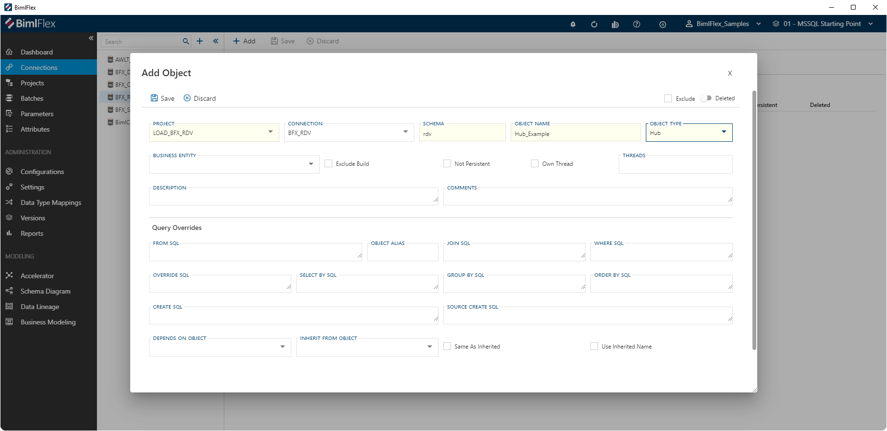

# Hubs

A Hub in Data Vault is the representation of a **Core Business Concept**. These are the main 'things' that are important to an organisation.

**Core Business Concepts** are related to other ones through [**Natural Business Relationships**](xref:bimlflex-data-vault-concept-link) (Links) and are described using [**Context**](xref:bimlflex-data-vault-concept-satellite) (Satellites) entities.

Any Hub entity in Data Vault can therefore have multiple active relationships to other entities through [Links](xref:bimlflex-data-vault-concept-link).

Each Hub maintains a distinct list of [**Integration Keys**](xref:bimlflex-data-vault-integration-keys-and-relationships) that represent unique instances of the identified concept.

In the model, the Hub serves as integration point when merging together disparate data sets.

## A Business Focused Approach for Data Integration

To be able to integrate data across systems and versions, the actual business terms used should be identified and used where possible to name Hubs and the corresponding Integration Key column.

In BimlFlex, this is supported through the [**Business Modeling**](xref:bimlflex-business-modeling) feature. **Business Modelling** supports an interactive workshop-style modeling of the involved processes and terminology, so that the right business terms can be defined.

The resulting Business Entities can be mapped to Data Vault Hubs in the [**Object Editor**](xref:bimlflex-object-editor) or the Data Vault [**Accelerator**](xref:bimlflex-data-vault-accelerator).

The Hub should accommodate all incoming data without judging, therefore it is recommended to use the most forgiving data type available.

For the Integration Key, it is recommended to use a wide Unicode (nvarchar) datatype. This accommodates data coming from many sources.

This configuration allows data to be integrated that might not adhere to the earlier assumed datatype of the Integration Key.

> [!IMPORTANT]
> Hubs are the core building block of the Data Vault and should reflect the **Core Business Concept** (CBC).
> The implementation team is recommended to identify and map Hubs to the **Business Model** as a priority.

## Implementation of the Hub Concept in BimlFlex

The Hub contains the distinct set of Integration Keys from the source data set. It is an insert-only table. Any effectiveness or descriptive attributes are tracked in attached Satellites.

A Hub is defined in the metadata editor as a collection of source-to-target mappings at column level from one or more data sources to the target Hub Object.

There are two ways to define a Hub in BimlFlex:

1. Accelerating a Hub
1. Manually defining a Hub

### Accelerating a Hub Object

The easiest and quickest way to define a new Hub is to define one based on source metadata using the Data Vault [**Accelerator**](xref:bimlflex-data-vault-accelerator).

This way, the target Hub Object and source-to-target mappings that facilitate the loading process are added automatically.

If required, this can be updated by modifying Accelerator settings or manually updating the Hub Object.

For more information, please refer to the [**Accelerator**](xref:bimlflex-data-vault-accelerator) documentation.

### Manually defining a Hub Object

To manually create a Hub in BimlFlex, an Object first needs to be defined in the **Connection** that represents the Data Vault.

Using the [**Object Editor**](xref:bimlflex-object-editor), a new Object with the Object Type `Hub` can be created.

## Inferred Hubs

A Hub created as a placeholder when a related **Core Business Concept** that is not in scope for the current iteration.

The [*INFER LINK HUB*](xref:bimlflex-app-reference-documentation-settings-index) setting will ensure the **Integration Keys** are always loaded enabling future expansion.

> [!NOTE]
> There isn't an *OBJECT TYPE* to define a `Stub Hub` as it is just a `Hub`.

## Hub Naming Convention

* Prefix or Suffix with one of the following recommendations `HUB`, `H`, `HB`.
* The Hub name will be derived by combing the **Object** *MODEL OVERRIDE NAME* if specified otherwise the **Object** *OBJECT NAME* and the [*APPEND HUB*](xref:bimlflex-app-reference-documentation-settings-index) **Setting**.

## Hub System Column Configuration

* [Load Date Time Stamp](xref:bimlflex-data-vault-best-practices#load-date-time-stamp)
* [Record Source](xref:bimlflex-data-vault-best-practices#record-source)
* [Audit Id](xref:bimlflex-data-vault-best-practices#audit-id)

## Integration Key Definition

BimlFlex makes use of a concatenated key to simplify implementation and allows for single key integration and is required when choosing a Data Vault implementation without using Hash Keys.

The **Setting** [*USE HASH KEYS*](xref:bimlflex-app-reference-documentation-settings-index) can be used to toggle between using a hashed or natural **Integration Key**.
  Integrate without a `HASH` which is very efficient for modern data warehouse solutions like [Snowflake](https://www.snowflake.com/) and [Azure Synapse](https://azure.microsoft.com/en-us/services/synapse-analytics/).

The Hub Integration key needs to accommodate data from existing sources as well as being able to accommodate changes in the existing sources and new sources added later.

The CBC/EWBK represented by the Hub is designed to integrate multiple systems. To support this, it is most common to use  Unicode string representation. The key length need to accommodate any reasonable Integration key that can be foreseen.

The default key length generated by BimlFlex using the Data Vault Accelerator is String/NVARCHAR(100).

BimlFlex uses a single Integration Key column to allow source agnostic integration. BimlFlex provides the `FlexToBk()` expression to allow easy construction of the Integration Key from multiple source columns and data types.

Using the Infer Integration Key setting in the metadata importer will add the Integration Key to the source table as a new column. It uses the `FlexToBk(ProductID)` custom SSIS Expression to build the Integration key. The default settings will concatenate the columns together with tilde `~` as the default concatenation character. The `Product_BK` only has a single column mapped. Adding additional columns to the expression will result in a single key with the columns concatenated.

`FlexToBk(ProductID)` will generate Product_BK column data from the ID only (example: `680`)

`FlexToBk(Name,ProductNumber)` will generate Product_BK column data from the Name concatenated with the ProductNumber (example: `HL Road Frame - Black, 58~FR-R92B-58`) with the concatenation character as separator (the `~`)

`FlexToBk(@@rs,ProductID)` will generate Product_BK column data from the Connection Record Source and the ID (example: `awlt~680`)

### Multiple key columns

Some Hub designs require multiple source key columns to define the Hub through the Integration Key. Sources with key overlap might need a system or source string added, multiple source keys might need to be combined to form a distinct Hub Integration key.

> [!NOTE]
> Deriving the Integration keys for the CBC/EWBK's is one of the more important design exercises in modeling the Data Vault. This guide does not include details on the required analysis and design process.

For these columns, BimlFlex concatenates them into a single string and separates them with the configured separator `~` as described above.

## Hub Settings

Choose a tab below to view relevant setting descriptions or examples for Hubs.

[!include[Hub Metadata Settings List](_settings_hub.md)]
