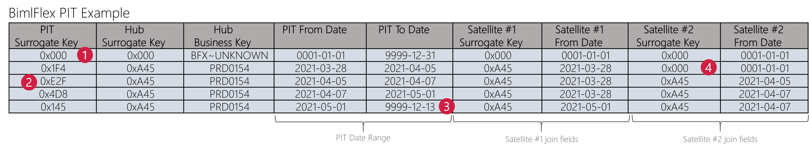

# Data Vault Point In Time tables in BimlFlex

A `Point In Time` (PIT) table is an optional concept in Data Vault that facilitates easier and more performant retrieval of data from the Data Vault model. It is a helper construct that is primarily meant to increase overall performance of queries.

By design, a Data Vault model can contain many entities. To build the required data set for delivery it is often necessary to join many of these entities together.

For example, a Hub ([Core Business Concept](xref:bimlflex-data-vault-concept-hub)) can have many Satellites [Contextual Entities](xref:bimlflex-data-vault-concept-satellite) providing details about the Hub. Each of these Satellites will receive data at different times depending on their scheduling frequency and the rate of change of data in the operational system that provided the data. This means that each Satellite typically contains data that is valid for a (potentially) different *point in time*, as per the effective date of the Satellite. The effective date of the Satellite is the `FlexRowEffectiveDateTime`, which conceptually is the load date / time stamp (LDTS) as per Data Vault standards.

A PIT table is a flexible construct. It can encompass many entities that span across multiple Hubs, Links and Satellites. A PIT table may also be comprised of a single Link and that Link's surrounding Satellites. When it makes sense, it is even an option to store business logic in the PIT. This may be useful when a certain calculation has to be done many times and the PIT is already on the right level of detail anyway.

However, the most common implementation is that of containing the Primary Key and Business Key values of a single Hub and that Hub's surrounding Satellites. This is also the approach BimlFlex has taken to support the PIT table concept.

The fact that the effective dates do not necessarily align means that complex *date math* logic needs to be used to understand exactly which values were active at a given moment, based on the effective date.

This is where the PIT table comes in; the logic to assess what values are to be used for a selected moment in time only needs to be done once and when this is done equi ('inner') joins can be used to select the relevant attributes for further processing.

This capability to support equi-join to create or view Fact Tables and Dimensions is where the performance boost provided by PIT tables starts to matter, because the same Data Vault entities are potentially queried many times.

## Snapshots and date ranges

In essence, a PIT is a table populated with snapshot-based records of keys and key structures. The most basic implementation of a PIT table is to store a snapshot of the scope of data (e.g. a Hub and its Satellites) with a `snapshot date`. For each snapshot date, the PIT table contains the 'state' of the information for that date - including *at least* (but not limited to) the Surrogate Key and the Effective Dates of each Satellite.

If you would like to understand what context is available for a given snapshot date, you can just select this date and equi-join the tables that are part of the PIT construct such as the Hub and Satellites. This join is done on the Surrogate Key and the Effective Date as is recorded in the PIT for the table that is joined to.

With this resulting record set further logic can be applied to deliver the Dimension or Fact table.

In a snapshot configuration it is important to have a snapshot in place for each frequency period (e.g. day) because if one snapshot is missed this may impact the data delivery. Also, this can result in a large number of snapshots which may require a maintenance schedule to clear from time to time. Any removed snapshots can always be re-created from the Data Vault model, if required.

In BimlFlex, this snapshot concept is implemented as a `range table` to reduce the number (and corresponding maintenance) of snapshots. Instead of having -for example- seven snapshots for each day in a week, BimlFlex will add an effective- and expiry date for which the snapshot is valid.

This significantly reduces the data volume while still retaining all the PIT functionality. Instead of querying the PIT table directly on a snapshot date, the point in time value to check (e.g. a specific day or time) must be between the PIT effective- and expiry dates.

> [!NOTE]
> Snapshots and date ranges are conceptually variations of the same theme. A snapshot can be converted into a date-range and vice-versa. BimlFlex has opted to use date ranges for delivering PIT tables, which we consider is easiest to manage and still delivers good performance.

## Point In Time example

The following example shows a PIT table created from a Hub and two supporting Satellites. The sample data is as it would be after data has gradually become available, and thus simulates the state after a few weeks of processing.

> [!NOTE]
> PIT tables are incrementally updated when new data becomes available in the Data Vault tables that support them. BimlFlex can configure the number of days should be taken into consideration for this refresh.

In this example, the first time information about the business key 'PRD0154' became available in the data solution was at 2021-03-28. At this point in time one of the Satellites (#1) contained data for this business key, however the other one (#2) does not (yet) have any information. The join fields for Satellite #2 are defaulted to 'unknown' values to record that no data is available for this point in time.

Joining to both Satellites, in order to get the descriptive attributes, will result in data being returned from Satellite #1 but not for #2.

The second row of the PIT example shows that Satellite #2 received data, and this is made available in the PIT. There was no change for Satellite #1, so the same context that was relevant previously still is the right data to join on.

The third row shows yet another change for Satellite #2, and again the data for Satellite #1 remains unchanged. Lastly, in row four of this example new data arrives in Satellite #1 and the PIT table is updated to reflect this. Satellite #2's context has not changed so the same values from row 3 can be used.

Using this PIT table, it is easy to query what context attributes from the Satellites were active at a certain moment in time. You pick a date, and find the record where this date is `greater or equal than` the PIT From Date (the `FlexRowEffectiveFromDate` in BimlFlex), and `smaller than` the PIT To Date (the `FlexRowEffectiveToDate` in BimlFlex). With this PIT record the corresponding Satellites can be queried with an inner join to receive the data that was valid at this point in time.

There are some important notes to clarify on the structure of the PIT table in BimlFlex, and these are numbered in the example:

1. Each PIT table contains a [`zero record`](xref:bimlflex-data-vault-concept-zero-records), which provides an 'unknown' record in the PIT table that refers to any NULL value.
2. Each PIT record receives a unique PIT surrogate key that uniquely identifies a row in the PIT table. This is purely for identification purposes.
3. BimlFlex uses a high end-date as default, which is 9999-12-13 in this example. This is to make sure that any queries on the PIT table always return a result, which is the most recent state of the data as it has been received by the data solution.
4. If no context is available for a given point in time BimlFlex will apply (configurable) default values to highlight that no data exists. This is to allow equi-joins even when there is no data, without risking data loss.

## Additional PIT features

As outlined above, PIT tables are flexible constructs and can even encompass business logic (transformations, logic) if it makes sense to do so from a performance perspective. This includes computed fields or additional being- and end dates to simplify upstream queries.

BimlFlex can apply [Extension Points](xref:bimlflex-concepts-extensionpoints) to support specific customizations for PIT tables, if required. These can provider detailed overrides to change the behavior of the out-of-the-box solution.

## Timelines in PIT tables

The concept as described here focuses on simplifying joins using the technical timeline, which is the load date / time stamp. This is the effective date of the Satellites, in BimlFlex referred to as the `FlexRowEffectiveDateTime`. In this approach, it is possible to combine the available Satellite attributes made available via the PIT table to construct a business, or functional, timeline.

For example, if the source operational system provides its own functional timeline (effective or validity dates) these can be used to understand a functional timeline of changes in data irrespective of the order they arrived in the data solution. The PIT table concept still supports this because it collects the right data was it was available in the data solution.

However, it is also possible to configure PIT tables in a different way by selecting (modeling) which timelines should be used to *construct* the PIT table. In this approach, the PIT timelines can be directly constructed from any available functional timeline.

The difference between these two approaches is where the joins across the functional timeline happens, into the PIT or after the PIT is available. By default, BimlFlex first constructs the PIT and then allows any modifications of data to be done - including recalculating the results along a different timeline.

This way, the load date / time stamp (FlexRowEffectiveDateTime) can be used for filtering, to report what data was available in the data solution at what time before applying interpretation.
