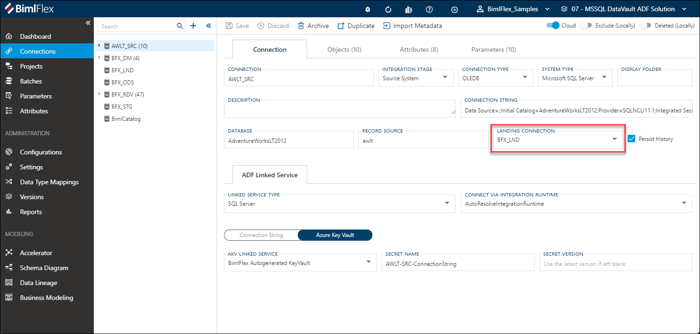
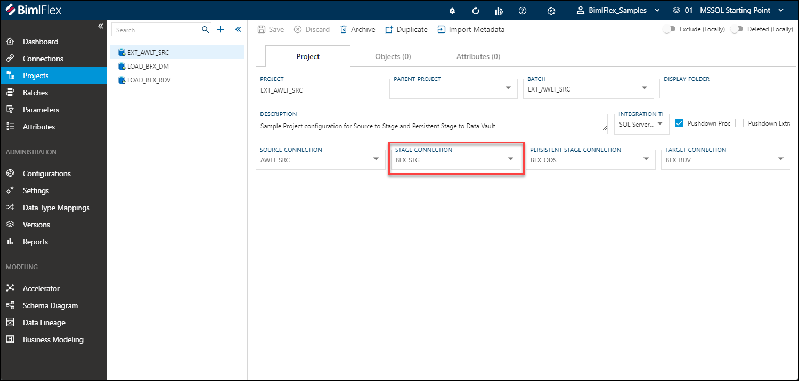
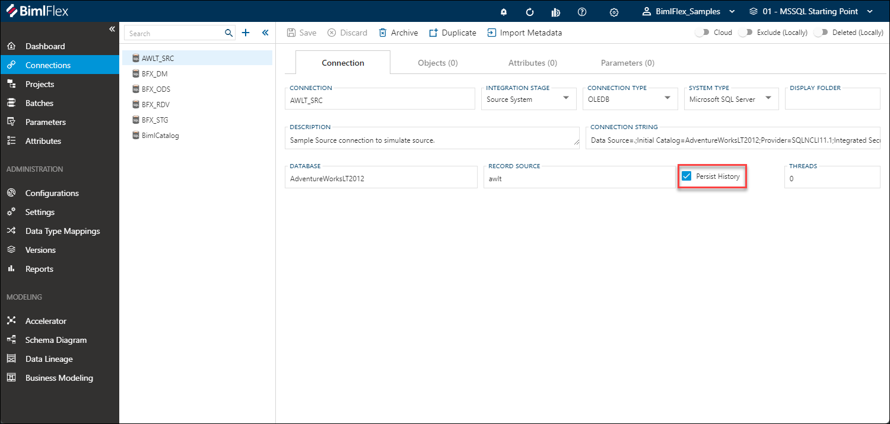

# Delivering a Staging Layer

Conceptually, the Staging Layer of a data solution records the data in the data solution mostly the way it was received. In BimlFlex, the Staging Layer is mostly inferred - it is derived from the source **Objects** that have been imported into the solution for **Connections** that have been configured with a `Source System` **Integration Stage** ('source connections').

For this reason, that Staging Layer objects will not be visible in BimlFlex. Instead, they will be generated during the [**Build Process**](xref:bimlflex-build-solution-overview) based on the conventions (**Configurations** and **Settings**) and thus be visible in the BimlStudio project and the generated output - but not in BimlFlex.

>[!NOTE]
> In BimlFlex, configuring a Staging Layer in some form is mandatory for a data solution. However, some data solutions may only require a Staging Layer and nothing else.

## Staging Layer Components

A Staging Layer can be defined in different ways, to do different things. The following components can be configured:

* Landing Area - this is a technical area to initially 'land' or 'stage' the data in the target environment for any further processing. This applies to connections that have been configured for **Cloud** connections so that external data can be made available in the target environment
* Staging Area - this is a series of objects that holds, and sometimes derives, incoming data delta before it is applied to subsequent areas of the data solution such as Data Vault or Data Marts. The Staging Area is truncated each time the corresponding process is run
* Persistent Staging Area (PSA) - structurally similar to the Staging Area but data is retained, not truncated. This represents a historical view of the data that was received by BimlFlex
* Operational Data Store (ODS) - similar to the Persistent Staging Area, but only the latest changes are retained

### Landing Area

A `Landing Area` is mandatory for **Connections** that have been enabled for the **Cloud**. The Landing Area is configured for the source connection - a  a connection that has an **Integration Stage** of `Source System`.

The **Landing Connection** for the source connection must exist as a BimlFlex connection for this to be selected.

### Staging Area

The `Staging Area` holds, and sometimes derives, incoming data delta before it is applied to subsequent areas of the data solution such as Data Vault or Data Marts.

In BimlFlex, a Staging Area is defined at **Project** level, by defining a **Stage Connection**. This will direct BimlFlex to generate Staging Area objects for the objects that are part of the project's **Source Connection**.

In BimlFlex, Staging Layer conventions are managed though the [`Staging`](xref:bimlflex-app-reference-documentation-settings-index#staging) and [`Staging Naming`](xref:bimlflex-app-reference-documentation-settings-index#staging-naming) **Setting Groups**.

>[!IMPORTANT]
> The Staging Area is truncated each time the corresponding process is run.

### Persistent Staging Area

[!include[PersistentStagingArea](_incl-header-persistent-staging-area.md)]

>[!TIP]
> For additional information on the Persistent Staging Area concept and implementation, please refer to the [BimlFlex PSA documentation](xref:bimlflex-deliver-persistent-staging-area).

### Operational Data Store

An `Operational Data Store` (ODS) is for all intents and purposes similar to the Persistent Staging Area (PSA) - with the exception that only the most recent change is visible in the ODS. The ODS does not provide a full history of changes.

An ODS can be configured by *disabling* the **Persist History** checkbox for a **Connection** that has an **Integration Stage** of `Source System`.

>[!TIP]
> The **Persist History** feature can be configured at a more granular level using the [**Persist History Setting**](xref:bimlflex-app-reference-documentation-setting-PersistHistory) and corresponding overrides.
