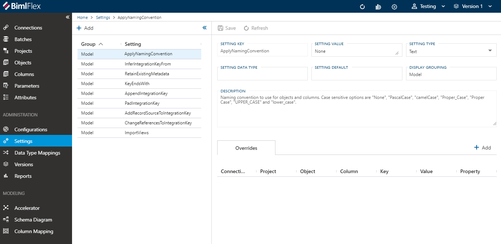

# Importing Source Metadata

Importing metadata from database connections is a convenient and agile way to start modeling data from a source to a Data Warehouse.

By reading existing metadata instead of manually entering it or manually creating tables for the Data Warehouse it is possible to increase development speed and quality.

The BimlFlex App provides a graphical metadata import function.

Click the Connections page in the app and click the source connection `AWLT_SRC`. Click the `Import Metadata` button to start the metadata importer.

Validate the settings, unselect the `Import Views` to only import metadata from the `SalesLT` tables. The remaining settings are left as defaults.

Note that all the options in the `Import Metadata` screen are populated from Settings and can be overridden in the `Connection` or `Project` by using `Attributes`. To view all the relevant settings, filter the `Settings Group` by `Model`.

BimlFlex will read all specified metadata from the chosen connection into the BimlFlex metadata repository.

The importer will associate the source connection metadata with the load project. BimlFlex will use this metadata to process data from the source system.

