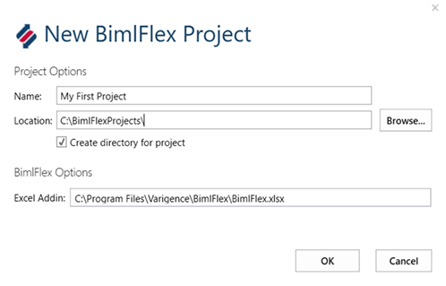
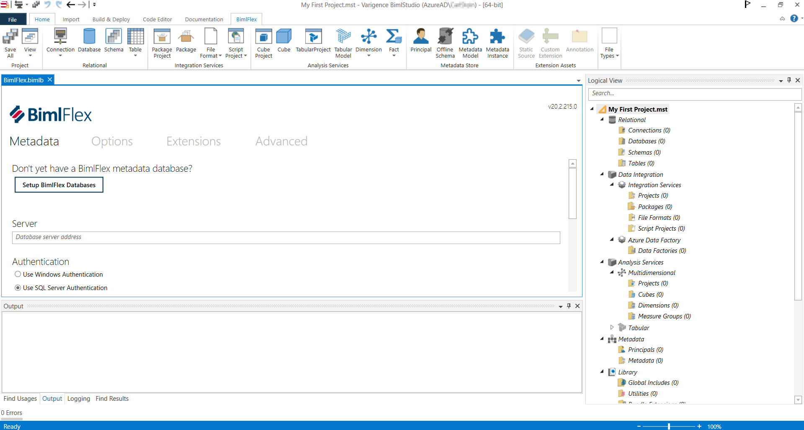
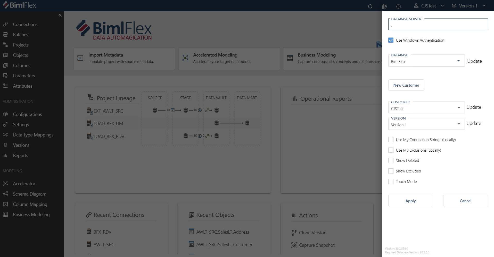
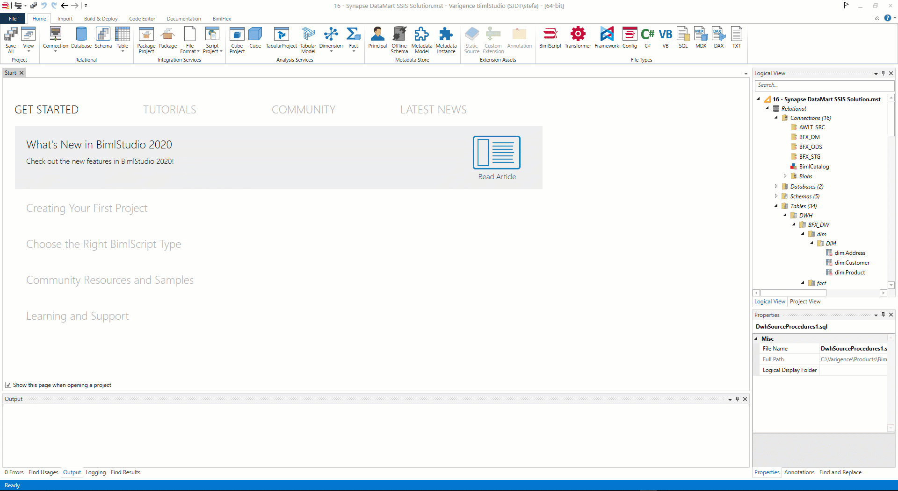

# Initial Configuration

The initial setup of BimlFlex include the steps to set up the full development environment:

* Creating the project
* Connecting to the databases
* Loading the Sample Metadata

These steps are required for the full BimlFlex framework to work.

Once the BimlFlex installation is completed, it is time to set up the environment for a BimlFlex project.

The development workflow is focused around the BimlFlex App and the BimlStudio-based BimlFlex project.

> [!NOTE]
> Complete the **Setup** first  
> More information: [Installing BimlFlex](xref:bimlflex-setup-installing-bimlflex)

## BimlStudio project

Open the BimlStudio Application and create a new, empty BimlFlex project.

BimlStudio and BimlFlex Excel Add-in will prompt for a License Key the first time a new installation starts.

If a trial key is required, please contact Varigence BimlFlex Support at [support@bimlflex.com](mailto:support@bimlflex.com).

### Video Walkthrough

### Creating the BimlFlex project

From the start page, create a new **BimlFlex Project**

Options for creating a new BimlFlex Project. Place the project in a suitable folder, the folder will contain source code for the project and should be managed through a source control system.

Once the project is created, it is possible to open it from the folder by opening the project file, or by opening the project from BimlStudio.

### Connect to the BimlFlex Database

The BimlFlex project in BimlStudio communicate with the BimlFlex BimlFlex database.

The databases are created and updated through the BimlFlex installer. It is also possible to set up the databases from the BimlFlex ribbon tab in BimlStudio.

More information, creating the database through the installer: [Installing BimlFlex](xref:bimlflex-setup-installing-bimlflex)

More information, creating the database through BimlStudio: [BimlFlex Metadata Database Installation](xref:bimlflex-setup-metadata-database-installation)

### Creating Customer

The **Customer** entity holds a set of metadata in the BimlFlex database and can be used to identify different projects, versions, customers, variations.

A **Customer** can have multiple versions of the related metadata. An initial Version is created with the Customer. Throughout a project, it is possible to progress through multiple different versions.

It is recommended that the **BimlStudio Project** and the **Metadata Customer** has the same name.

The Customer can be created through:

* BimlStudio > BimlFlex Ribbon > Open Bundle > New Customer
* BimlFlex App > Settings Pane > New Customer
* BimlFlex Excel Add-in > BimlFlex Ribbon > Metadata Connection pane > New Customer

Set up the connection information to the BimlFlex database.

Use the **New Customer** option in the BimlFlex App to add the Customer to the Database

## BimlFlex App

The BimlFlex App is used to manage the metadata for the BimlFlex solution.

## BimlFlex App Metadata Connection

Start the BimlFlex App and configure it to connect to the BimlFlex database.

The BimlFlex app allows easy metadata management and provides features such as metadata import and graphical Data Vault acceleration.

The BimlFlex app has a connection to the BimlFlex Database, the customer and the version.

Set up the Connection through the Setup Pane, accessed from the Settings Cog in the top right corner

More information: [Metadata Editors Overview](xref:metadata-editors-overview)

## BimlFlex App Reports Connection

The BimlFlex App has a Reports function that can connect to a BimlCatalog database and show execution information.

Set up the required connections through the **Select BimlCatalog Connection** option in the App.

View Reports in the **Reports** Page in the App

More information: [BimlFlex Operational Reports](xref:bimlflex-operational-reports)

## Excel Add-in Metadata Editor

The Excel-based Metadata Editor is opened from the BimlFlex Ribbon tab in BimlStudio. The Excel Add-in provides an optional environment for bulk-editing metadata.

The BimlFlex Excel metadata editor comes with an additional Excel tab in the Ribbon for interacting with BimlFlex.

Configure the BimlFlex database connection in the **Metadata Connection** pane and connect to the BimlFlex Database.

Once the connection is defined the metadata can be read into Excel. The main data is stored in the database and the working set is cached and displayed in Excel. The data is not updated in real-time. It is important to commit changes to the database and to communicate within the development team to synchronize changes to the Metadata.

Retrieve all metadata into Excel by clicking the `Get All Entities` and `Get All Settings` buttons in the Excel BimlFlex Ribbon UI.

More information: [Bulk Edit Overview](xref:bimlflex-excel-add-in)

## Configuration

This step includes the required and optional configurations available for the BimlFlex framework.

### BimlStudio Project Settings

The BimlStudio project options include settings such as the target SQL Server, SSIS versions, project, or package deployments for SSIS. Most of these are optional to change, but the target version and deployment method needs to be correct for the packages to open correctly in Visual Studio and run correctly on the destination SSIS server.

#### Biml Engine

The Engine to use (bimlc.exe/MSBuild) as well as their respective paths and options.

#### Build

Output locations and options for built artifacts.

#### Target Versions

The target versions to use. Update these to match the target architecture.

SQL and DDL

* SQL Server, this corresponds to the SQL Version to use for Scripts and SSDT Projects
* DDL Build Mode, always leave as None for BimlFlex projects. BimlFlex provides direct script options and SSDT Projects for DDL instead

Data Integration

* ADF Build Mode, ADF can be managed through multiple, separate .json files or Azure ArmTemplate files
* SSIS, the SSIS Server version to build for
* Use Project Deployment, should the build spawn Project Deployment ready projects and packages. This is the preferred deployment methodology for SSIS since SQL Server 2012

SQL Server Analysis Services

* SSAS Multidimensional, not included in BimlFlex projects
* SSAS Tabular, not included in BimlFlex projects

#### Options

Generic Editor options

#### Externals

Paths and arguments to external tools

Once all settings are completed, restart BimlStudio and reopen the BimlFlex project to load the metadata.
