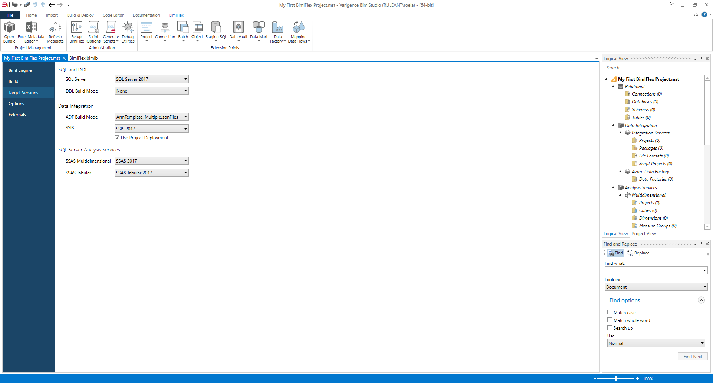

# Initial Configuration

Once the BimlFlex installation is completed, it is time to set up the environment for a BimlFlex project. The initial setup of BimlFlex include the steps to set up the full development environment:

* Connecting to the BimlFlex database
* Loading sample metadata (optional)
* Creating the BimlStudio project

## BimlFlex App

[!include[Dashboard](../metadata-editors/_incl-header-dashboard.md)]
[!include[BimlFlex](../metadata-editors/_incl-header-bimlflex-app.md)]

## Metadata Connection

To begin designing your data solution, start the BimlFlex App and configure it to connect to the BimlFlex database.

Set up the Connection through the **Database Setup Pane**, which can be accessed from the **Database Settings Cog** in the top menu bar. The database setup pane contains options to specify connectivity to the BimlFlex database. The **Update Button** can be pressed to refresh the database contents when connection details have been modified.

Once connection has been established, a new [**Customer**](xref:bimlflex-concepts-customer) can be created. Or, an existing Customer and [**Version**](xref:bimlflex-concepts-version) can be selected.

### New Customer Creation

[!include[NewCustomer](../metadata-editors/_incl-header-new-customer.md)]

### Load Sample Metadata

[!include[Samples](_incl-header-samples.md)]

## BimlStudio Configuration

With the BimlFlex database available, and a new customer created, the metadata can be connected to via BimlStudio so that the metadata can be compiled into the various data solution artifacts - table scripts, procedures and data logistics processes.

Open the BimlStudio application and create a new, empty BimlFlex project.

> [!NOTE]
> BimlStudio and the BimlFlex Excel Add-in will prompt for a License Key the first time a new installation starts.
> If a trial key is required, please contact Varigence BimlFlex Support at [support@bimlflex.com](mailto:support@bimlflex.com).

### Creating the BimlFlex project

From the start page, create a new **BimlFlex Project**.

Place the project in a suitable folder, the folder will contain source code for the project and should be managed through a source control system.

Once the new BimlStudio project is created, it is possible to open it from the folder by opening the project file directly, or by opening the project from BimlStudio.

At this stage, a new BimlFlex project has been created in BimlStudio, but this has not yet been connected to the metadata repository.

> [!TIP]
> The Varigence YouTube channel contains various introduction videos about using BimlFlex and BimlStudio. [This video](https://www.youtube.com/watch?v=qhDTwv-jYKc?rel=0&autoplay=0) provides an overview of creating a new BimlFlex project in BimlStudio.

### Connect to the BimlFlex Database

The BimlStudio project needs to access the metadata in the BimlFlex database in order to generate output.

> [!NOTE]
> The databases are created and updated through the [BimlFlex installer](xref:bimlflex-setup-installing-bimlflex). It is also possible to set up the databases from the BimlFlex ribbon tab in BimlStudio, or directly by using the **Setup BimlFlex Databases** button.
> Additional information is available in the[BimlFlex database installation section](xref:bimlflex-setup-metadata-database-installation).

To connect the BimlStudio project to the BimlFlex database, connectivity details to the metadata database need to be provided.

When the connectivity to the BimlFlex database is established, a customer and version can be selected from the drop-down lists. Selecting a customer and version here and saving the project will ensure the right output is generated.

> [!TIP]
> Connectivity from BimlStudio to the BimlFlex database can always be opened by clicking the **Open Bundle** option in the BimlFlex ribbon.

When the BimlStudio project is associated with a customer and version, the metadata can be refreshed on an ongoing basis by clicking the **Refresh Metadata** option in the BimlFlex ribbon. This will reload the metadata, parse and validate it, and update the **Logical View** in BimlStudio.

### BimlStudio Project Settings

For further, more detailed configuration, the BimlStudio project options include settings such as the target SQL Server version, SSIS and ADF versions, and whether to use the project or package deployment model for SSIS.

Most of these are optional to change, but when using SSIS the target version and deployment method needs to be correct for the packages to open correctly in Visual Studio, and run correctly on the destination SSIS server.

The project settings can be accessed via the 'File' menu in BimlStudio, and then selecting 'Project Settings' from the menu.

> [!IMPORTANT]
> Once all settings are completed, restart BimlStudio and reopen the BimlFlex project to load the metadata.

The most important settings to configure initially are the **Build** and **Target Versions** settings.

For additional information, please refer to the [BimlStudio reference documentation](xref:bimlstudio-user-guide).

#### Build

In the build section, the output locations and options for built artifacts. Use these settings to direct where the output artifacts will be created.

#### Target Versions

In the target version section, the correct versions of the technical environment can be specified. These settings will direct the Biml compiler to output the generated artifacts in a way that matches the version, so these settings should match the target architecture.

SQL and DDL

* SQL Server, this corresponds to the SQL Version to use for Scripts and SSDT Projects
* DDL Build Mode, always leave as None for BimlFlex projects. BimlFlex provides direct script options and SSDT Projects for DDL instead

Data Integration

* ADF Build Mode. ADF can be managed through multiple, separate JSON files or Azure ArmTemplate files
* SSIS, the SSIS Server version to build for
* Use Project Deployment, should the build spawn Project Deployment ready projects and packages. This is the preferred deployment methodology for SSIS since SQL Server 2012

SQL Server Analysis Services

* SSAS Multidimensional, not included in BimlFlex projects
* SSAS Tabular, not included in BimlFlex projects
