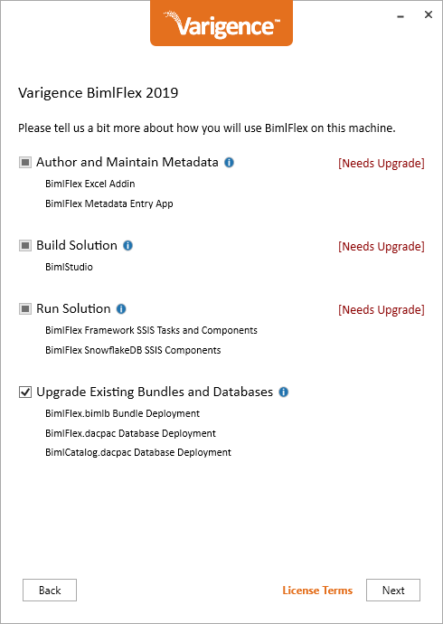
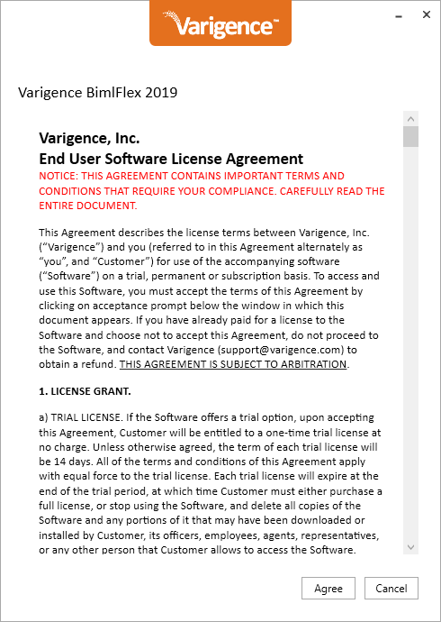
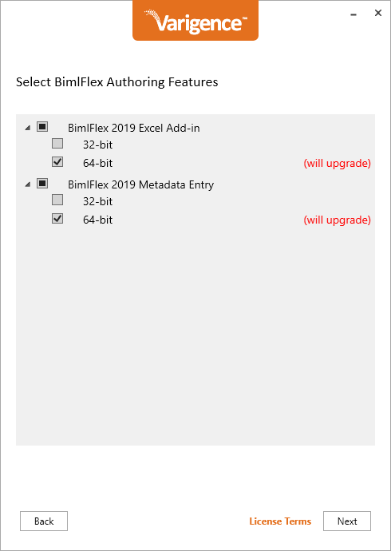
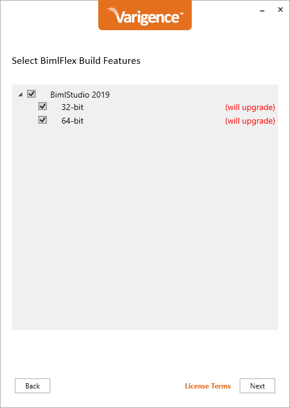
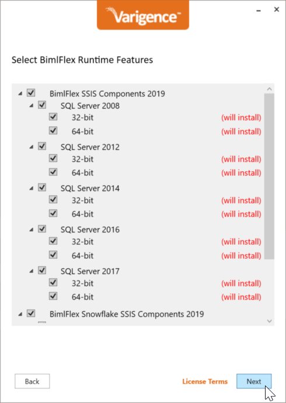
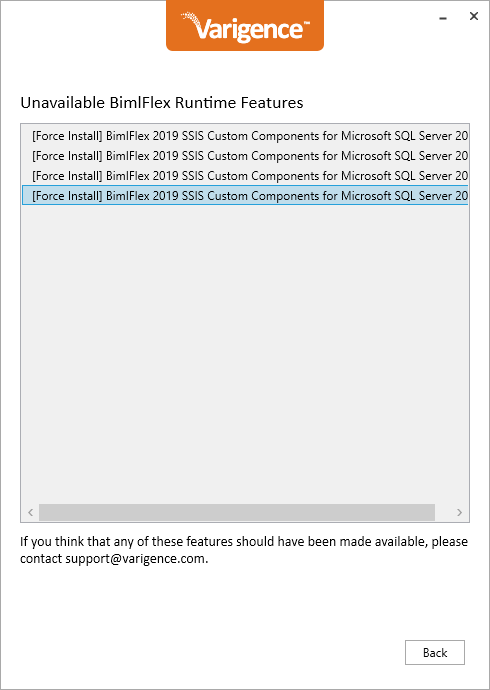
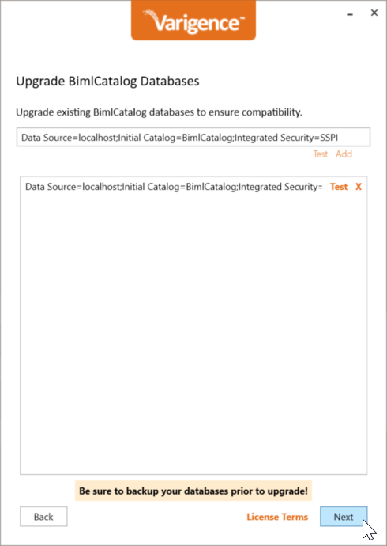
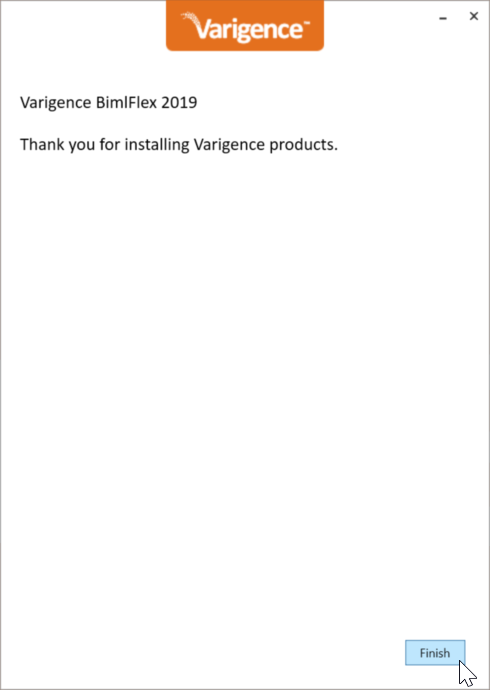

# Installing BimlFlex

BimlFlex is provided in a role-based, consolidated installer. This allows all parts of the framework to be installed and upgraded through a single installation.

The following installers are available:

* BimlFlex Developer  
    This installer includes all parts of the product framework and is suited for developers who will build the solution in BimlStudio and test the resulting packages in Visual Studio
* BimlFlex Modeler  
    This installer includes the BimlFlex App and is suited for modelers who will perform metadata import, modeling and acceleration
* Runtime installation  
    This installer include the required runtime components for servers that will execute SSIS packages

The BimlFlex developer installation allows the installation of all components used in the BimlFlex framework:

* BimlStudio
* BimlFlex App
* BimlFlex Excel-based metadata editor
* SSIS Custom Components for SQL Server SSIS
* SSIS Custom Components for Snowflake
* Upgrades of existing BimlFlex and BimlCatalog databases

Run the developer installation and choose to install all components on the developer machine. For complete functionality all components are required.

The Excel-based metadata editor is a plugin for Microsoft Excel and will be visible as a separate tab in the Excel ribbon when the BimlFlex-enabled Excel workbook is opened from a BimlFlex project.

When installing it is important to match the Excel bitness version. Verify the Excel bitness version before starting the installation and only install the matching version of BimlFlex.

The first time BimlStudio or the BimlFlex Excel file is opened from a BimlFlex project it will ask for a license key. Add a BimlFlex-enabled license key to enable the application. The key is validated online and once validation completes it is possible to run the applications.

## Detailed Steps

The following detailed steps walks through the installation of BimlFlex

### Download the BimlFlex installer

Use the link in the welcome or trial email to download the installer

### Check bitness of Microsoft Excel

> [!NOTE]
> Microsoft Excel is a prerequisite for installing and using the BimlFlex Excel-based Metadata Editor.

Check the bitness of the local installation of Microsoft Excel using the [Microsoft guidelines available here](https://support.office.com/en-us/article/About-Office-What-version-of-Office-am-I-using-932788B8-A3CE-44BF-BB09-E334518B8B19).

> [!WARNING]
> Install only the bitness version that match the installed Excel version.

### Install BimlFlex for developers

Run the installer to install the applications.

Accept the license agreement

If the installer can't identify an existing key, click the `I already have a product key` if you have a valid key, or use the request form to request a trial key for BimlFlex. It is also possible to skip this step and add the required keys later

Add an existing key through the `I already have a product key` dialog

The main feature page allows choosing the applications and features to install. For a BimlFlex developer installation, pick all. For existing installations, also check to upgrade existing databases and projects.

Pick BimlFlex features to install. Install the BimlFlex app as the main metadata management solution. Add the relevant bitness for Excel should there be a need to manage metadata through the legacy Excel Add-in

Pick BimlStudio features to install. For most developer installations, choose to install both 32-bit and 64-bit versions

Pick Custom components to install. Only identified available ones are available in the list. It is possible to force installation of unavailable options

list unavailable options

right-click to force installation

all unavailable options are picked for forced installation

Upgrade BimlFlex databases by adding the connection strings and then clicking the add to add the database to the upgrade tasks

Upgrade BimlCatalog databases by adding the connection strings and then clicking the add to add the database to the upgrade tasks

Review the installer tasks and allow the installation to occur

Once the installation concludes successfully, click finish to end the installer. Please refer to the getting started guide to get started with BimlFlex: @bimlflex-getting-started

### Enter product key

Once an application is started for the first time, enter a valid product key to activate the product.