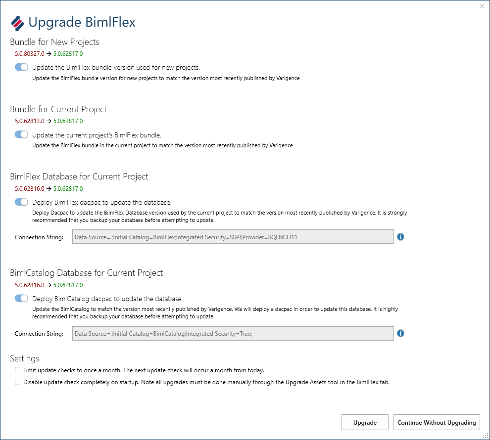

# Upgrade and Testing Process

BimlFlex is built on BimlStudio and contains the following components that are of interest when upgrading to a later version:

* BimlStudio Application
* BimlFlex component of BimlStudio
* BimlFlex Excel Add-in
* BimlFlex Bundle file
* BimlFlex Metadata database
* BimlCatalog Orchestration database
* BimlFlex Custom SSIS Components
* The BimlStudio application is distributed as a single, separate installer
* The BimlFlex Excel Add-in is distributed as a single, separate installer
* The BimlFlex databases are embedded in the Bundle used by BimlStudio and can be deployed and updated from within BimlStudio
* The BimlFlex Custom SSIS Components are distributes as an archive file that contains the component .dll and a .bat file installer

## Upgrading BimlStudio and BimlFlex from the Varigence website

The current version of [BimlStudio is available for download here](https://varigence.com/downloads/bimlstudiosetup.exe).

Other components are available on request from the BimlFlex Enterprise support team at [bimlflex-support@varigence.com](mailto:bimlflex-support@varigence.com). The download locations are also detailed in the licensing email.

## Preparation for upgrading an existing project

Current projects with existing Extension Point script files and existing metadata needs planning and consideration before upgrading.

A new version of BimlFlex and its components can include both fixes and new functionality. This is detailed in the @bimlflex-release-notes that accompany the new version.

### 1. Do database backups

Do backups of the existing metadata and catalog databases so that they can be rolled back if needed

### 2. Build expanded code files

To verify that the upgrade implements new functionality as expected and that no unforeseen effects are affecting the new version, build expanded code files for Biml and SQL for all projects.

The expanded code is automatically enabled in the Bundle Options for a new project. The `Build Flat Biml File` and `Build DDL Script File` options control the creation. By creating the 2 files for each project before and after upgrading it is easy to validate all changes.

### 3. Backup project files

The BimlStudio project and the Custom Extension Point files and any other local file contents that have been created should be backed up to a backup location so that a copy of the pre-upgrade project is available if needed.

### 4. Upgrade Bundle and Databases through BimlStudio

BimlStudio checks for updates to BimlFlex when opening a project. The Upgrade BimlFlex dialog is shown when a new version is available.

If there is a new version available online,BimlFlex will allow the new version to be downloaded and applied to both the project template location, the current project and the current databases. For new versions there is also a link to the release notes. These should be reviewed before starting an upgrade.

* Update the template Bundle file.
    BimlFlex uses a template file for creating new projects. BimlStudio can connect to and download the updated Bundle from the online location and make it available for new projects and as an upgrade source for other existing projects.

* Update the current project's Bundle.
    For a project with an older Bundle compared to either the online or the template Bundle. BimlStudio will update the project Bundle to the later version.

* Upgrade the current project's BimlFlex database.
    When opening a project BimlStudio will offer to upgrade that project's specific BimlFlex database. Use the Upgrade Assets dialog in the BimlFlex Ribbon tab to upgrade other database locations.

* Upgrade the current project's BimlCatalog database.
    When opening a project BimlStudio will offer to upgrade that project's specific BimlCatalog database. Use the Upgrade Assets dialog in the BimlFlex Ribbon tab to upgrade other database locations.

### Reviewing the upgraded versions

Once the databases and Bundle file have been updated it is time to open the project in BimlStudio. Once the project has opened and downloaded, metadata applied, the BimlFlex solution is ready for testing.

1. review any errors or warnings
    There might have been updates to the logic applied by the Bundle. Review any error or warning messages in BimlStudio and review the release notes to see if any metadata or Extension Point behavior has changed.
1. recreate the Biml and SQL Scripts
    Rebuild all projects and compare the ExpandedCode files to their previous versions using a merge/file compare tool.
1. test build and run
    Test the build once the new project is verified as generating Biml with expected functionality.
    Run the new builds and validate both logs and data to verify behavior in the development and test environments before upgrading production runs.

### Resolving issues

If there are unexpected behavior or issues with the upgrade, follow the guidelines in the @bimlflex-support-process to log a support ticket with the BimlFlex Support team at Varigence.