# SSIS with on-premises SQL Server

This document describes the steps and considerations for extracting data from a **Source** database and moving it through **Staging**, **Persisted Stage**, **Raw Data Vault**, and **Business Data Vault** on an on-premise SQL Server.

## Source to Stage (STG) and Persisted Stage (PSA)

### Create BimlStudio Project and BimlFlex Customer Metadata

A prerequisite for this guide is that the BimlFlex project exists with Customer Metadata.

See the [documentation on Initial Configuration](../getting-started/initial-configuration.md) for information on creating a BimlFlex project.

#### Configure BimlStudio Project Target Architecture


#### BimlFlex Customer Metadata

In BimlFlex, start with applying Sample Metadata: `01 - Starting Point for MSSQL`


##### Import the Source Metadata from AWLT2012

See [Importing Metadata](../concepts/importing-metadata.md) for more detail.
  


##### Create LastLoadDate Parameters


### Create tables in DW databases

BimlStudio provides the Create Table Scripts which should be applied to the databases to allow the BimlStudio project to build and output the SSIS packages that will be used to extract the data.


Note the **Source**, **Stage** and **Persistent Stage** Connections in the `EXT_AWLT_SRC` Project.

#### BimlStudio: Set BimlFlex Customer and Version (Open Bundle and Refresh Metadata)


#### BimlStudio: Generate and deploy scripts

Grab Create Table Scripts


Deploy Create Table Scripts


BimlStudio: Build SSIS packages for the target version


This will create a .dtproj which can be opened for debugging in your target Visual Studio version.

### Test deployment of database artifacts through the SSDT project

Go to the output folder created above and open the .dtproj file in the `EXT_AWLT_SRC` folder


#### Test run SSIS packages (Run 01_EXT_AWLT_SRC_Batch.dtsx), validate data loaded to target


#### Validate data in SQL Management Studio

```sql
SELECT * FROM [BFX_STG].[awlt].[Product]
SELECT * FROM [BFX_ODS].[awlt].[Product]
```

#### Validate logging happening to BimlCatalog/Logging schema

```sql
SELECT * FROM [BimlCatalog].[bfx].[Package] p
INNER JOIN [BimlCatalog].[bfx].[Execution] e
ON e.PackageID = p.PackageID
WHERE p.PackageName = '01_EXT_AWLT_SRC_Batch'
```

#### Introduce changes in the Source database (Insert/Update/Delete) using a test script

- Test Insert

```sql
INSERT INTO [AdventureWorksLT2012].[SalesLT].[Product]
           ([Name]
           ,[ProductNumber]
           ,[Color]
           ,[StandardCost]
           ,[ListPrice]
           ,[Size]
           ,[Weight]
           ,[ProductCategoryID]
           ,[ProductModelID]
           ,[SellStartDate]
           ,[SellEndDate]
           ,[DiscontinuedDate])
     VALUES
           ('Test Cycle'
           ,'BF101'
           ,'Black'
           ,123
           ,123
           ,5
           ,123
           ,18
           ,6
           ,'20010101'
           ,null
           ,null)

-- Re-Run the Package and Validate the Data
SELECT * FROM [BFX_STG].[awlt].[Product] -- Should have only the single 'Test Cycle' record

SELECT * FROM [BFX_ODS].[awlt].[Product] WHERE [Name] = 'Test Cycle'
SELECT * FROM [BFX_ODS].[awlt].[Product] WHERE [Name] <> 'Test Cycle' -- Should have older ModifiedDate, FlexRowEffectiveFromDate than 'Test Cycle'
```

- Test Update

```sql
UPDATE [AdventureWorksLT2012].[SalesLT].[Product] SET [Color] = 'Red', ModifiedDate = GETDATE() WHERE [Name] = 'Test Cycle'

-- Re-Run the Package and Validate the Data
SELECT Color, * FROM [BFX_STG].[awlt].[Product] -- Should have single record with Color = Red

SELECT Color, * FROM [BFX_ODS].[awlt].[Product] WHERE [Name] = 'Test Cycle'  -- Should have 2 records - One with the higher FlexRowAuditId should be Red
SELECT * FROM [BFX_ODS].[awlt].[Product] WHERE [Name] <> 'Test Cycle' -- Should not have changed from previous query
```

> [!NOTE]
> Delete detection has not been set up yet, so deletions won't be processed to STG or PSA

### Set up delete detection

- See [Delete Detection](../concepts/delete-detection.md) for more detail.


- Repeat previous steps
  - BimlStudio: Refresh Metadata
  - BimlStudio: Create and Deploy Table Scripts
  - BimlStudio: Build Package
  - Update LastLoadDate to allow re-retrieval of data:
  
```sql
UPDATE [BimlCatalog].[bfx].[ConfigVariable]
  SET [VariableValue] = '1900-01-01', PreviousValue = NULL
WHERE VariableName = 'LastLoadDate'
  AND SystemName = 'AWLT_SRC'
```

- Run Packages
  - 01_EXT_AWLT_SRC_Batch.dtsx
  - 01_DEL_EXT_AWLT_SRC_Batch.dtsx
- Now Test the record deletion

- Test Delete

```sql
DELETE FROM [AdventureWorksLT2012].[SalesLT].[Product] WHERE [Name] = 'Test Cycle'

-- Re-Run the Packages (01_EXT_AWLT_SRC_Batch and 01_DEL_EXT_AWLT_SRC_Batch) and Validate the Data
SELECT Color, * FROM [BFX_STG].[awlt].[Product] -- Should have no records
SELECT * FROM [BFX_STG].[awlt].[Product_DEL] -- Should have a single record with the correct ProductId

SELECT Color, * FROM [BFX_ODS].[awlt].[Product] WHERE [Name] = 'Test Cycle'  -- Should have at least one record with FlexRowChangeType = D
SELECT * FROM [BFX_ODS].[awlt].[Product] WHERE [Name] <> 'Test Cycle' -- Should not have changed from previous query
```

---

## Raw Data Vault (RDV)

After Stage and Persised Stage steps have been completed setup can begin for the Raw Data Vault step of this process.

In this scenario, setting up the RDV will include the following steps.

1. Configure the RDV Project
1. Apply modeling overrides to the source metadata
    a. Object overrides
    b. Column overrides
1. Add a link source object and map it to the unit of work
1. Configure the system to accelerate LSAT entities
1. Split a satellite
1. Join links into a single unit of work
1. Publish metadata and create run BS scripts
1. Add a virtual hub entity as a staged query
1. Create Staging and Persistent Staging databases and tables using BimlStudio Script
1. Create a Virtual Hub as a Staged Query for the Culture column on from the staged `[awlt].[ProductModelProductDescription]` table
1. Create BDV database and tables using BimlStudio script
1. Build SSIS Packages for the target version
1. Test Deployment of database artifacts through the SSDT project
1. Test run SSIS packages and validate the data that is loaded to the RDV
1. Validate logging happening in BimlCatalog
1. Make changes to the source database (inserts, updates, and deletes), rerun load packages, and validate that those changes are loaded as expected
1. Validate that the metadata is populated as expected

### Configure the RDV Project

1. Change the RDV connection's connection type.
1. Enable acceleration of Linked Satellites.

#### Change the RDV connection's connection Type

1. Navigate to **Connections**  
  
1. Select the BFX_RDV Connection  
  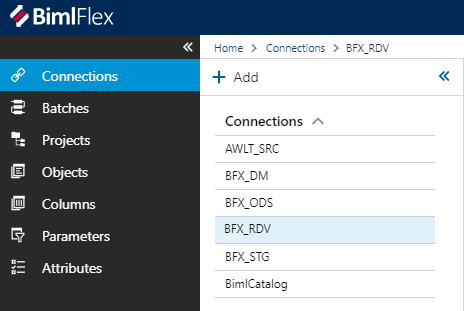
1. Change the Connection Type to "OLEDB" and save  
  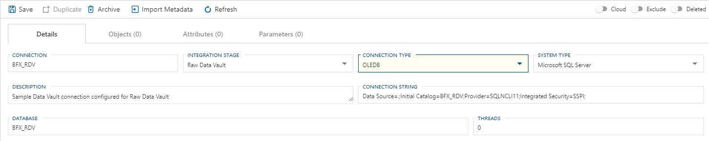

#### Enable acceleration of Link Satellites

1. Navigate to **Settings**  
  
1. Find or filter to "DvAccelerateLinkSatellite"  
  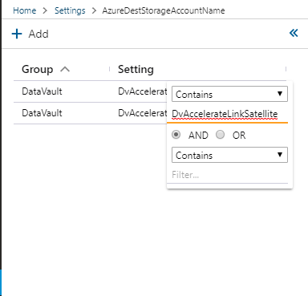
1. Change the Setting Value to "Y" and save  
  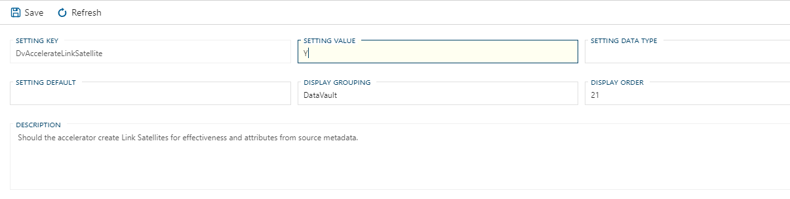

### Apply Modeling Overrides to the Source Metadata

In this limited case using a single source, no model overrides are required, but to test the feature make the following changes:

- Set the Model Override Name for the source table SalesLT.SalesOrderHeader to "SalesOrder"
- Set the Model Override Name for the source table SalesLT.SalesOrderDetail to "SalesOrderLine"
- Set the Model Override Name for the column Phone on source table SalesLT.Customer to "PhoneNumber"
- Set the Model Override Name for the column SalesPerson on source table SalesLT.Customer to "SalesPersonName"

#### Set the Model Override Name for an Object through the Objects Editor

1. Navigate to **Objects**  
  
1. Find or filter to "SalesOrderHeader"  
  
1. Select the object  
1. Set the Model Override Name to "SalesOrder" and save  
  

#### Set the Model Override Name for an Object through the Accelerator or Schema Diagram

1. Navigate to **Accelerator** or **Schema Diagram**  
  
1. Find or filter to "SalesOrderDetail" in the side menu and check the box  
  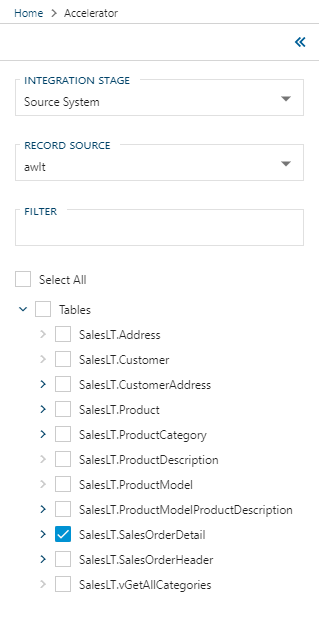
1. Click the "SalesLT.SalesOrderDetail" table header to activate the actions menu  
  
1. Click "Edit Table"  
  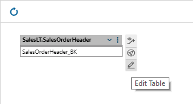
1. Set the Model Override Name in the Edit Table pane to "SalesOrderLine" and save  
  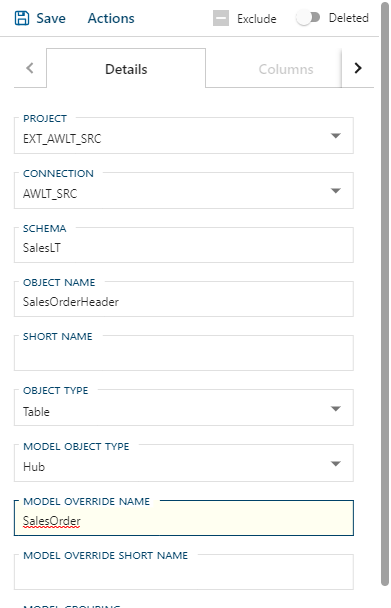

#### Set the Model Override Name for a Column through the Columns Editor

1. Navigate to **Columns**  
  
1. Find or filter to "Phone"  
  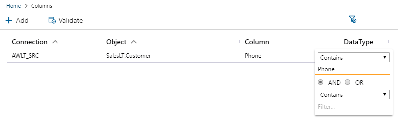
1. Select the object  
1. Set the Model Override Name to "PhoneNumber" and save  
  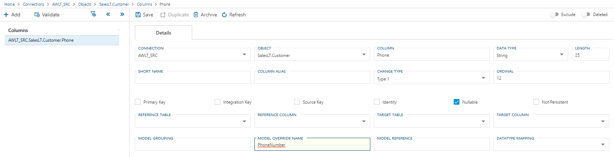

#### Set the Model Override Name for a Column through the Accelerator or Schema Diagram

1. Navigate to **Accelerator** or **Schema Diagram**  
  
1. Click the *View Settings* icon in the top right  
  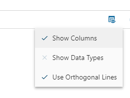
1. Click "Show Columns" to enable  
1. Find or filter to "Customer" in the side menu and check the box  
1. Click the "SalesPerson" column to activate the actions menu  
1. Click "Edit Column"  
1. Set the Model Override Name in the Edit Column pane to "SalesPersonName" and save  
  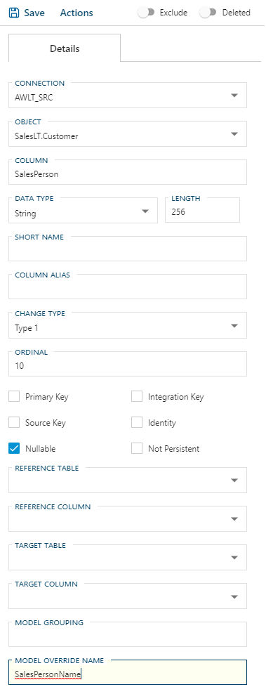

### Configure a SAT Model Object Type

Configure a Satellite from the source view SalesLT.vGetAllCategories to send Parent Category information to the data vault.

1. Configure the view to be a satellite and set Model Override Name
1. Set the Source Key and create an Integration Key
1. Add a reference from the Satellite to the source table

#### Configure the view to be a Satellite and set Model Override Name

1. Navigate to **Objects**  
  
1. Find or Filter to vGetAllCategories  
  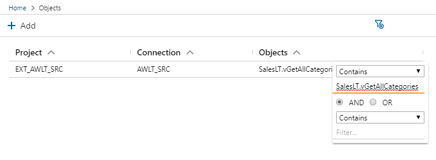
1. Set Object Type to Satellite  
  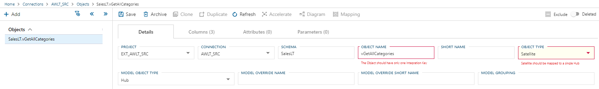
1. Set Model Override Name to "ProductCategory_ParentCategory" and save  
  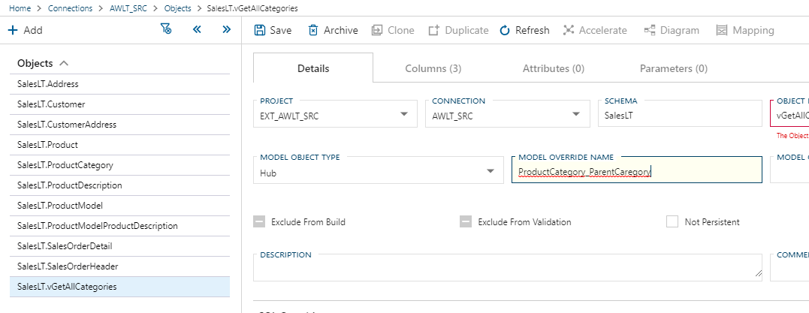

#### Set the Source Key and create an Integration Key

1. In the same window, click the Columns tab  
  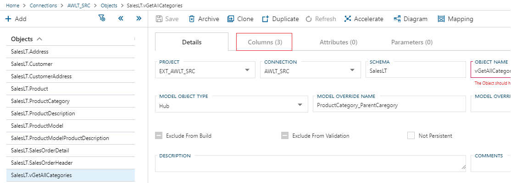
1. In the Overview grid, check the box for ProductCategoryId in the Source Key column and save  
  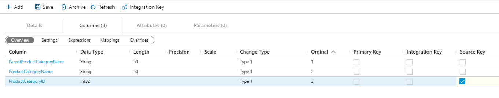
1. To create an Integration Key from ProductCategoryId, click the ProductCategoryId row to select it, then click the Add Integration Key button  
  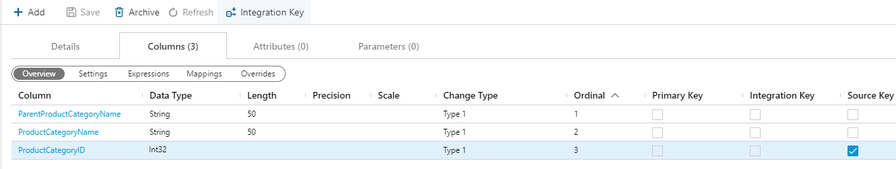
1. In the Generate Derived Integration Key dialog, change the Column Name to "ProductCategory_BK"  
  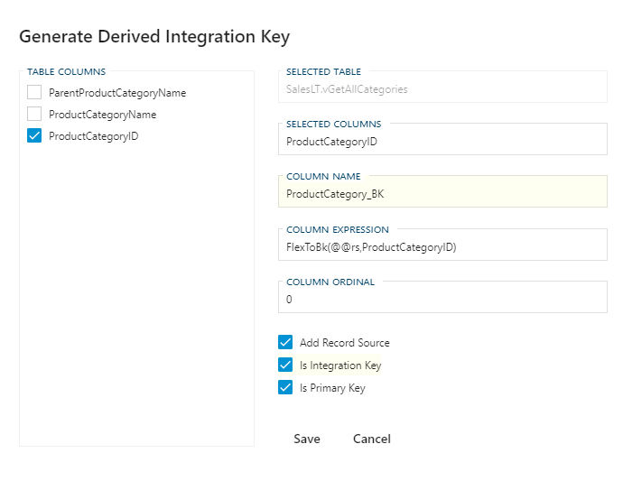
1. Check the box for Is Integration Key, which automatically checks Is Primary Key and sets the Column Ordinal to 0  
1. Click the Save button  

##### Add a reference from the Satellite to the source table

1. In the same window, click on the column name ProductCategory_BK to navigate to the Columns page  
  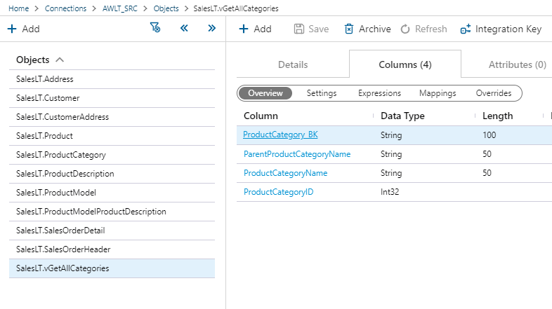
1. Set the Reference Table to AWLT_SRC.SalesLT.ProductCategory  
  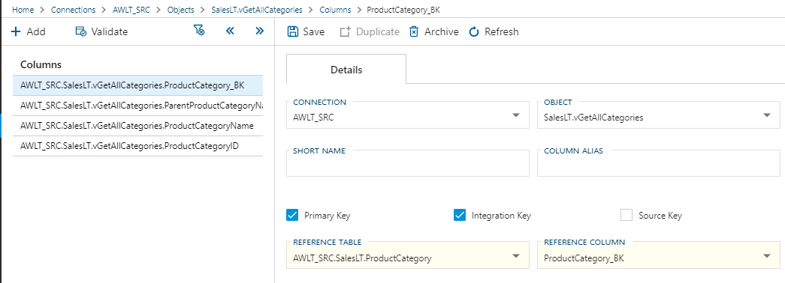
1. Set the Reference Column to ProductCategory_BK and save  

#### Add a reference from the Satellite to the source table

1. Navigate to the **Accelerator**  
  
1. Select the Satellite SalesLT.vGetAllCategories and the Table SalesLT.ProductCategory in the side menu  
1. Click on ProductCategory_BK in SalesLT.vGetAllCategories and drag to ProductCategory_BK in SalesLT.ProductCategory  
  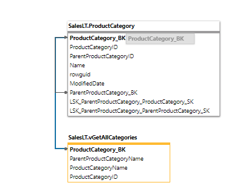
1. Click Ok in the Add Reference dialog to create the reference  
  

### Split and Join in the Accelerator

1. Split a Satellite into 3
1. Join Links to for a single Unit of Work

### Create a Virtual Hub as a Staged Query

A virtual hub as a Staged query will be used to bypass the staging and persistent staging steps and send data in the desired format from the source table to the RDV.
To create a Virtual Hub as a Staged Query you will need to:

1. Create a schema in the staging database (optional)
1. Create the staged query view in the staging database
1. Create a Connection for the Staged Query
1. Create a Batch to execute the defined procedure
1. Create a Project to manage the Staged Query

#### Create a schema in the staging database BFX_STG

1. Use the following script to create the schema "STQ" for the stored query

```sql
USE [BFX_STG]
GO

CREATE SCHEMA [STQ]
GO
```

#### Create the Staged Query view in the staging database

1. Use the following script to create the Staged Query that will present the data

```sql
USE [BFX_STG]
GO

DROP VIEW IF EXISTS [STQ].[Culture]
GO

CREATE VIEW [STQ].[Culture]
AS

SELECT
   [Culture] AS                       [Culture_BK] ,
   [Culture] AS                       [Culture] ,
   GETDATE( ) AS                      [FlexRowEffectiveFromDate] ,
   N'I' AS                            [FlexRowChangeType] ,
   [FlexRowRecordSource] AS           [FlexRowRecordSource] ,
   CONVERT(BINARY(20), HASHBYTES('SHA1', CONVERT(NVARCHAR(MAX), COALESCE(CAST([Culture] AS VARCHAR(100)),'NVL')))) AS [FlexRowHashKey]
FROM
 [awlt].[ProductModelProductDescription]
GROUP BY
     [Culture] ,
     [FlexRowRecordSource]
GO
```

#### Create a Connection for the Staged Query

This connection will connect to the staging database "BFX_STG" to access the view that we create there.

1. Navigate to **Connections**  
1. Select "BFX_STG" and click **Duplicate**  
1. Set Connection Name to "BFX_STG_AWLT_SRC"  
1. Set Integration Stage to "Source System"  
1. Set Record Source to "awlt" and save  
  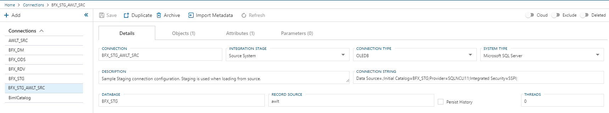

#### Create a Batch for the Staged Query

1. Navigate to **Batches**  
1. Select LOAD_BFX_RDV and click **Duplicate**  
1. Set Batch Name to "LOAD_BFX_RDV_AWLT_STQ" and save  
  

#### Create a Project for the Staged Query

1. Navigate to **Projects**  
1. Select LOAD_BFX_RDV and click **Duplicate**  
1. Set Project Name to "LOAD_BEF_RDV_AWLT_STQ"  
1. Set Batch to "LOAD_BEF_RDV_AWLT_STQ"  
1. Set Connection to "BFX_STG_AWLT_SRC" and save  
  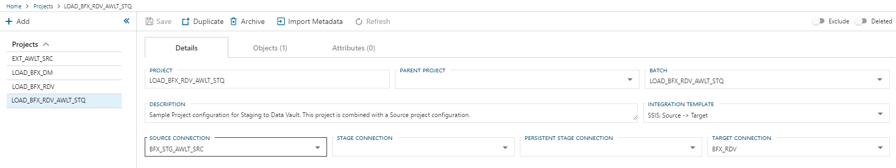

#### Import the Staged Query on the BFX_STG_AWLT_SRC connection

1. Navigate to **Connections**  
1. Select the Stored Query connection "BFX_STG_AWLT_SRC"  
1. Click **Import Metadata**  
1. Click the **Connect to Database** button  
1. Select the Stored Query  
1. Set Infer Integration Key From to "None"  
1. Click **Import Metadata**  

#### Configure the Staged Query

1. Navigate to **Objects**  
1. Filter to or Find STQ.Culture  
1. Set Object Type to `Staged Query` and Save  
  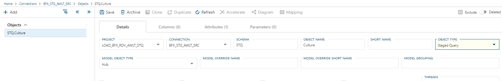
1. Click the Columns tab  
1. Change the ChangeType to "Exclude DV" for FlexRowEffectiveFromDat, FlexRowChangeType, and FlexRowRecordSource  
1. Check the Source Key box for the Culture column and save  
1. Click the Culture row to select it then click the  button to  create an Integration Key  
1. Set the Column Name to Culture_BK  
1. Set Add Record Source to `False`  
1. Set Is Integration Key and Is Primary Key to `True` and click Save  

#### Add Setting override for UseRecordSourceAsSchema for Staged Query

This override is for #1975 and will be removed after it is resolved.

1. Navigate to **Settings**  
1. Filter to or Find "UseRecordSourceAsSchema"  
1. Click **Add+** in the Overrides section  
1. Set Attribute Type to `Object`  
1. Select Connection to BFX_STG_AWLT_SRC  
1. Select Object to STQ.Culture  
1. Set Attribute Property to "N" and save  
  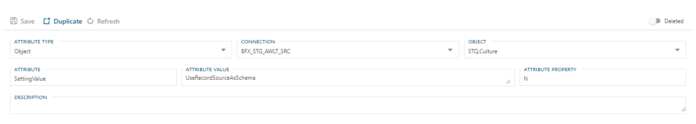

#### Add relationship between SalesLT.ProductModelProductDescription and STQ.Culture

1. Navigate to Accelerator  
1. Select STQ.Culture and SalesLT.ProductModelProductDescription  
1. Create a link from SalesLT.ProductModelProductDescription.Vulture_BK to STQ.Culture.Culture_BK  

### Accelerate and Publish

To complete the RDV setup in BimlFlex, accelerate all tables and publish.

1. In the **Accelerator**, select all tables and the stored query then click **Publish**  
1. In BimlStudio, generate the Create Table scripts again  
1. Run the generated scripts in Sql Server  
1. Build the BimlStudio Project  

### Run SSDT Projects

The SSDT Projects are now ready to be run and have the results verified.

---

## Business Data Vault (BDV)

The BDV is a set of materialized constructs that generally focus on either performance improvements or providing easier structures to query off of.  The two entities currently support are the **Point in Time** (PIT) and **Bridge** (BRG) structures.

BimlFlex implements these artifacts using tables for data storage, Stored Procedures for loading and SSIS packages for orchestration.

> [!NOTE]
> All tasks can be performed individually using the following Metadata from the prior RDV(#Raw-Data-Vault-(RDV)) process.

### Bridge (BRG) Tables

The BRG constructs allow multiple LNKs surrounding a HUB to be combined in one table, and optionally the business keys from the HUBs associated with the LNKs, minimizing the required joins.  This makes it easier to query from and can also lead to a significant performance increase depending on the size and configuration of the HUBs and LNKs.

> [!IMPORTANT]
> BimlFlex implements all BRG tables starting from a single business concept, i.e. HUB. Once a HUB is selected, you want to ensure you keep N-1 (or many-to-one) flow from the central business concept.  
>
> You can attach objects of HIGHER grain with no issues, however.  If your central business concept was for instance `Product`, going to `ProductCategory` is perfectly acceptable as it preserves the grain.  However, going in the opposite direction will likely not have the desired effect as you are breaking the fundamental grain of the business concept.

#### Creating a BRG w/ 3 HUBs and 1 LNK

Below are the steps to design a basic BRG between 3 HUBs and 1 LNK.  With a minimal change, the below process could also be expanded to increase either the number of HUBs included or the spanning across additional LNKs.  Callouts are made below to highlight these steps.

1. Navigate to the target `business concept`.  In this example the ProductModel HUB (**rdv.HUB_ProductModel**).  
  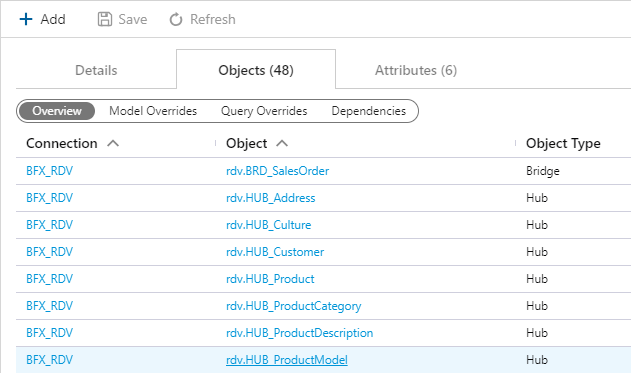

1. Ensure you are on the Details tab, if not click the Details tab.  

1. Click the  button in the menu bar towards the top  
  

1. In the [Create Bridge] dialog, choose **LNK_ProductModelDescription** followed by **HUB_Culture** and **HUB_ProductDescription**  
  

> [!NOTE]
> Although the steps used above only use a single LNK, you can easily adjust the same scenario to allow for spanning across multiple LNKs.

> [!IMPORTANT]
> When spanning multiple LNKs, ensure that the grain of the business concept is not violated or lowered.

1. Click **Save**

### Point In Time (PIT) Tables

For insert-only Data Vault solutions, the PIT constructs provide a convenient way to recreate timelines and end date records so that timeline-sensitive queries are easier to create. This is also useful when a HUB has multiple SATs attached and there is a requirement to query data from several of these SATs for a specific date and time.

#### Single SAT

As mentioned above, it is often handy to have an immediate `EndDate` to query for ease of use.  Generally insert only architecture requires a nested self join to generate this, though this can also be handled with the use of a PIT table.  Steps below outline an example of applying this pattern HUB with a single SAT to achieve the aforementioned result.

1. Navigate to the target `business concept`.  In this case the Address HUB (**rdv.HUB_Address**)  
  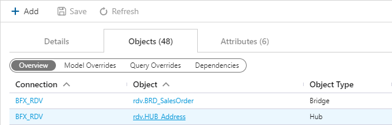
1. Ensure you are on the Details tab, if not click the Details tab.  
1. Click the  button in the menu bar towards the top  
  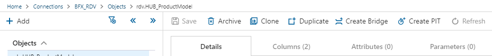
1. In the [Create PIT] dialog, choose [SAT_Address_awlt].  
  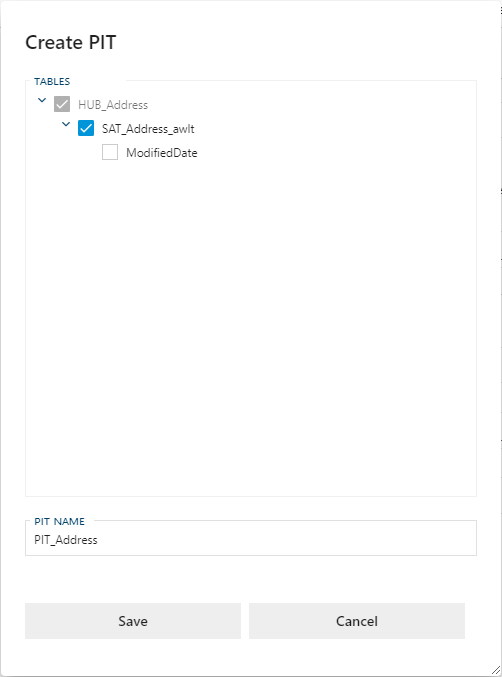

1. Click **Save**

#### Multiple SATs

When a HUB has multiple SATs it is often very convenient to have a single table to regenerate a specific point in time.  A PIT table can serve this purpose extremely well.  By selecting what SATs you want to align and generating the construct, you can simply target the PIT table for a Date and Time and immediately get back the appropriate entries in the tracked SATs.

> [!NOTE]
> This process is virtually identical to a Single SAT process with the only exception being that the target business entity has more SATs available/selected.

1. Navigate to the target business concept.  In this case the Customer HUB (**rdv.HUB_Customer**)  
  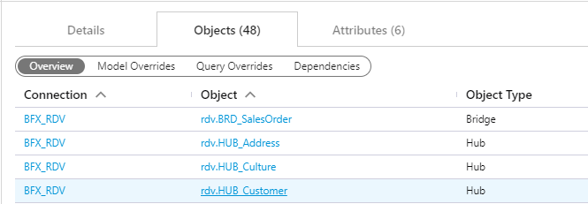
1. Ensure you are on the Details tab, if not click the Details tab.  
1. Click the  button in the menu bar towards the top  
  
1. In the Create PIT dialog, choose `SAT_Customer_ContactInfo_awlt` and `SAT_Customer_Password_awlt`.  
  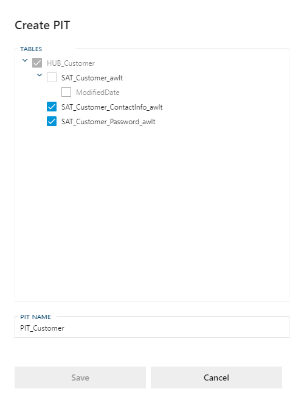
1. Click **Save**  

#### SAT w/ Business Date

A PIT table can also be built to group off of a `business date` verses the standard `load date`.  A scenario may be that sales need records grouped by the

1. Navigate to the target business concept.  In this case the SalesOrder HUB (rdv.HUB_SalesOrder)  
  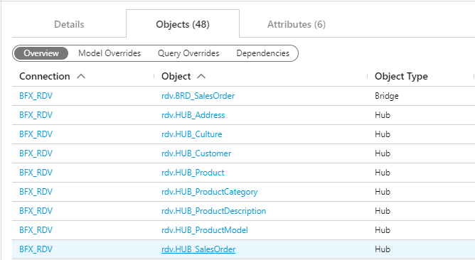
1. Ensure you are on the Details tab, if not click the Details tab.  
1. Click the  button in the menu bar towards the top  
  
1. In the Create PIT dialog, choose `SAT_SAT_SalesOrder_awlt` followed by `ShipDate`.  
  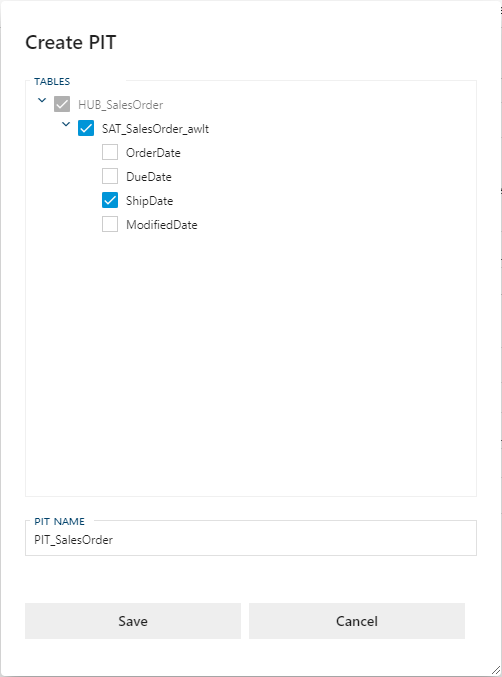
1. In the *PIT Name* box put **PIT_SalesOrder_ShipDate**  
  
1. Click **Save**  

---

### Creation and Deployment of BDV Entities

Once the BDV entities are modeled we will need to deploy the structures.  For this we use BimlStudio.  By default, BimlStudio will attempt to build all our artifacts.  Before we can do that we will require that the entities exist else we will get an error when attempting to validate the SSIS packages.  This is resolved by first generating and executing the [Create Tables Script] before building.  BimlStudio will also build an SSDT project should you want the ability to deploy via DACPAC or publish directly from Visual Studio.  The following section outlines the steps required to add new BDV entities (PITs and/or BRGs) to the Data Vault.

> [!IMPORTANT]
> Please ensure you follow prior deployment guides for STG, PSA, and RDV.

#### Manually Deploy Tables

If you are not in a CI/CD environment, or perhaps only testing, it can be quicker to manually deploy the artifacts.  This is done by using the [Generate Scripts] function inside BimlStudio.  Once generated you can then deploy these to a target server of your choice.

> [!WARNING]
> These scripts are `DROP AND CREATE` by default.  This means they are destructive.  If manually deploying tables please ensure you are in a database where it is safe to do so.

1. Open up your BimlFlex BimlStudio Project.  
1. Click the BimlFlex tab.  
  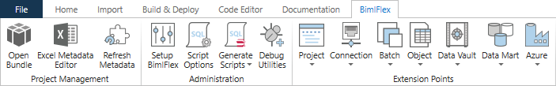
  
   > [!IMPORTANT]
   > There is currently a bug in BimlFlex.  The intended steps are as follows but the BDV does not output with the below steps.  Until resolved (or if running an older bugged version) one should ignore steps 3 through 7.
1. Click the 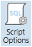 button to access the Script Options Dialog.  
  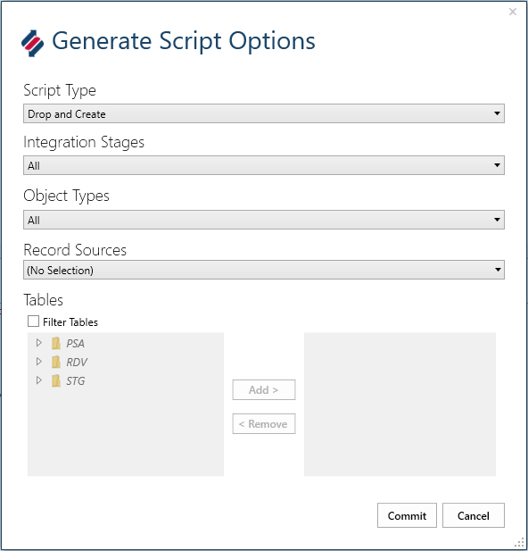
1. Under Integration Stages click the dropdown  
  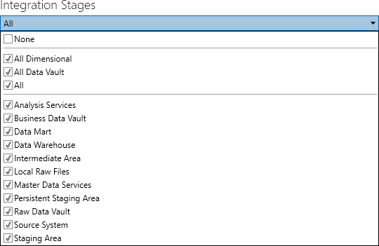
1. Click the `None` checkbox to clear selections  
  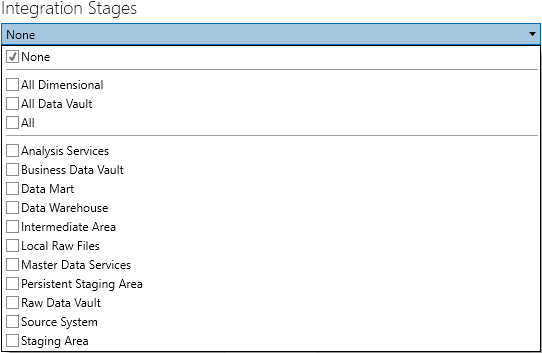
1. Click the `Business Data Vault` checkbox.  
  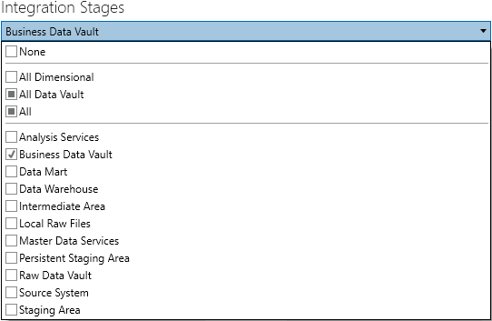
1. Click `Commit`  
1. Click the *Generate Scripts* button to show the dropdown menu.  
  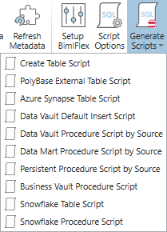
1. From the *Generate Scripts* dropdown box choose `Create Table Script`.  
1. Copy the outputted script.  
   > [!TIP]
   > [Ctrl] + [A] = Select All
   > [Ctrl] + [C] = Copy to Clipboard
1. Open SQL Server Management Studio (SSMS).  
   > [!NOTE]
   > Alternatively you could use any other preferred tool to execute DDL SQL statements.
   > Generated scripts are generated in the ANSI standard.
1. Paste the script from Step 9 into a new query window  
   > [!TIP]
   > [Ctrl] + [V] = Paste from Clipboard
1. Execute the script.  
   > [!TIP]
   > If using SSMS you can use the following key.
   > [F5] = Execute Query
1. Back in BimlStudio click the [Build & Deploy] tab.  
  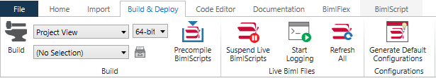
1. Click the **Build** button.  

#### Deploying Artifacts with SSDT

If you are working with a previously populated environment you will often not want to `DROP` artifacts and instead publish an incremental deployment.  As part of the build process, BimlStudio/BimlFlex will build an SSDT project to allow for customizable deployment.

Publishing projects via SSDT (or the built DACPAC) is the equivalent of running Create Table Scripts, Data Vault Default Insert Script, Data Vault Procedure Script by Source, and the Business Vault Procedure Script from the Generate Scripts utility for the **Data Vault** and **Business Data Vault**.

1. Open Visual Studio 2019 or SQL Server Development Tools (SSDT).  
   > [!TIP]
   > If you are unsure as to what version of SSDT you require, please refer to the link below.
   > [Download SQL Server Data Tools (SSDT) for Visual Studio](https://docs.microsoft.com/en-us/sql/ssdt/download-sql-server-data-tools-ssdt?view=sql-server-ver15)
1. Click File -> Open -> Project/Solution...  
   > [!TIP]
   > [Ctrl] + [Shift] + [O] = Open Project/Solution
1. Navigate to your root BimlStudio project folder.  
   > [!NOTE]
   > If you do not know your root project directory and have the project open do the following:
   > 1. Go to BimlStudio.
   > 1. Under Logical View or Project View, Right-Click your project.
   > 1. Choose Open in Windows Explorer.
   > 1. You are now in your project root directory.
   > 1. (Optional) Copy the path to the clipboard for quicker navigation in SSDT.
1. Open the `output` folder.  
1. Open the `SSDTS` folder.  
1. Open the folder with your `Customer GUID`.  
1. Open the folder for the `Version` you just built.  
1. Open the `BFX_RDV` folder.  
1. Select the `BFX_RDV.sqlproj` file and click **Open**.  
1. Navigate to the  Solution Explorer on the right.  
  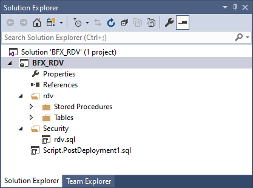
1. Right-Click the project `BFX_RDV`.  
  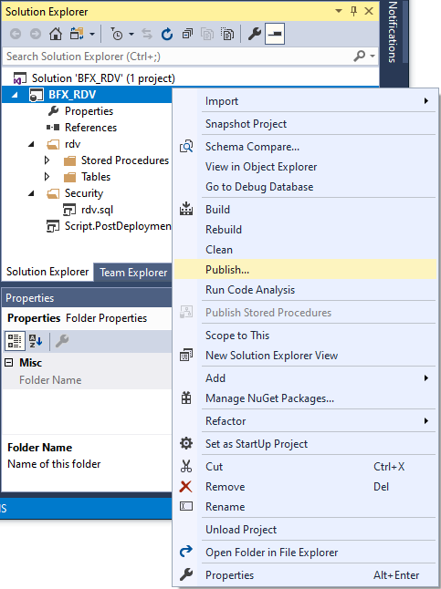
1. Select *Publish...* to get the Publish Database dialog box.  
  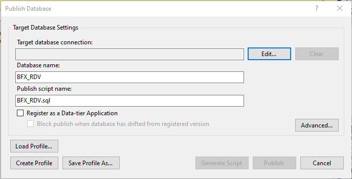
1. Configure your *Target database connection* by clicking **Edit** to get the Connect dialog box.  
  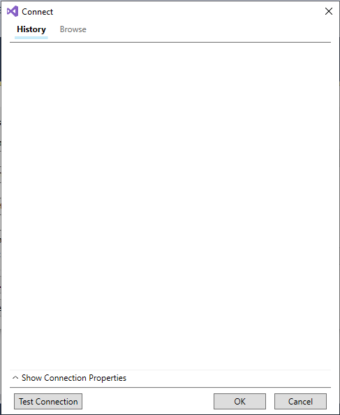
1. In the Connect dialog box expand the Connection Properties by clicking *Show Connection Properties*.  
  
1. Input the Server Name.  
   > [!NOTE]
   > If testing on your local machine this can be abbreviated at "."
1. Choose Authentication.  
   > [!NOTE]
   > The demo lab uses Windows Authentication.
1. Input the Database Name.  
   > [!NOTE]
   > The demo uses "BFX_RDV".
1. Click **OK**.  
1. Click **Publish**  
   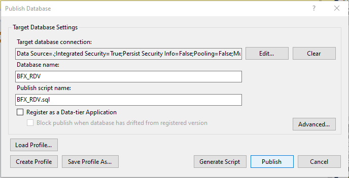
1. The Data Tools Operations window should appear.  
   
1. Wait for deployment to complete.  
   
1. Deployment via SSDT complete.  

   > [!IMPORTANT]
   > It should be noted again that this is only for the RDV / BDV layer.  This does not deploy any Staging (STG) or Persistent Staging (PSA) tables or artifacts.  Additionally, this is only for the tables and does not include any SSIS packages that may be required.

---

### Execution

Once the projects are built the next step in the process is to execute the packages and load the data.  The following sections will walk you through navigating to the default output folder, finding the projects and executing them.

> [!NOTE]
> This article will assume your output folder is in the default location.  This can be changed in the properties of the BimlStudio project itself.  You can find this by going to Logical View, Right-Click the BimlStudio project, and choosing *Properties*.  From here select *Build* on the left menu and look at the Output Path setting.

> [!IMPORTANT]
> If you are using settings besides the default proceed straight to Step 3 manually navigating to your custom output folder.

1. Open Visual Studio 2019 or SQL Server Development Tools (SSDT).
   > [!TIP]
   > If you are unsure as to what version of SSDT you require, please refer to the link below.
   > [Download SQL Server Data Tools (SSDT) for Visual Studio](https://docs.microsoft.com/en-us/sql/ssdt/download-sql-server-data-tools-ssdt?view=sql-server-ver15)

1. Click File -> Open -> Project/Solution...
   > [!TIP]
   > [Ctrl] + [Shift] + [O] = Open Project/Solution

1. Navigate to your root BimlStudio project folder.

   > [!NOTE]
   > If you do not know your root project directory and have the project open do the following:
   > 1. Go to BimlStudio.
   > 1. Under Logical View or Project View, Right-Click your project.
   > 1. Choose Open in Windows Explorer.
   > 1. You are now in your project root directory.
   > 1. (Optional) Copy the path to the clipboard for quicker navigation in SSDT.

1. Open the output folder.

1. Open the LOAD_BFX_RDV folder.

1. Select LOAD_BFX_RDV_Project.dtproj and click *Open*.

1. Run SSIS Packages

---

## Validation

1. Validate Load

1. Validate BimlCatalog Logging

1. INSERT / UPDATE / DELETE Test Script to 'Source'

1. Rerun Packages

1. Validate Load
   1. New Inserts
   1. Updates
   1. PSA Ignored Unchanged Rows
1. Validate Metadata

---
