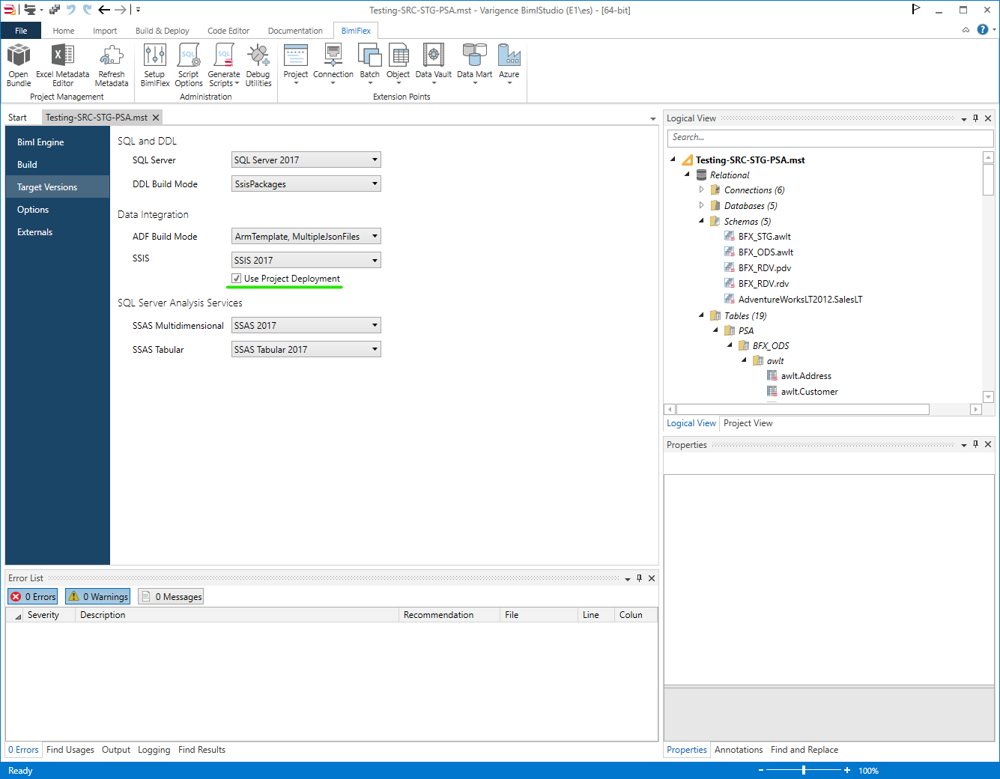
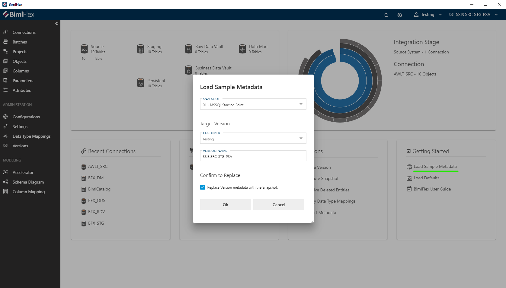
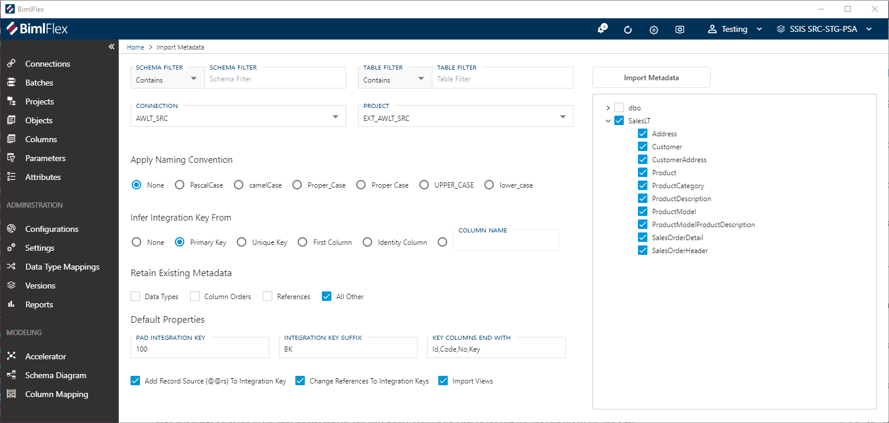
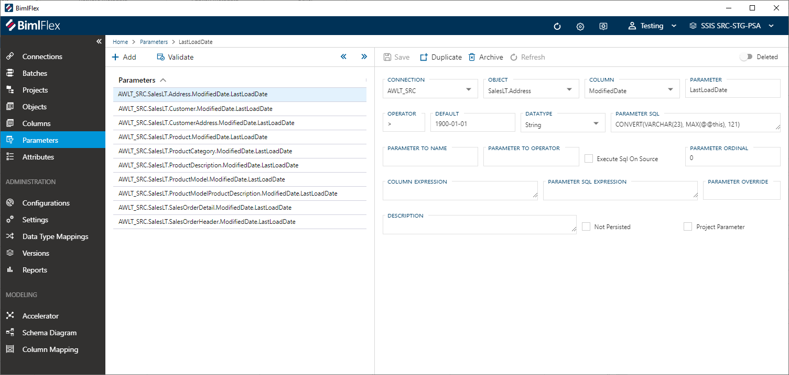
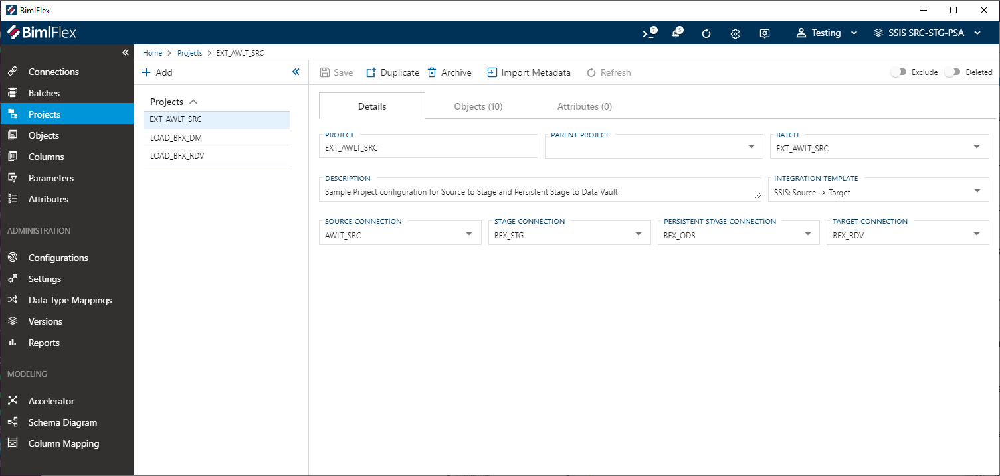
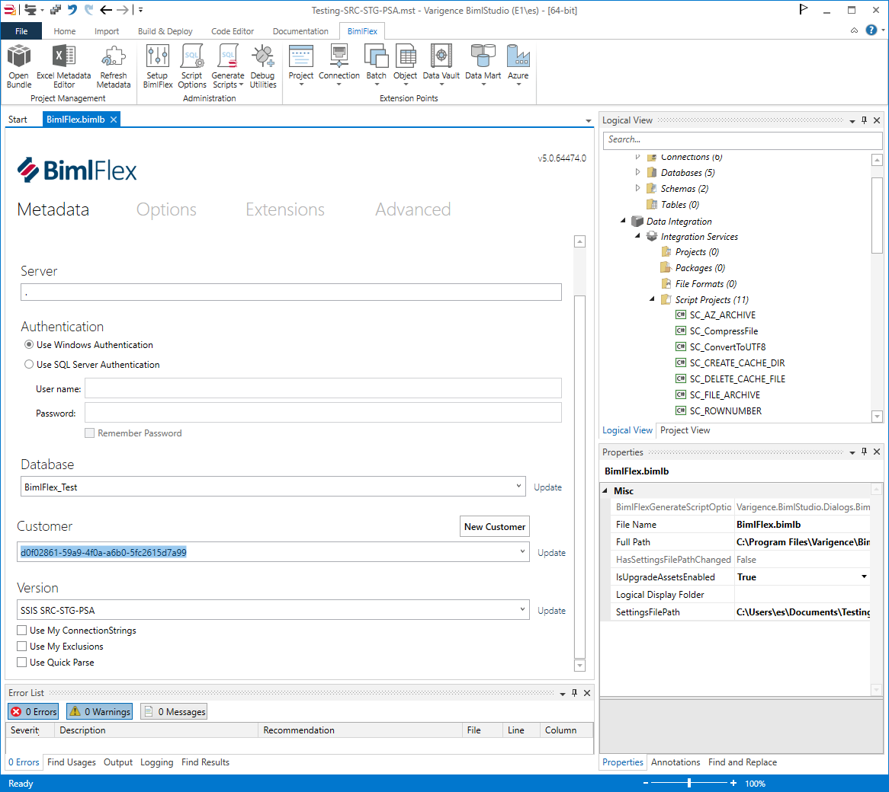
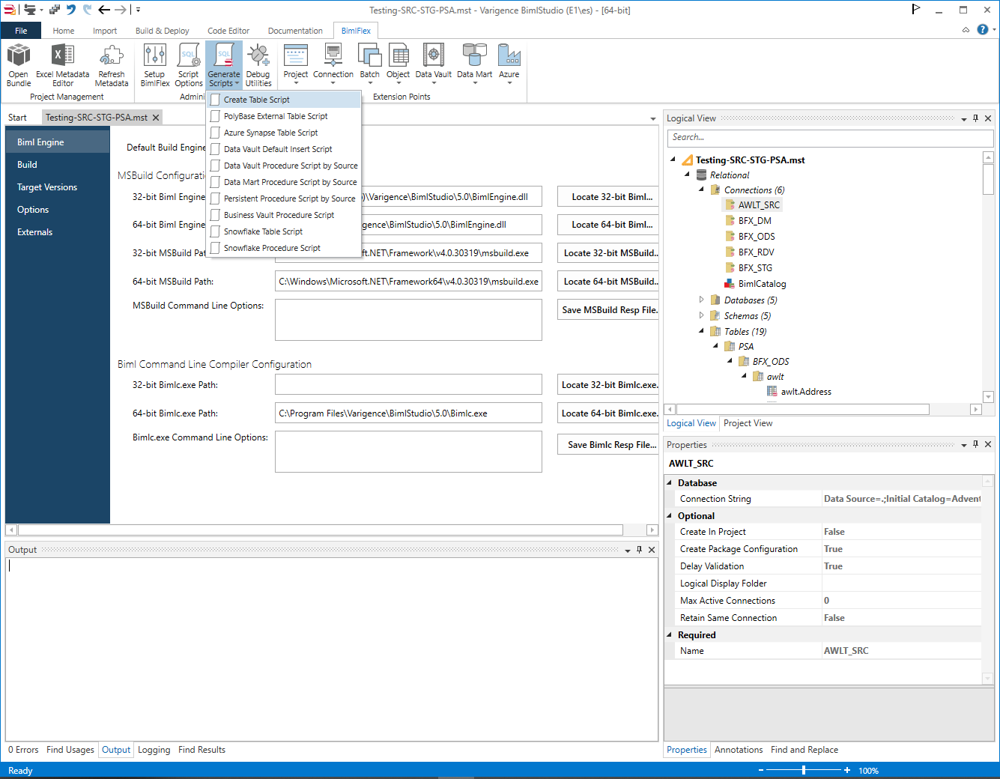
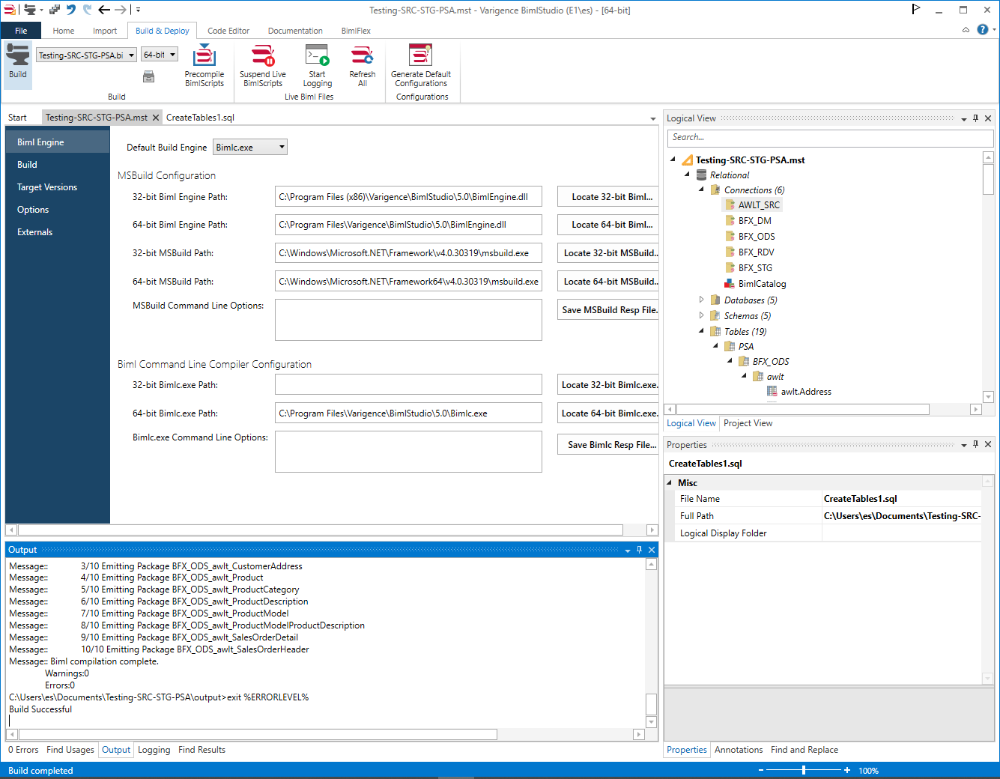
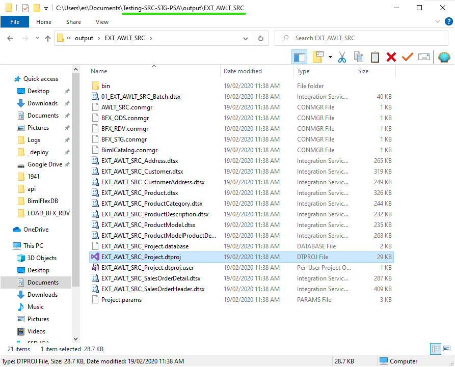
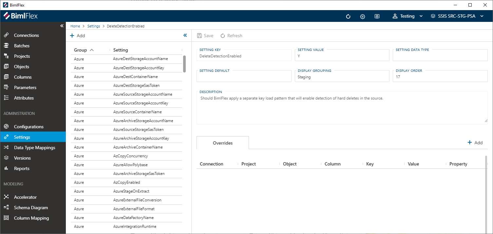

# SSIS Source to Stage to Persistent Stage

This document describes the steps and considerations for extracting data from a `Source` database and moving it through `Staging` to `Persisted Stage` on an `on-premise SQL Server`.

## Create BimlStudio Project and BimlFlex Customer Metadata

A prerequisite for this guide is that the BimlFlex project exists with Customer Metadata.

See @bimlflex-trial-creating-and-configuring-a-bimlflex-project

### Configure BimlStudio Project Target Architecture



### BimlFlex Customer Metadata

In BimlFlex, start with applying Sample Metadata: `01 - Starting Point for MSSQL`



#### Import the Source Metadata from AWLT2012 - See @bimlflex-importing-metadata fro more detail
  


#### Create LastLoadDate Parameters




## Create tables in DW databases 

BimlStudio provides the `Create Table Scripts` which should be applied to the databases to allow the BimlStudio project to build and output the SSIS packages that will be used to extract the data.



Note the `Source`, `Stage` and `Persistent Stage` Connections in the `EXT_AWLT_SRC` Project. The `RDV` database won't be used in this guide. (Clear or Drop the databases if required)

### BimlStudio: Set BimlFlex Customer and Version (Open Bundle and Refresh Metadata)



### BimlStudio: Generate and deploy scripts

Grab Create Table Scripts



Deploy Create Table Scripts


BimlStudio: Build SSIS packages for the target version



This will create a dtproj which can be opened for debugging in your target Visual Studio version.

## Test deployment of database artifacts through the SSDT project

Go to the output folder created above and open the .dtproj file in the `EXT_AWLT_SRC` folder



### Test run SSIS packages (Run 01_EXT_AWLT_SRC_Batch.dtsx), validate data loaded to target


### Validate data in SQL Management Studio
```
SELECT * FROM [BFX_STG].[awlt].[Product]
SELECT * FROM [BFX_ODS].[awlt].[Product]
```

### Validate logging happening to BimlCatalog/Logging schema
```
SELECT * FROM [BimlCatalog].[bfx].[Package] p 
INNER JOIN [BimlCatalog].[bfx].[Execution] e 
ON e.PackageID = p.PackageID 
WHERE p.PackageName = '01_EXT_AWLT_SRC_Batch'
```

### Introduce changes in the Source database (Insert/Update/Delete) using a test script
- Test Insert
```
INSERT INTO [AdventureWorksLT2012].[SalesLT].[Product]
           ([Name]
           ,[ProductNumber]
           ,[Color]
           ,[StandardCost]
           ,[ListPrice]
           ,[Size]
           ,[Weight]
           ,[ProductCategoryID]
           ,[ProductModelID]
           ,[SellStartDate]
           ,[SellEndDate]
           ,[DiscontinuedDate])
     VALUES
           ('Test Cycle'
           ,'BF101'
           ,'Black'
           ,123
           ,123
           ,5
           ,123
           ,18
           ,6
           ,'20010101'
           ,null
           ,null)

-- Re-Run the Package and Validate the Data
SELECT * FROM [BFX_STG].[awlt].[Product] -- Should have only the single 'Test Cycle' record

SELECT * FROM [BFX_ODS].[awlt].[Product] WHERE [Name] = 'Test Cycle'
SELECT * FROM [BFX_ODS].[awlt].[Product] WHERE [Name] <> 'Test Cycle' -- Should have older ModifiedDate, FlexRowEffectiveFromDate than 'Test Cycle'
```

- Test Update
```
UPDATE [AdventureWorksLT2012].[SalesLT].[Product] SET [Color] = 'Red', ModifiedDate = GETDATE() WHERE [Name] = 'Test Cycle' 

-- Re-Run the Package and Validate the Data
SELECT Color, * FROM [BFX_STG].[awlt].[Product] -- Should have single record with Color = Red

SELECT Color, * FROM [BFX_ODS].[awlt].[Product] WHERE [Name] = 'Test Cycle'  -- Should have 2 records - One with the higher FlexRowAuditId should be Red
SELECT * FROM [BFX_ODS].[awlt].[Product] WHERE [Name] <> 'Test Cycle' -- Should not have changed from previous query 
```

NOTE: Delete detection has not been set up yet, so deletions won't be processed to STG or PSA

## Set up delete detection

  - See @bimlflex-delete-detection



- Repeat previous steps
  - BimlStudio: Refresh Metadata
  - BimlStudio: Create and Deploy Table Scripts
  - BimlStudio: Build Package
  - Update LastLoadDate to allow re-retrieval of data:
```
UPDATE [BimlCatalog].[bfx].[ConfigVariable] 
  SET [VariableValue] = '1900-01-01', PreviousValue = NULL 
WHERE VariableName = 'LastLoadDate' 
  AND SystemName = 'AWLT_SRC'
```

  - Run Packages
    - 01_EXT_AWLT_SRC_Batch.dtsx
    - 01_DEL_EXT_AWLT_SRC_Batch.dtsx
  - Now Test the record deletion


- Test Delete
```
DELETE FROM [AdventureWorksLT2012].[SalesLT].[Product] WHERE [Name] = 'Test Cycle' 

-- Re-Run the Packages (01_EXT_AWLT_SRC_Batch and 01_DEL_EXT_AWLT_SRC_Batch) and Validate the Data
SELECT Color, * FROM [BFX_STG].[awlt].[Product] -- Should have no records
SELECT * FROM [BFX_STG].[awlt].[Product_DEL] -- Should have a single record with the correct ProductId

SELECT Color, * FROM [BFX_ODS].[awlt].[Product] WHERE [Name] = 'Test Cycle'  -- Should have at least one record with FlexRowChangeType = D
SELECT * FROM [BFX_ODS].[awlt].[Product] WHERE [Name] <> 'Test Cycle' -- Should not have changed from previous query 
```
