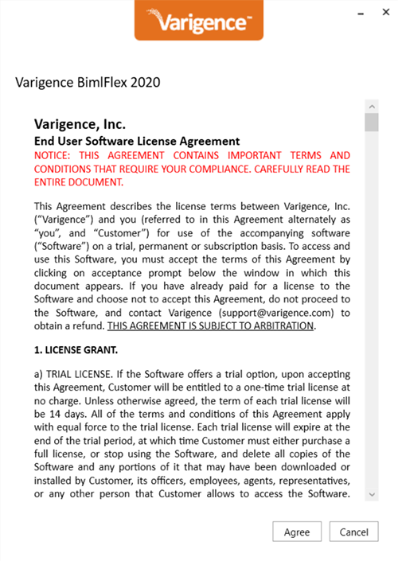

# Installing BimlFlex

The following installers are available:

* **BimlFlex Developer Installation**  
    This installer includes all parts of the product framework and is suited for modelers, who use the BimlFlex App for modeling and developers, who build the solution in BimlStudio and test the resulting packages in Visual Studio
* **BimlFlex Runtime Installation**  
    This installer includes the required runtime components for servers that will execute SSIS packages

The current installer is available through the [BimlFlex Release Notes](xref:bimlflex-release-notes-overview)

The BimlFlex Developer installation includes all components used in the BimlFlex framework:

* BimlStudio
* BimlFlex App
* BimlFlex Excel-based metadata editor
* SSIS Custom Components for SQL Server
* SSIS Custom Components for Snowflake
* Installation of new, or upgrades of existing, [BimlFlex](xref:bimlflex-setup-metadata-database-installation) and [BimlCatalog](xref:bimlflex-setup-bimlcatalog-database-installation) databases

The first time BimlStudio or the BimlFlex Excel Add-in file is opened from a BimlFlex project it will ask for a license key. Add a BimlFlex-enabled license key to enable the application. The key is validated online and once validation completes it is possible to run the applications. It is also possible to add the license key through the installation program.

## Detailed Steps

The following detailed steps walk through the installation of BimlFlex

### Download the BimlFlex installer

The current installer is available through the [BimlFlex Release Notes](xref:bimlflex-release-notes-overview)

### Check bitness of Microsoft Excel

> [!NOTE]
> Microsoft Excel is a prerequisite for installing and using the BimlFlex Excel Add-in Metadata Editor.

The Excel-based metadata editor is a plugin for Microsoft Excel. This tool adds a separate tab in the Excel ribbon UI when the BimlFlex-enabled Excel workbook is opened from a BimlFlex project. The Excel Add-in is suited for bulk-editing of metadata.

When installing it is important to match the Excel bitness version. Verify the Excel bitness version before starting the installation and only install the matching version of BimlFlex.

Check the bitness of the local installation of Microsoft Excel using the [Microsoft guidelines available here](https://support.office.com/en-us/article/About-Office-What-version-of-Office-am-I-using-932788B8-A3CE-44BF-BB09-E334518B8B19).

> [!WARNING]
> Install only the bitness version that matches the installed Excel version.

### Install BimlFlex for developers

Run the installer to install the applications.

#### Installer steps

1. Run the Installer
1. Accept the License Agreement
1. Enter License Key  
    If the installer can't identify an existing key, click the `I already have a product key` if you have a valid key, or use the request form to request a trial key for BimlFlex. It is also possible to skip this step and add the License Key later
1. The main feature page allows choosing the applications and features to install.  
    For a BimlFlex developer installation, pick all. Also check to install new, or upgrade existing, databases and projects
1. Pick BimlFlex features to install  
    BimlFlex App: Install the BimlFlex app as the main metadata management solution
    Excel Add-in: Add the matching bitness for the installed version of Excel
1. Pick BimlStudio features to install  
    For most developer installations, choose to install both 32-bit and 64-bit versions
1. Pick Custom components to install  
    These are used to add additional functionality to SSIS Packages  
    Only identified available versions are available in the list. It is possible to force the installation of unavailable options  
    Click **View Unavailable Features** to add force installation of unavailable versions  
    right-click to force installation  
1. Install or upgrade BimlFlex databases by adding the connection string and clicking **add** to add the database to the upgrade tasks  
    Use the **Test** button to test the connection string for existing databases  
    Backup existing databases before upgrade  
1. Install or Upgrade BimlCatalog databases by adding the connection strings and clicking **add** to add the database to the upgrade tasks  
    Use the **Test** button to test the connection string for existing databases  
    Backup existing databases before upgrade  
1. Review the installer tasks and allow the installation to occur

Once the installation concludes successfully, click finish to end the installer.

Refer to [Getting Started with BimlFlex](xref:bimlflex-getting-started) to get started with BimlFlex
