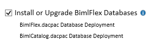
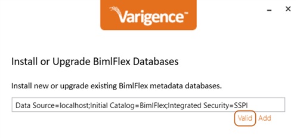
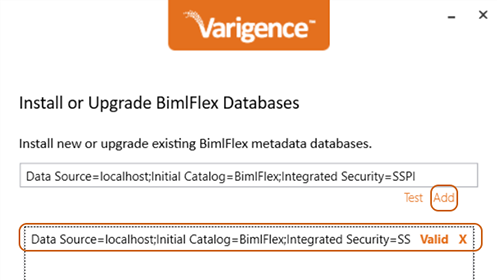
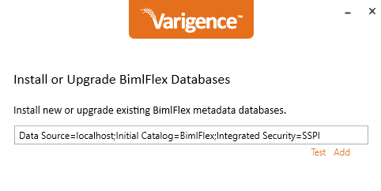
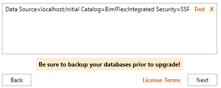
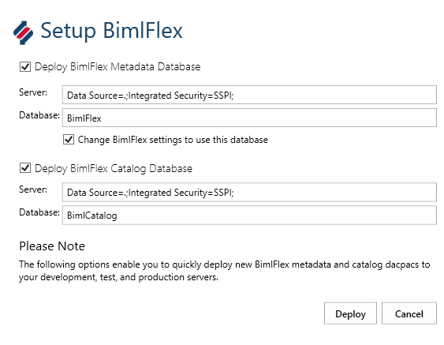
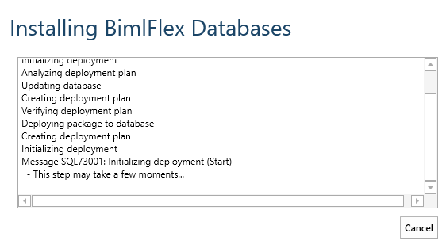

# BimlFlex Metadata Database Installation

BimlFlex data warehouse automation metadata is stored in the BimlFlex metadata database.

* More information: [BimlFlex Metadata Database](xref:bimlflex-components-metadata-database)

Operational data, audit information, and logging data is stored in the BimlCatalog Database.

* More information: [BimlCatalog Database](xref:bimlflex-components-bimlcatalog-database)

There are two different methods used to install these databases.
The first option is to use the BimlFlex installer.
The second option is to use BimlStudio.

## BimlFlex Installer Setup

### Enable the Database Installation

On the first pane of the installation process, there is the option to setup and install the BimlFlex and BimlCatalog databases. Check this box before continuing.

### Setting the Connection Strings

Proceed through the setup until the "Install or Upgrade BimlFlex Databases" screen is reached.
This represents the location(s) of the BimlFlex databases to be installed.

Click `Test` to test the target connection and ensure that it is valid. `Test` will change to `Valid` once confirmed.  
Once a working connection string has been validated, click the `Add` button to finalize the database configuration. 

<!--

  
-->

The desired installation location is now saved and will be used to install the database.

>[!IMPORTANT]
> It is important to back up any databases prior to an upgrade.

Press `Next` to repeat this same configuration process for **BimlCatalog**.

Before finalizing the BimlFlex database or BimlCatalog upgrade or installation, examine the *Pending Actions* list. 
Ensure that there is a pending action that corresponds to the desired database installation.

Press `Upgrade` or `Install` to finalize the BimlFlex database installation or upgrade.

## BimlStudio-Based Setup

### Open the Project in BimlStudio

Alternatively, it is also possible to install the databases from the BimlFlex project in BimlStudio.

In order to setup the databases, first create a [BimlFlex project for BimlStudio](xref:bimlflex-setup-bimlstudio-project).

When the BimlFlex project is opened in BimlStudio, the metadata database setup option is available in the BimlFlex Ribbon.

  

### Setting the Connection String

Set up the databases through the **Setup BimlFlex** dialog.

Configure the connection string to point to the database instance where the database should be created.

> [!NOTE]
> Change the name of the databases from their defaults, **BimlFlex** and **BimlCatalog**, as needed

### Deployment

Click **Deploy** to deploy the databases

Once setup completes, configure the BimlFlex Project and BimlFlex App metadata connections to use the new **BimlFlex** database.
Configure The project and the Operational Reports to use the **BimlCatalog** database.

## Command Line/Terminal-Based Setup

To deploy the databases using the Microsoft `SqlPackage.exe` application (https://docs.microsoft.com/en-us/sql/tools/sqlpackage), or a similar task/process, the following process can be used.

The BimlFlex metadata database and BimlCatalog orchestration and auditing databases are delivered as dacpac files, with a pre-upgrade script for upgrades of existing databases. 

The dacpac and pre-upgrade script files can be extracted from BimlStudio.

Open a BimlFlex project in BimlStudio, navigate to the BimlFlex Ribbon UI tab, click the Debug Utilities option, click Extact DACPAC Folder button.

Once the dacpacs and scripts are available, it is possible to deploy them to a target using the `SqlPackage.exe` application.

Note that any existing database must be updated by first running the corresponding `BimlFlex_PreDacpac_Deployment.sql` or `BimlCatalog_PreDacpac_Deployment.sql` script.
