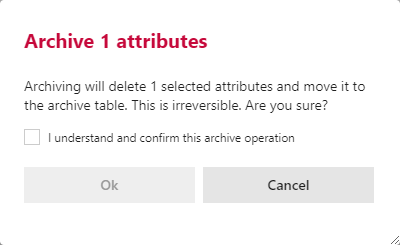

#### Archive Attribute Dialog Box  

Confirmation box warning against the dangers of archiving.  You are required to confirm by both the check box and the *Ok* button.

>[!WARNING]
> Archiving is a permanent removal of the selected entity from it's associated table in the metadata database.  The best practice is to first use the *Deleted* flag to soft delete if you need to remove an entity.  *Archive* should only be used in the case that both:
>
> 1. The only fix to the current issue requires the *Archive* of the selected entity.
> 2. The full implications that the removing of the selected entity from the metadata system will cause.
