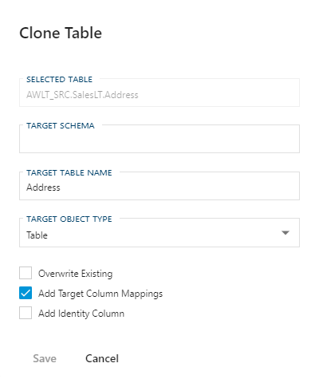

#### Clone Table Dialog Box  

The [Clone Table] function is provided to allow for quick generation of **Dimensions** and **Facts**.  This is designed to be used on manually created view, generally deriving from the **Data Vault**, that has been transformed to the desired end state.  Once that view has been imported enter your [Target Schema], choose your *Target Object Type*, set your [Clone Table Options](#Clone-Table-Options) and click  **Save**.  Please refer to the links below for details on creating a **Data Mart**.

 

##### Clone Table Options

|Option|Description|
|-|-|
|Overwrite Existing|When enabled if the **Object** or associated **Columns** already exists, the **Object** and/or **Columns** will be overridden with current settings.  When disabled only not existing entities will be created.|
|Add Target Column Mappings|This will automatically map the appropriate **Target Columns** required to build the table.|
|Add Identity Column|Adds an **IDENTITY** column to be used as the **Surrogate Key** (SK) for the cloned table.  This is common among **Dimensions** to support **Type 2** (or history tracking) values.  Generally not used when building a **Fact** unless there is a specific use case.|

> [!TIP]
> For more details on building a **Data Mart** see the associated link(s).  
>
> Getting Started:  
> [Dimensional Model](..\getting-started\dimensional-model.md)
>
> Concepts:  
> [Data Mart Templates](..concepts\data-mart-templates.md)