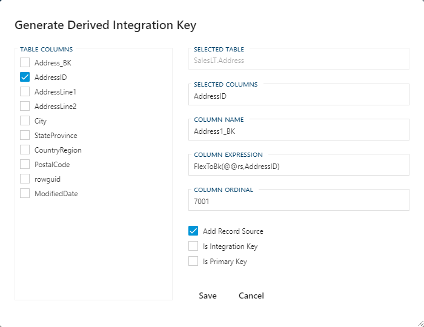

#### Generate Derived Integration Key Dialog Box

The Generate Derived Integration Key dialog will allow you to quickly generate an **Integration Key**.  The selected **Columns** from the prior screen should already be selected and a *Column Name* is automatically populated based on the associated **Objects** *Model Override Name* or, if that is empty, the *Object Name*.  The "_BK" suffix can be controlled with the **Setting** **AppendIntegrationKey**.

##### Generate Derived Integration Key Options

| Option             | Description |
| ------------------ | ----------- |
| Add Record Source  | This will prefix the `@@rs` to the *Column Expression*.  `@@rs` will generate the value currently assigned to *Record Source* on the associated **Connection**. |
| Is Integration Key | This will flag the generated **Column** to become the *Integration Key* for the associated **Object**.  Once selected it will automatically update *Column Ordinal* to "0" and also *Is Primary Key* to `true`. |
| Is Primary Key     | This will flag the generated **Column** as a Primary Key for the associated **Object**. |
