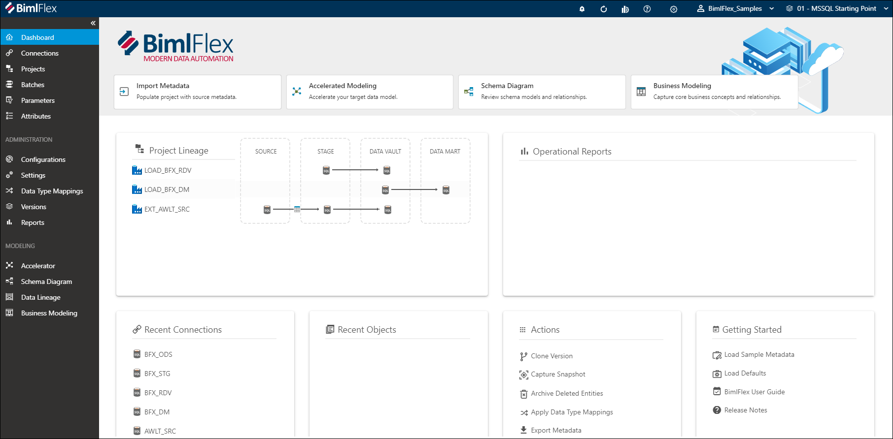

Welcome to BimlFlex!

The [BimlFlex Dashboard](xref:bimlflex-dashboard)  is the first screen you will see when opening BimlFlex. The dashboard provides a quick overview of the metadata in the active [**Customer**](xref:bimlflex-concepts-customer) and [**Version**](xref:bimlflex-concepts-version), and supports the most common tasks and navigation options.

