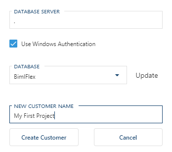

The **Customer** entity holds a set of metadata in the BimlFlex database and can be used to identify different projects, versions, customers, variations.

A **Customer** can have multiple **Versions** of metadata. An initial Version is created for a new Customer.

The Customer can be created through:

* BimlStudio > BimlFlex Ribbon > Open Bundle > New Customer
* BimlFlex App > Settings Pane > New Customer
* BimlFlex Excel Add-in > BimlFlex Ribbon > Metadata Connection pane > New Customer

Set up the connection information to the BimlFlex database.

Use the **New Customer** option in the BimlFlex App to add the Customer to the Database

This step includes the required and optional configurations available for the BimlFlex framework.
