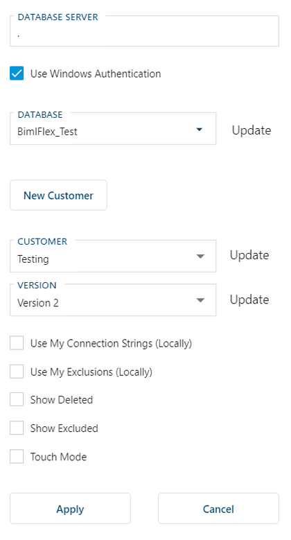
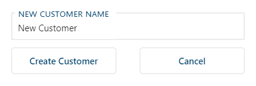

## Settings Side Pane

Configure BimlFlex to connect to the BimlFlex database through the configuration pane opened by the settings cog on the right-hand side of the main toolbar.

### Database Connection Settings

Specify the database server, database and login information for the metadata database to connect and work with metadata projects.

### Create New Customer

Click the *New Customer* button and enter a new **Customer** to create a new customer. An empty *Version* will automatically be created and selected.

### Additional Options
| Option | Description |
|-|-|
| Use My Connection Strings (Locally) | Specifies that the app should use and update Connection String Changes for the current user only. |
| Use My Exclusions (Locally) | Specifies that the app should use and update Exclusions for the current user only. |
| Show Deleted | Shows deleted entities. Use this to view and restore entities that are deleted. |
| Show Excluded | Shows excluded entities. Use this to view and restore entities that are excluded. |
| Touch Mode | This setting makes some changes to the User Interface to make working on a tablet or phone easier for example some clickable icons are larger. |
